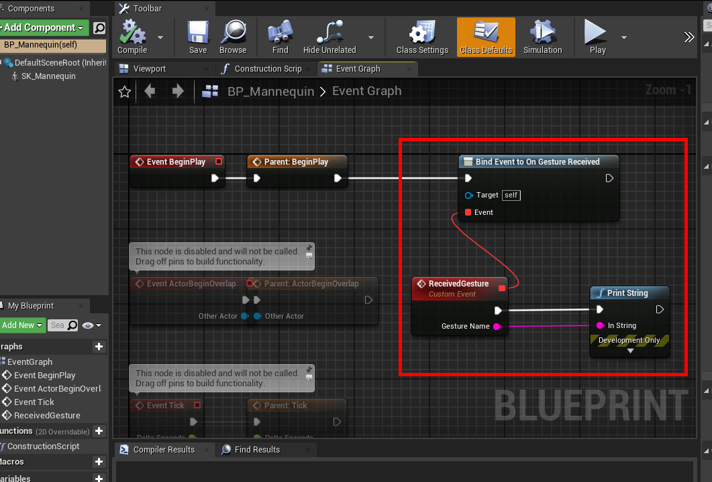
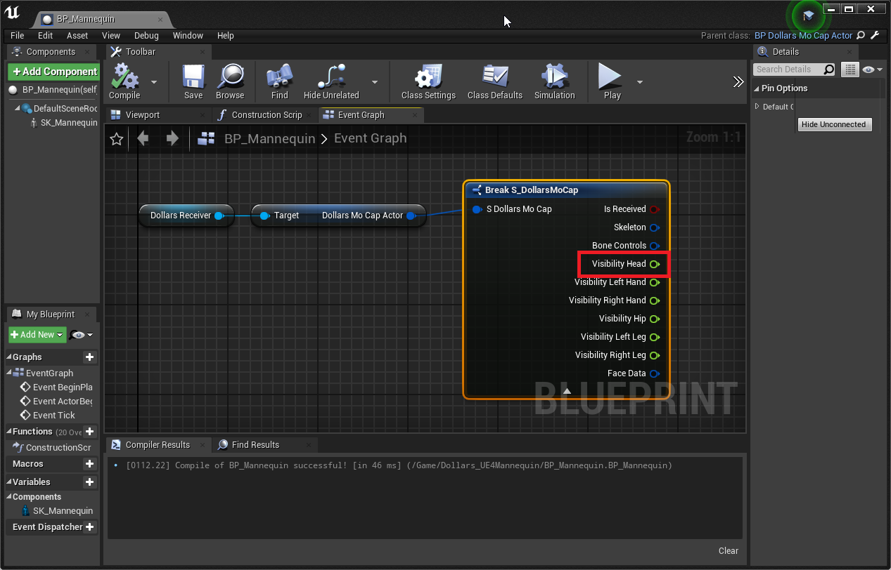
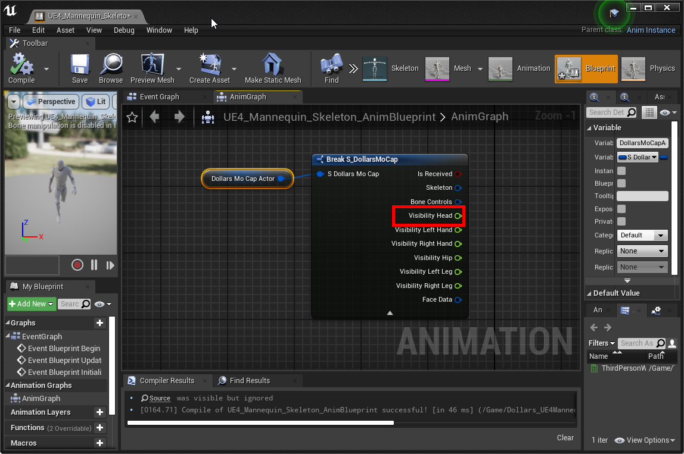

# 虚幻中的使用

您需要在这里下载与 DEEP Lite 匹配的[虚幻插件](https://kilimanjaro.sunnyview.tech/DEEP_Lite/Dollars.zip)以及 [UE4 Mannequin 蓝图](https://kilimanjaro.sunnyview.tech/DEEP_Lite/Dollars_UE4Mannequin.zip)。

插件的使用，与其他道乐师产品的基本相同，您可以在[这里](/ue-getstarted)查看。

以下是一些不同之处，以 UE4 Mannequin 为例，

## 在 Receiver 中设置 MoCapActor

如果您希望获得姿态识别的消息，除了在角色蓝图中指定 Dollars Receiver 之外，您还需要在 Dollars Receiver 中，指定角色蓝图。

## 姿态识别

您可以在角色蓝图中，绑定 On Gesture Received 消息，并通过 Gesuture Name 获得触发的姿态类型。

您可以在下载的 UE4 Mannequin 蓝图中找到示例。

Gesuture Name 当前为以下几种，

- RaiseRightHand
- RaiseLeftHand
- SwipeLeft
- SwipeRight
- Jump

## 追踪状态

您可以通过 DollarsMoCap 数据结构中的 Visibility Head 来判断当前是否追踪到人。

当追踪到人时，该值为 1。否则为 0。

角色蓝图中获取方法如下，

动画蓝图中获取方法如下，

