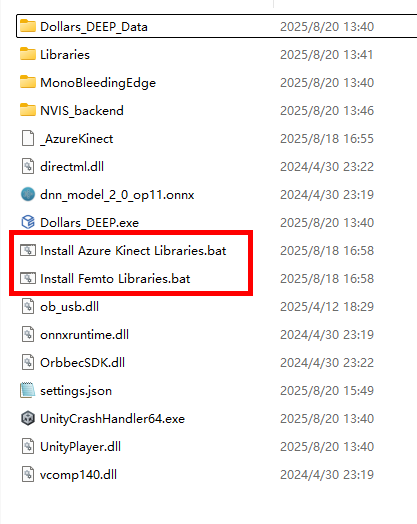
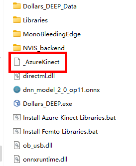
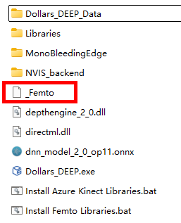

# 切换运行库

## 切换方式

Dollars DEEP 默认将启动适用于 Azure Kinect 的运行库。

如果您使用的是 Femto Bolt 或是 Femto Mega，请在程序启动前运行下图中的 Install Femto Libraries.bat 文件，以切换到支持 Femto 的运行库。

之后，当您需要使用 Azure Kinect 时，可以运行 Install Azure Kinect Libraries.bat 文件，以切换到支持 Azure Kinect 的运行库。

:::info
该操作只需要在第一次使用 Femto 或 Azure Kinect 时进行。
:::

## 查看当前运行库

在程序根目录下，您会看到一个文件 _AzureKinect 或 _Femto，它标识了当前启用的运行库。

**AzureKinect**

**Femto**

:::info
在 v.240306 及之前版本中，不支持该特性。
:::

