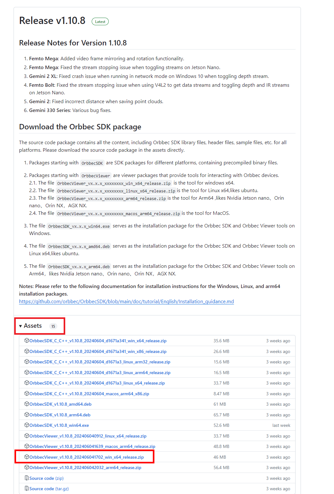
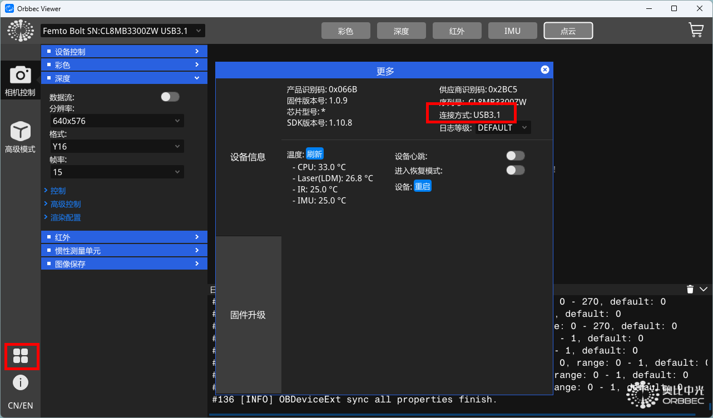
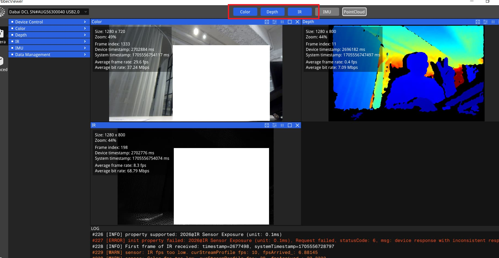
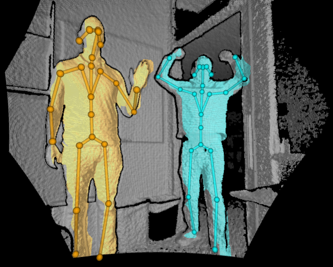

# 连接 Femto Bolt

在使用 DEEP 前，请先使用一下步骤确认 Femto Bolt 正常连接并可以进行骨骼识别。

## 确认摄像头正常工作

下载并运行 OrbbecViewer

https://github.com/orbbec/OrbbecSDK/releases

点击左下方四角，在弹出的更多对话框中确认连接方式为 3.1。

点选上方按钮，确认各相机可以正确输出。

##  确认骨骼追踪正常工作

下载 Azure Kinect Body Tracking SDK 并安装

https://github.com/orbbec/Azure-Kinect-Samples/releases/download/body-tracking-bolt-and-mega-bin/body-tracking-bolt-and-mega-bin.zip

（来自 https://github.com/orbbec/Azure-Kinect-Samples ）

解压缩后，运行 Azure Kinect Body Tracking SDK\tools\k4abt_simple_3d_viewer，确认有人体骨骼输出。

