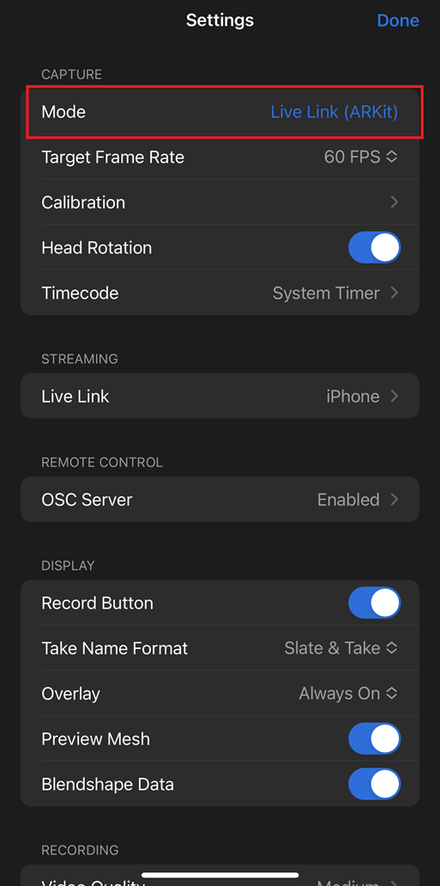
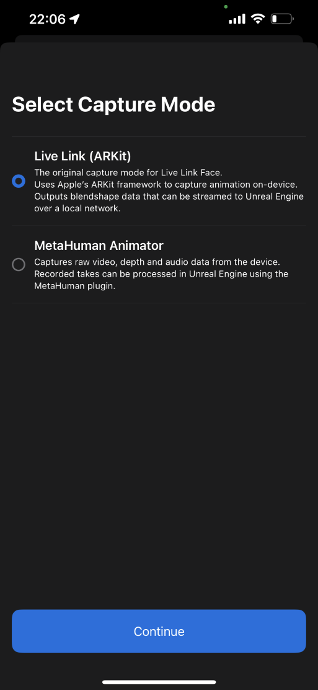
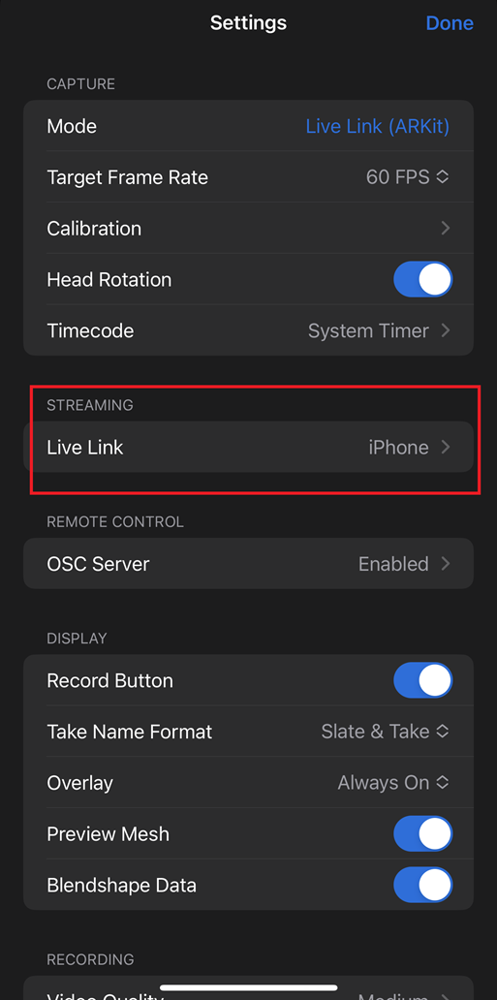
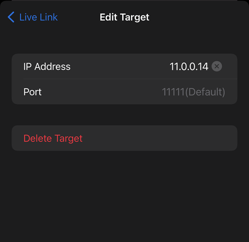
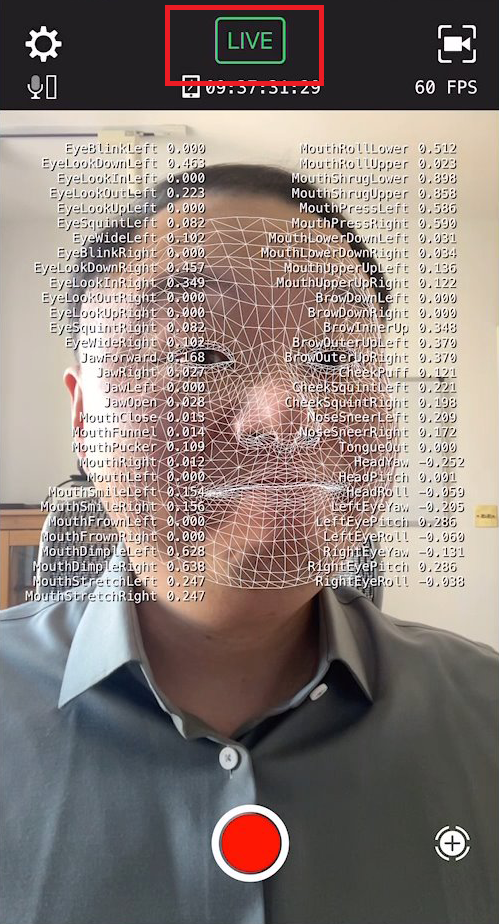
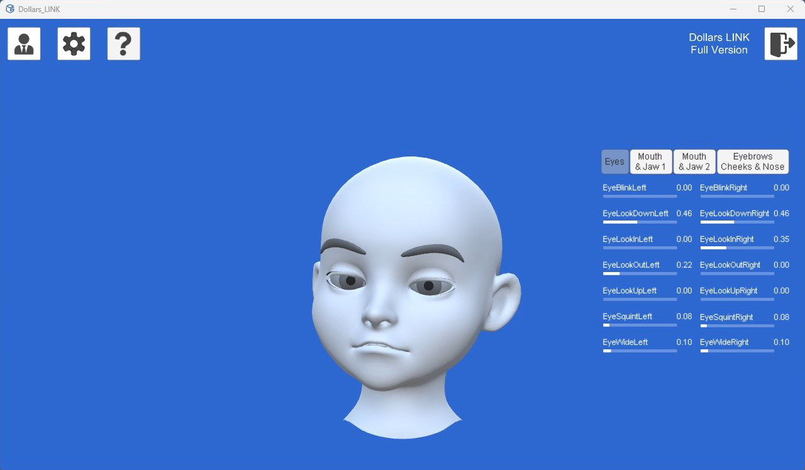

# 准备使用

您需要一台支持 FaceID 的 iPhone 手机，并且安装 [Live Link Face](https://apps.apple.com/us/app/live-link-face/id1495370836) 以进行面部捕捉。

## 获取电脑端 IP

在电脑端打开命令提示符，输入 `ipconfig`，找到你的局域网 IP 地址。

## Live Link Face 的设置

### 选择模式

打开 Live Link Face，点击左上角的设置按钮，在模式选项中，选择 Live Link (ARKit)。

### 添加流送目标

在流送选项中，添加一个新的目标。

输入电脑端 IP 地址，默认的端口号 11111 不需要修改。

Live Link Face 其他选项保持默认即可。

## 开始捕捉

点击 Live Link Face 主界面上面的 LIVE 方框，使其变为绿色，即可开始捕捉。

打开 Dollars LINK，您可以通过人偶看到面部捕捉的结果。

