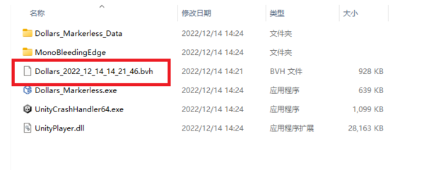

# 录制 BVH 文件

您可以按下图中按钮开始、结束 BVH 文件的录制。


## 录制帧率

### v.241128 及之前的版本

录制频率：30FPS

预估大小：每分钟 5M

### v.241223 及之后的版本

录制频率：60FPS

预估大小：每分钟 10M

## 保存位置

### Windows

录制的文件将以当前时间戳为文件名，存放于道乐师程序根目录下。



### macOS

录制的文件将以当前时间戳为文件名，保存在以下目录中。

```/Users/[用户名]/Library/Application Support/com.SunnyView.Dollars-MONO```
