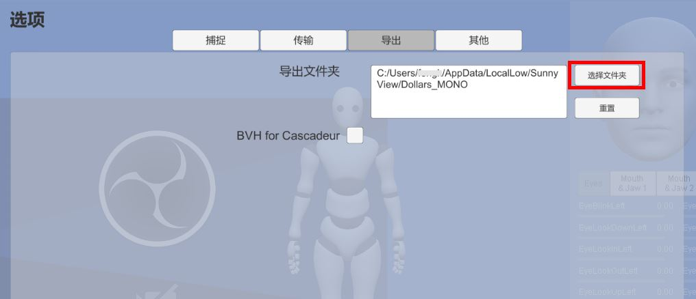

# 录制 BVH 文件

您可以按下图中按钮开始、结束 BVH 文件的录制。


## 录制帧率

### v.241128 及之前的版本

录制频率：30FPS

预估大小：每分钟 5M

### v.241223 及之后的版本

录制频率：60FPS

预估大小：每分钟 10M

## 文件名与保存位置

### v.250618及之后版本

录制的文件将以当前时间戳作为文件名，并根据操作系统的不同，默认保存在以下目录中。

- Windows

```C:\Users\[用户名]\AppData\LocalLow\SunnyView\Dollars_MONO\```

- MacOS

```/Users/[用户名]/Library/Application Support/com.SunnyView.Dollars-MONO```

- Linux

```~/.config/unity3d/SunnyView/Dollars_MONO/```

#### 修改保存位置

您可以在设置中修改存放的目录。



通过**重置**按钮，您可以将保存位置重置为以上默认目录。

请确保您设置的目标目录具有写入权限。若 MONO 无法在指定目录中成功保存文件，文件将自动保存在上述默认路径中。

:::info 建议

我们建议您修改存放目录后，先尝试进行一次录制，以确保该目录可以正确写入。

:::

### 非 v.250618及之后版本

- Windows

录制的文件将以当前时间戳为文件名，存放于道乐师程序根目录下。

- MacOS

```/Users/[用户名]/Library/Application Support/com.SunnyView.Dollars-MONO```

