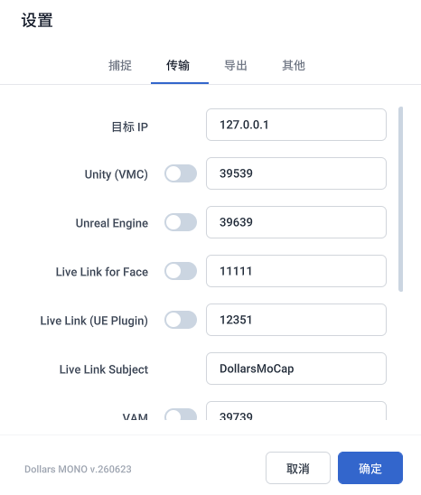
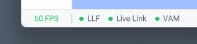
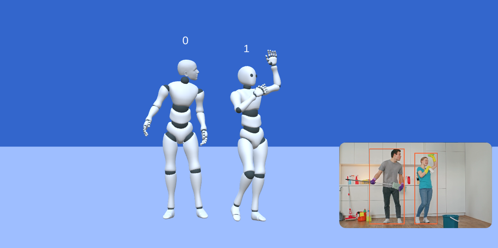
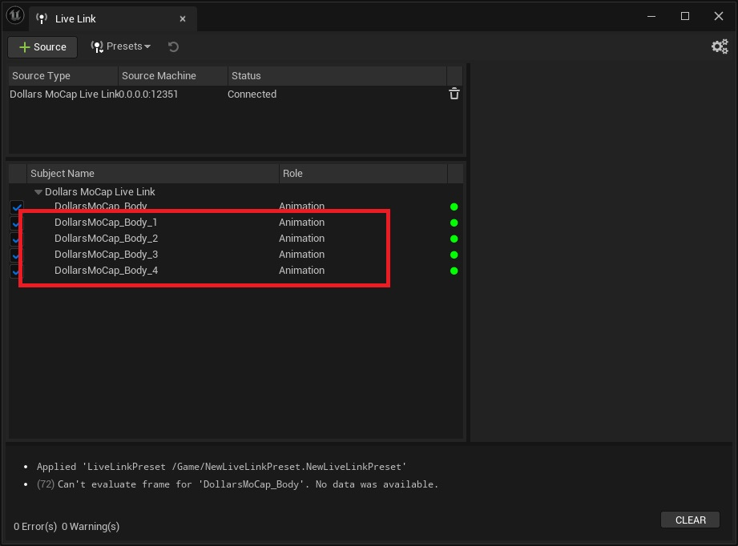

# 同步至其他应用程序

## 设置同步

您可以通过同步引擎中的选项，开启或关闭向对应引擎的同步。

目标 IP 为引擎所在电脑的 IP 地址，若动捕与引擎在同一台电脑上运行，保持默认的 127.0.0.1 即可。

端口选项为道乐师的引擎插件所监听的端口。

程序左下角会显示当前激活的同步选项。

## 多人动捕

开启多人动捕后，动捕角色上方会显示 0、1 等编号。

### UE Live Link 插件

使用 Live Link 插件时，您会在同一个动捕源中看到多至五个 Subject。

Subject 的编号与动捕程序中的编号一致，选择对应的 Subject 即可驱动对应的角色。

### 其他同步插件

使用其他同步插件时，各个动捕角色的动作会从设置的端口开始，按编号依次向后发送。

例如端口设为 39639 时，0 号角色使用 39639，1 号角色使用 39640，依此类推。

在第三方程序端，添加多个接收端并分别监听对应的端口，即可同时驱动多个角色。

