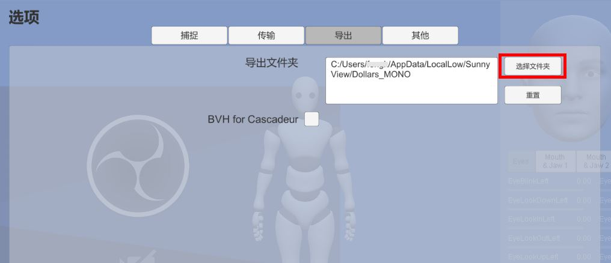

# 导出

您可以按下图中按钮开始、结束录制。


## 导出格式

MONO 当前支持导出为以下格式，

1. FBX
2. BVH
3. BVH for Cascadeur

其中 FBX 支持动作与表情两种类型的导出，BVH 仅支持动作的导出。

### 如何选择导出格式

当您计划在 iClone 或者 Cartoon Animator 中使用 BVH 的话，请选用格式 2。

如果您计划在 Cascadeur 中使用 BVH 的话，请选用格式 3。

除以上两种情况之外，您可以根据您的喜好选择导出的格式。

## 文件名与保存位置

动作文件将以 "Dollars_" 加上当前时间戳作为文件名。

表情文件将以 "Dollars_" 加上当前时间戳以及 "_BS" 作为文件名。

根据操作系统的不同，保存在以下目录中。

- Windows

```C:\Users\[用户名]\AppData\LocalLow\SunnyView\Dollars_MONO\```

- MacOS

```/Users/[用户名]/Library/Application Support/com.SunnyView.Dollars-MONO```

- Linux

```~/.config/unity3d/SunnyView/Dollars_MONO/```

### 修改保存位置

您可以在设置中修改存放的目录。



通过**重置**按钮，您可以将保存位置重置为以上默认目录。

请确保您设置的目标目录具有写入权限。若 MONO 无法在指定目录中成功保存文件，文件将自动保存在上述默认路径中。

:::info 建议

我们建议您修改存放目录后，先尝试进行一次录制，以确保该目录可以正确写入。

:::
