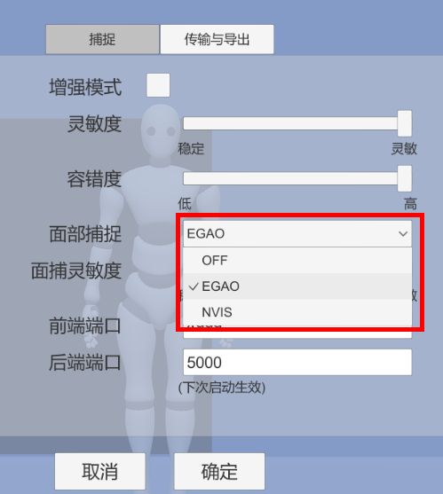
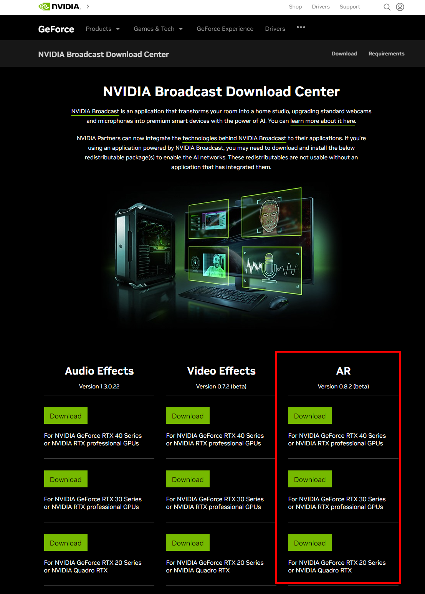
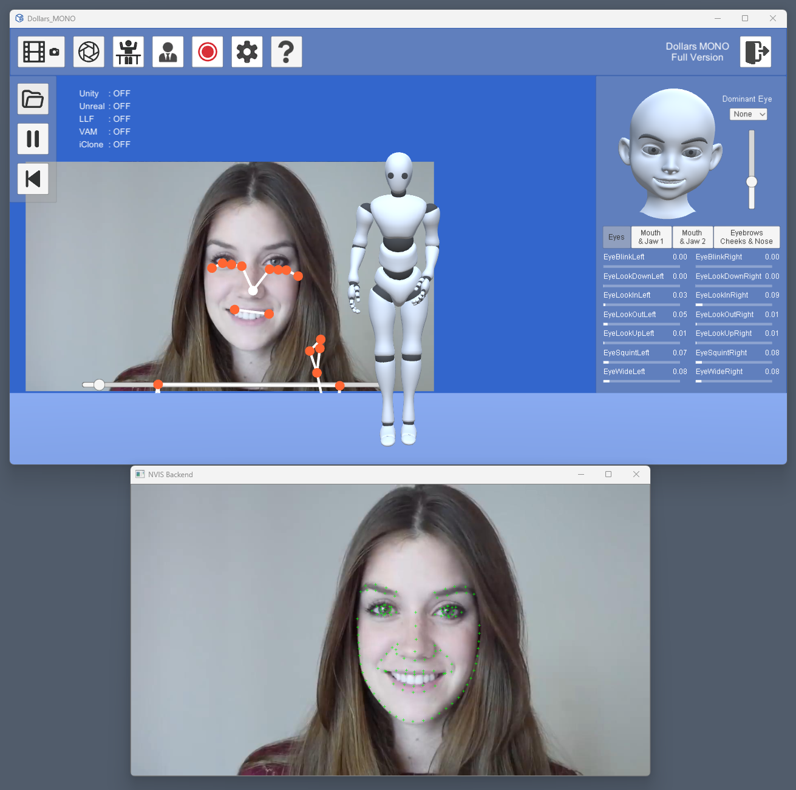

# 面部捕捉模块

MONO 从 v.241128 起，提供 EGAO 与 NVIS 两个面捕模块。您可以根据需要，在设置中选择使用。

:::warning

MONO 的 macOS、Linux 版本，当前只提供 EGAO 面捕模块。

:::

## EGAO

EGAO 是 MONO 自 v.230708 搭载的面捕模块，可以以极低的运行负载完成基础的面部捕捉。

## NVIS

NVIS 模块使用 NVidia 提供的捕捉技术。借助于 NVidia 的显卡，可以提供接近于 iPhone 级别的面部捕捉。

使用前，您需要在 NVIDIA Broadcast 下载中心，下载您的显卡对应的程序包，并且进行安装。安装之后建议重启。

https://www.nvidia.com/en-us/geforce/broadcasting/broadcast-sdk/resources/

正确安装并且启动 NVIS 模块后，您可以在 MONO 程序基础上，看到 NVIS 的面捕窗口。

### NVIS 设置

您可以在设置中修改 NIVS 与 MONO 主程序通信的前后端端口。请注意这两个修改需要再次重启 MONO 后生效。
