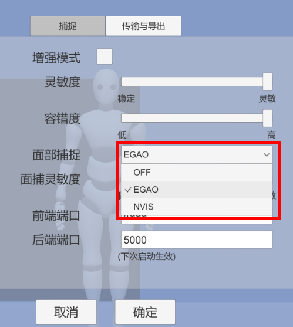

# 面部捕捉模块

MONO 从 v.241128 起，提供 EGAO 与 NVIS 两个面捕模块。您可以根据需要，在设置中选择使用。

:::warning

MONO 的 macOS、Linux 版本，当前只提供 EGAO 面捕模块。

:::

## EGAO

EGAO 是 MONO 自 v.230708 搭载的面捕模块，可以以极低的运行负载完成基础的面部捕捉。

## NVIS

NVIS 模块可以提供接近于 iPhone 级别的面部捕捉。
