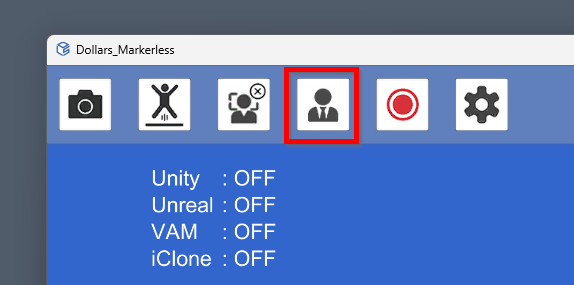
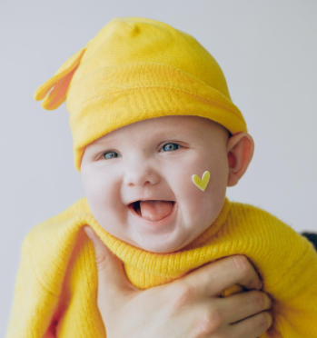
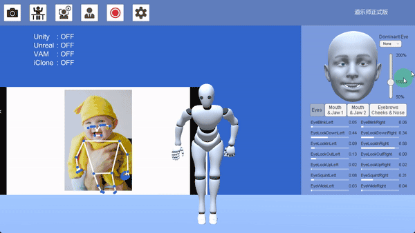
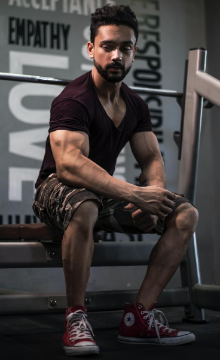
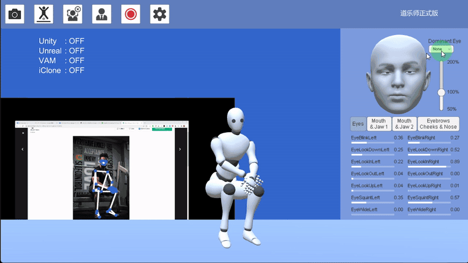
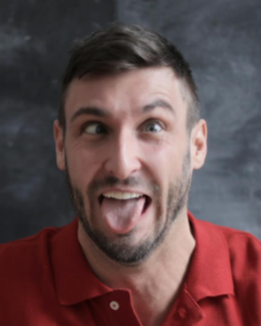
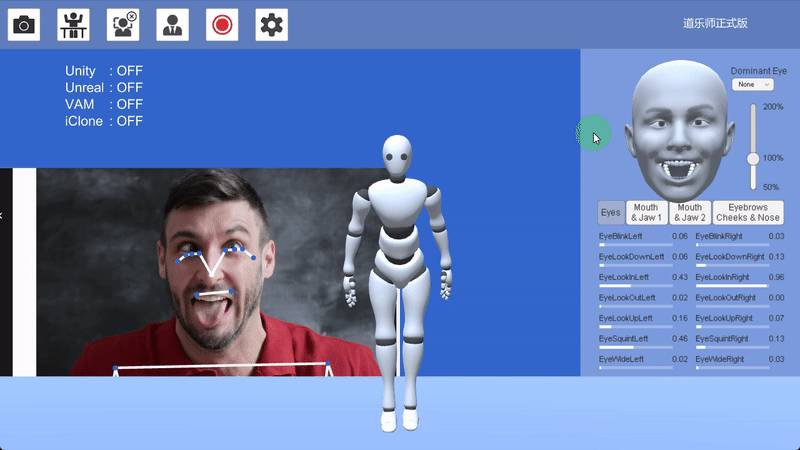

# 面部捕捉参数

道乐师提供与 Apple ARKit 兼容的面部表情捕捉。

## 校准

在开始捕捉前，您可以点击下图中的按钮进行表情校准。

校准时，请表情放松，目视前方。

## 面部参数

### 表情幅度
您可以通过右侧滑动条控制表情的幅度。

### 主视眼
由于拍摄时的灯光，角度，成像清晰度，是否佩戴眼镜等因素，有时双眼的转向可能会有误识别。此时，您可以通过设置主视眼来确保双眼转向同步。

设置主视眼的代价是您将无法做出斗鸡眼的表情。

