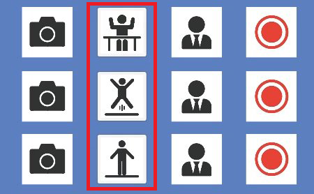

# 动捕模式

Dollars MONO 提供”上半身“，“全身(跳跃)”以及“全身(平地)”三种动捕模式，您可以根据实际动捕需求，通过点击按钮在这些模式间进行切换。

:::info 注意

当增强模式激活时，全身(跳跃)与全身(平地)将合并为全身模式。

此时，程序将仅保留“上半身”和“全身”两种可选模式。

:::

## 上半身模式

在“上半身”模式中，动捕只会捕捉您的上半身，下半身将被锁定。

## 全身(跳跃)模式

在“跳跃”模式中，您的腰部位置变化将被视为高度变化，从而可以完成跳跃，下蹲等动作。但是在该模式下，您将无法前后走动。

比如以下的动作，适合使用跳跃模式，

<iframe src="//player.bilibili.com/player.html?bvid=BV1hB4y1s7Ah&autoplay=0" width="640" height="360" scrolling="no" border="0" frameborder="no" framespacing="0" allowfullscreen="true"> </iframe>

## 全身(平地)模式

在“平地”模式中，您的腰部位置变化将被视为平面的位置变化，从而实现前后的走动。但是在该模式下，您将无法跳跃。

比如以下的动作，适合使用平地模式，

<iframe src="//player.bilibili.com/player.html?bvid=BV1Va411x73C&autoplay=0" width="640" height="360" scrolling="no" border="0" frameborder="no" framespacing="0" allowfullscreen="true"> </iframe>
