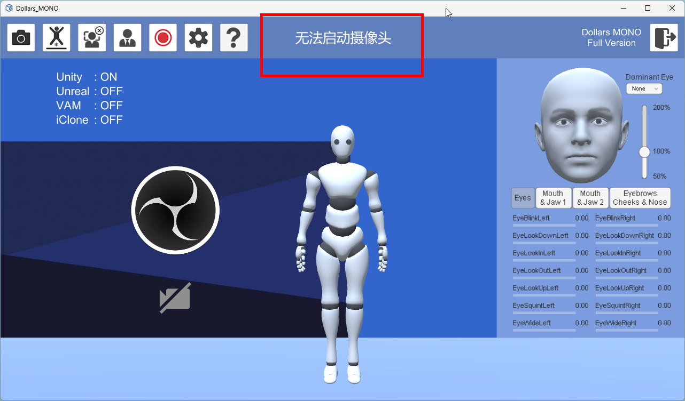

# 错误提示

当 MONO 运行出现错误时，程序上方会显示相应的提示信息。

以下是 MONO 常见错误提示及其解决方法，

## 无法启动摄像头

**可能原因：**

- 程序未被授权访问摄像头。
- 摄像头存在硬件问题。
- 摄像头被其他程序占用。

**解决方法：**

- 在 Windows 系统设置中，确认 Dollars MONO 是否具有摄像头访问权限。
- 使用 Windows 自带的 Camera 应用测试摄像头是否可以正常工作。
- 确保摄像头未被其他程序占用，关闭其他可能使用摄像头的软件后重试。

## 无法播放视频

**可能原因：**

- 视频文件格式不受支持或文件已损坏。

**解决方法：**

- 使用兼容的视频格式（建议 MP4，编码格式为 H.264）。
- 如果文件无法正常播放，请尝试重新编码视频文件。

## 目录中含有非英文字符

**可能原因：**

MONO 程序所在的目录或其路径中包含非英文字符（如中文、特殊符号等），这将导致文件无法正确加载，使得程序无法正常运行。

**解决方法：**

请确保程序所在的目录和路径中仅包含英文字符（包括字母、数字和常规符号）。

**例如：**

正确路径：`C:\Program Files\Dollars_MONO`

错误路径：`C:\程序文件\Dollars_MONO`

## 端口已被占用

**可能原因：**

- 其他程序占用了 MONO 需要使用的端口。

**解决方法：**

- 检查并关闭占用该端口的其他程序。
- 根据提示信息中显示的端口号，在 MONO 中修改端口，避免冲突。

## 缺少所需的动态库

**可能原因：**

使用 NVIS 模块时，未正确安装相关库文件。

**解决方法：**

请参考[这里](/Dollars-MONO/facialcap-module)，下载并安装必要的动态库文件。