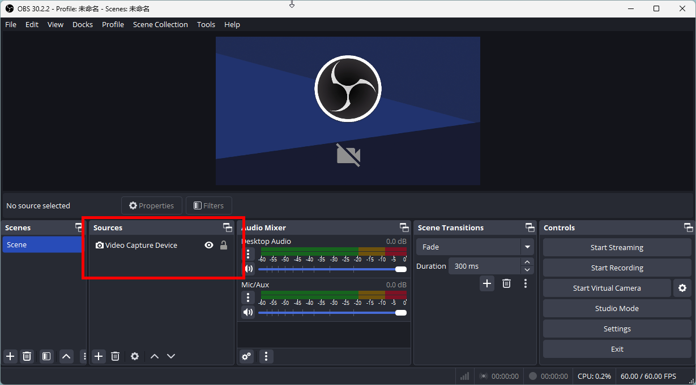
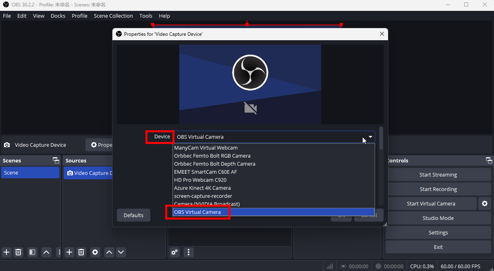
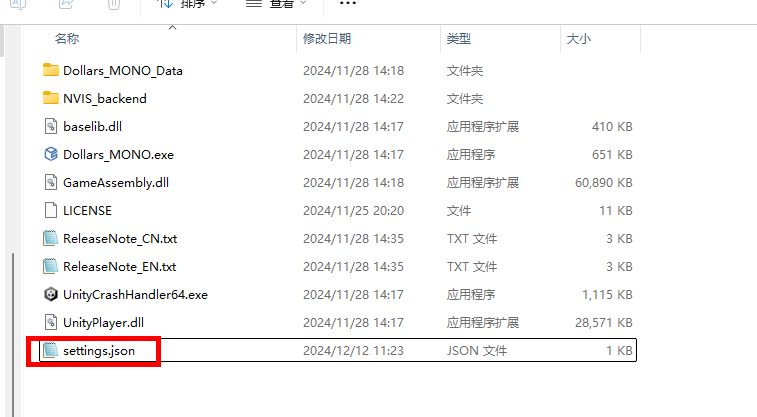
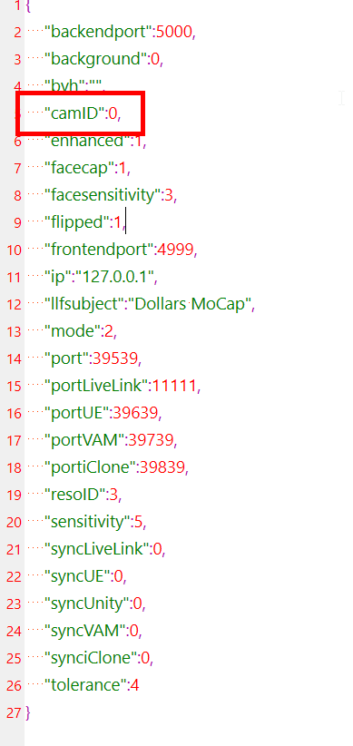

---
sidebar_position: 90
title: 常见问题
slug: /mono-faq
---	

# Dollars MONO 常见问题

import TOCInline from '@theme/TOCInline';

<TOCInline toc={toc} />

## 启动程序时异常关闭{#crashes}

**原因一：缺少必要的运行库**

**解决方案：**

1. 访问以下页面，下载最新的 Visual C++ 运行库：[Microsoft 官方下载页面](https://learn.microsoft.com/en-us/cpp/windows/latest-supported-vc-redist?view=msvc-170)  并下载： [vc_redist.x64.exe](https://aka.ms/vs/17/release/vc_redist.x64.exe)
2. 安装并重启电脑，然后尝试重新启动 MONO。

**原因二：打开相机时失败**

**解决方案：**
1. 在这里下载最新版的 OBS。https://obsproject.com

2. 打开 OBS，添加一个 Video Capture Device。

3. 在 Device 列表中，找到 **OBS Virtual Camera**，并记下它在列表中的位置。

4. 打开 MONO 目录下的 **settings.json** 文件（如果 MONO 目录下没有此文件，可以在以下路径找到：`C:\Users\{您的用户名}\AppData\LocalLow\SunnyView\Dollars_MONO`）

5. 在 **settings.json** 文件中，将 **camID** 的值更改为 **OBS Virtual Camera** 在设备列表中的排位减去 1。

例如，如果 OBS Virtual Camera 排在第 3 位，将 camID 设置为 2。

6. 启动 MONO，确认是否可以正常打开。

如果在完成上述修改后，MONO 能够正常启动，说明您的相机列表中可能存在某个设备导致程序异常关闭。您可以逐一尝试相机，并注意观察哪个设备会引发问题。

如果发现某个相机导致程序崩溃，建议将 MONO 中的相机列表发送至 hi@sunnyview.tech，并标明引起异常关闭的相机，我们将进一步调查。感谢您的配合与支持！

:::danger 已知问题

ShareX 的 screen-capture-recorder 相机，会导致 MONO 异常关闭。建议您通过以上介绍的方法避开选择该相机。

:::

## 相机无法打开{#camera-error}

建议您使用其他程序尝试打开摄像头，以确认摄像头与电脑的连接正常。

您也可以进入 Winows 的相机设置，检查 Dollars MONO 是否有权限使用摄像头。

如果您可以在 OBS 中打开摄像头，您也可以通过 OBS 的虚拟摄像头将摄像头画面传入 Dollars MONO。

关于 OBS 的虚拟摄像头的使用方法，可以参考[使用 OBS 虚拟摄像头作为输入](/Dollars-MONO/virtualcam)。

## 人漂浮或者陷入地面中{#characters-floating}

当您使用摄像头实时捕捉时，开始动捕前进行一次[校准](/Dollars-MONO/calibration)，并且选择合适的[动捕模式](/Dollars-MONO/mode)，会减轻漂浮或者陷入地面的情况。

如果您是通过视频进行动捕时遇到这样的问题，您可以尝试通过外部播放器播放视频，使用 OBS 捕获播放的画面，适当调整位置后，通过虚拟摄像头输入 Dollars MONO。

关于 OBS 的虚拟摄像头的使用方法，可以参考[使用 OBS 虚拟摄像头作为输入](/Dollars-MONO/virtualcam)。

您也可以尝试勾选[智能贴地选项](/Dollars-MONO/ground)。

## 视频卡顿或其他问题{#stuttering}

您可以尝试降低视频分辨率，或者视频帧率。

或者您也可以使用外部播放器播放，然后通过 OBS 的虚拟摄像头将视频画面传入 Dollars MONO 中，使用外部播放器也可以为您提供一些播放的控制，更易于使用。

关于 OBS 的虚拟摄像头的使用方法，可以参考[使用 OBS 虚拟摄像头作为输入](/Dollars-MONO/virtualcam)。

## 如何利用手机摄像头{#cellphone-cameras}

您首先需要根据您使用的手机，找寻配套软件，将手机画面映射到电脑上。之后通过使用 OBS 的虚拟摄像头，就可将画面进一步传入 Dollars MONO 中。

关于 OBS 的虚拟摄像头的使用方法，可以参考[使用 OBS 虚拟摄像头作为输入](/Dollars-MONO/virtualcam)。

## 是否支持多人，多摄像头{#multiple-support}

Dollars MONO 目前只支持单人，单摄像头。

如果您希望在同一场景中实现多人动捕，可以参看以下教程：

[虚幻多人动捕](/ue-multiplayer)

[Unity 多人动捕](/unity-multiplayer)

Virt-A-Mate 多人动捕

<iframe src="//player.bilibili.com/player.html?bvid=BV1u24y1W7LP&autoplay=0&t=270.0" width="640" height="360" scrolling="no" border="0" frameborder="no" framespacing="0" allowfullscreen="true"> </iframe>

