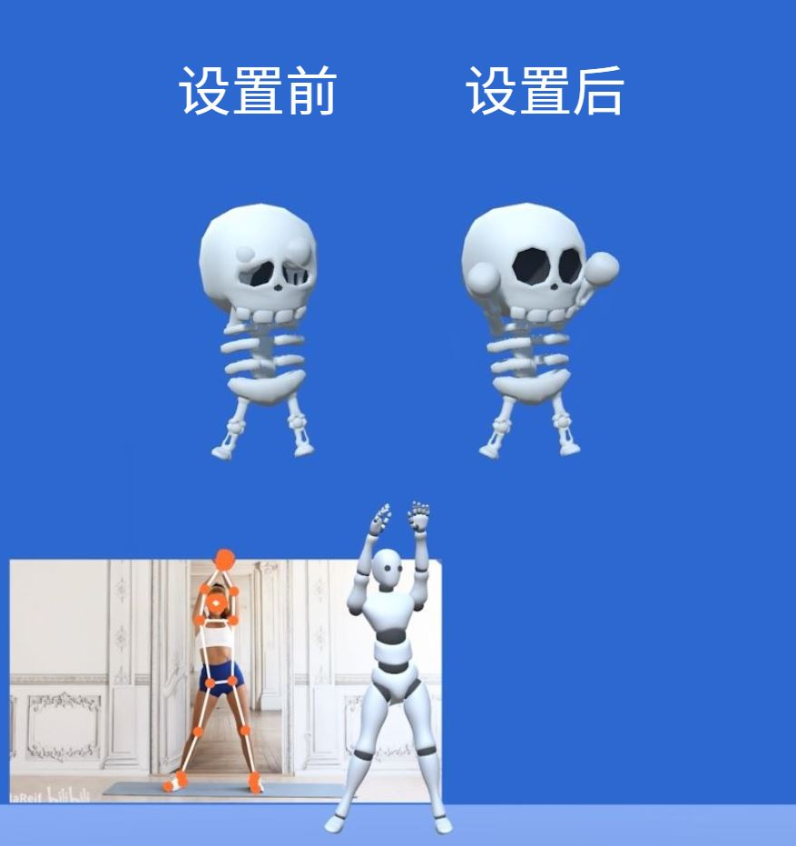
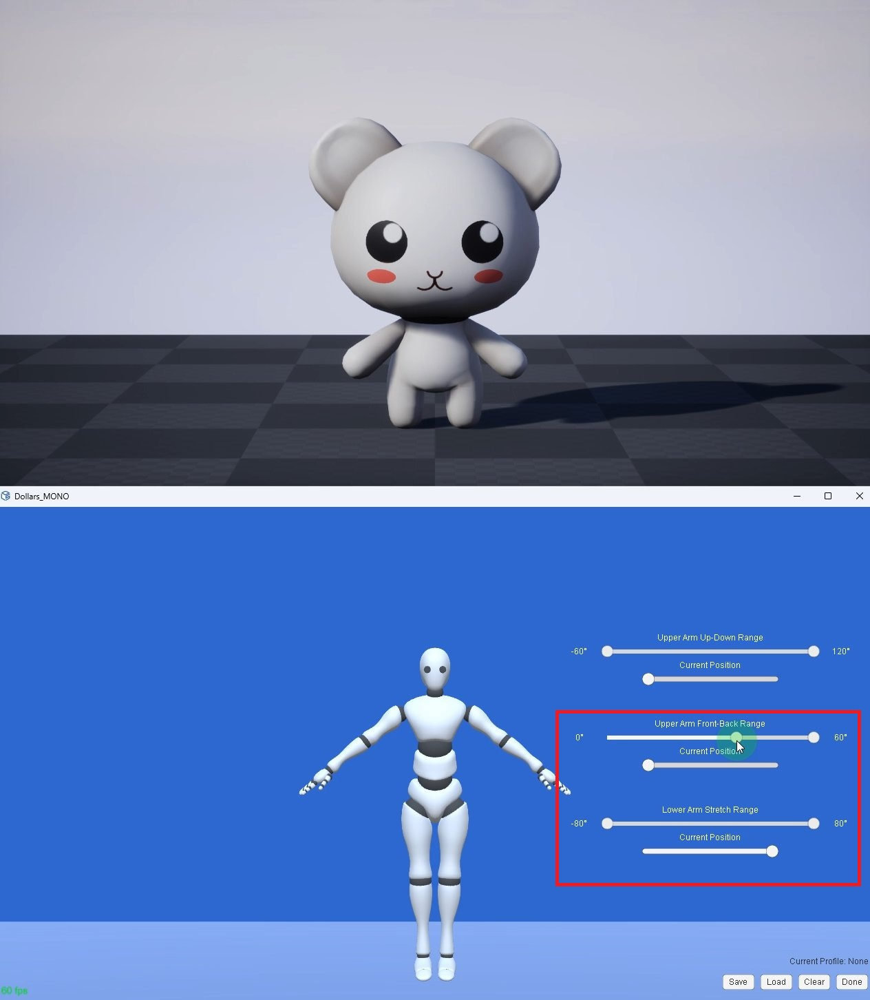
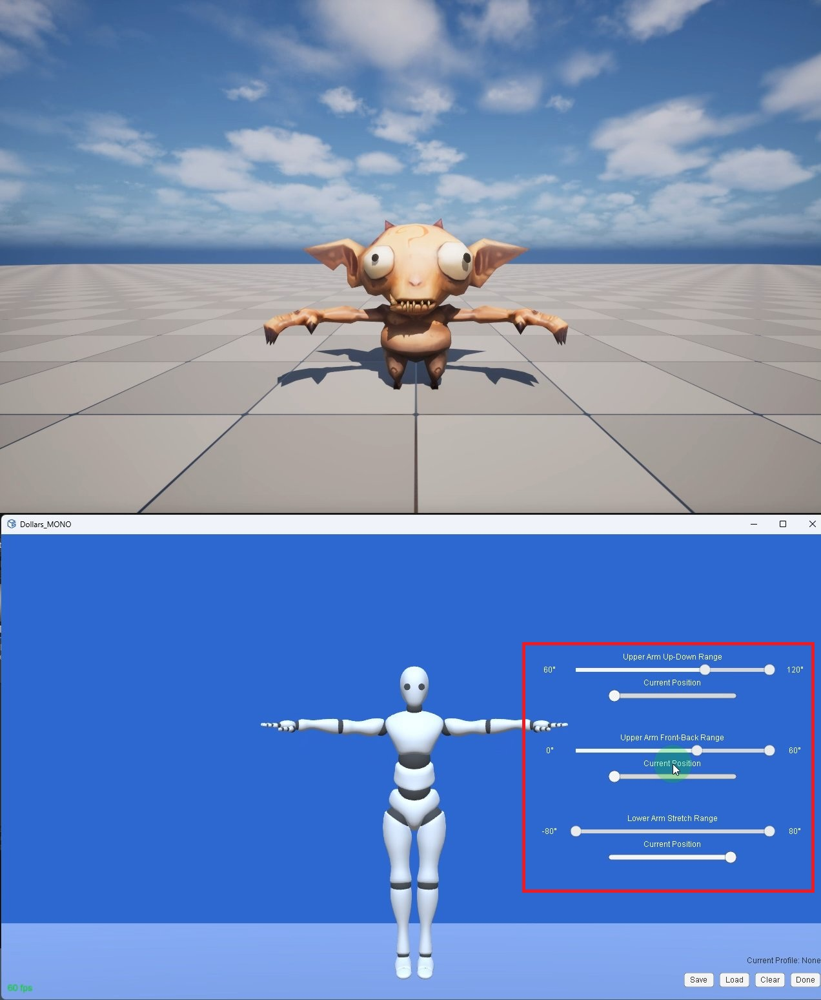

# 设置动捕 Profile

从 v.250707 起，MONO 支持设置动捕 Profile。

通过设置 Profile，您可以限制关节的活动范围，以减轻捕捉过程中可能出现的穿模问题，如下图右侧所示。

如果您使用 Unity 渲染虚拟形象，也可以通过 Unity 自带的 Muscle Settings 实现类似的效果，详情请参见，

https://github.com/SunnyViewTech/MuscleSettings

:::warning 注意

实时动捕中完全避免穿模仍然存在技术挑战，本功能旨在提供一种有效的缓解手段。

:::

## 设置步骤

### 准备工作

1. 在进行 Profile 设置前，请先完成道乐师插件的配置，确保动作可以正确同步至您的虚拟形象。

2. 在 MONO 中激活虚拟形象的动作同步。

3. 进入 Profile 编辑模式。

### 设置手臂的上下活动范围

当虚拟形象的头部或身体较大时，手臂放在身体两侧容易发生穿模。可以通过限制手臂的上下活动范围来改善这一问题。

1. 将 Upper Arm Front-Back Range 的下限设为 0。Current Position 设为最小值。

2. 将 Lower Arm Stretch Range 的上限设为 80，Current Position 设为最大值。此时虚拟形象将处于 APose。

3. 将 Current Position 拉到最左侧。调整 Upper Arm Up-Down Range 的最小活动范围。

4. 将 Current Position 拉到最右侧，调整 Upper Arm Up-Down Range 的最大活动范围。

5. 调整 Current Position，观察虚拟形象的动作并确认效果是否符合预期。

<video controls width="50%">
  <source src="/2025-09-23 19-37-54-638_1.mp4"/>
</video>

6. 点击**保存**，完成设置。

### 设置手臂的前后活动范围

当虚拟形象手臂较长时，容易在身体前方交叉穿模。可以通过限制手臂的前后活动范围来减少这种情况。

1. 将 Lower Arm Stretch Range 的上限设为 80，Current Position 设为最大值。

2. 将 Upper Arm Front-Back Range 的下限设为 0。Current Position 设为最小值。

3. 将 Upper Arm Up-Down Range 的最小值设为 60，Current Position 设为最小值。此时虚拟形象将处于 TPose。

4. 调整 Upper Arm Front-Back Range 的上下限。

<video controls width="50%">
  <source src="/2025-09-23 19-58-49-339_1.mp4"/>
</video>

5. 如有需要，调整 Upper Arm Up-Down Range 的上下限。

<video controls width="50%">
  <source src="/2025-09-23 19-58-49-339_2.mp4"/>
</video>

6. 调整 Lower Arm Stretch Range 的上下限。

<video controls width="50%">
  <source src="/2025-09-23 19-58-49-339_3.mp4"/>
</video>

7. 调整 Upper Arm Up-Down Range 和 Lower Arm Stretch Range，使得他们的其取值范围大小类似。

<video controls width="50%">
  <source src="/2025-09-23 19-58-49-339_4.mp4"/>
</video>

8. 调整各个 Current Position，确认效果。

<video controls width="50%">
  <source src="/2025-09-23 19-58-49-339_5.mp4"/>
</video>

9. 点击**保存**，完成设置。

## 多个 Profile

保存后的 Profile 将在每次启动程序时自动载入。

您可以为不同角色设置不同的 Profile，并且根据需要加载它们。