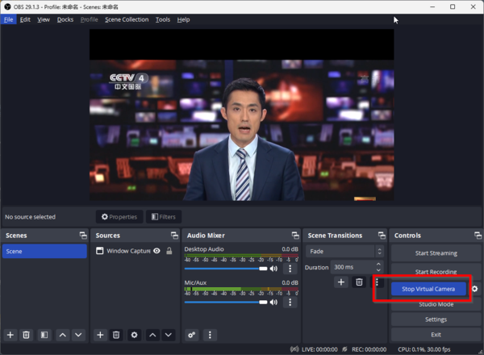
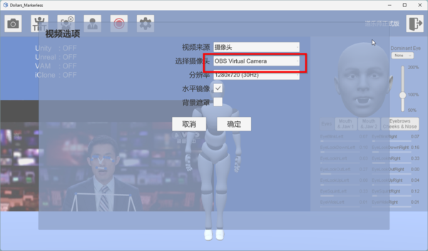
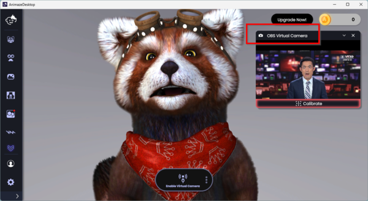

# 在多个应用程序中共享摄像头

下面将介绍如何利用 OBS 的虚拟摄像头，在多个应用程序中使用同一个摄像头作为输入。这样您可以在道乐师中进行动作捕捉，同时在 Animaze，VSeeFace 等软件中进行面部捕捉。

您可以在这里下载 OBS，https://obsproject.com

您可以将视频，桌面窗口，或者摄像头加入 OBS 后，通过右侧按钮启动虚拟摄像头。

在道乐师中，选择 OBS 的虚拟摄像头作为视频源，

同时在 Animaze 也以 OBS 虚拟摄像头作为输入。

这样您就可以通过一个摄像头，在道乐师中进行动作捕捉，同时在 Animaze 中进行表情捕捉。