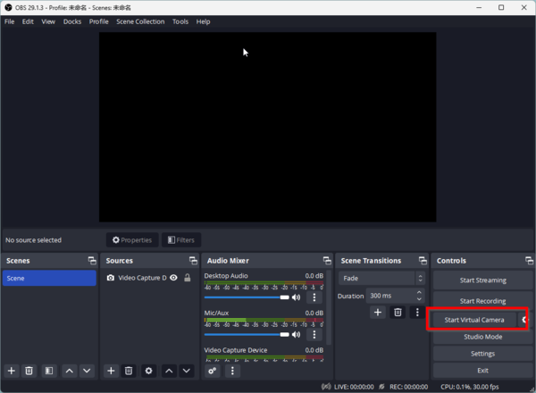
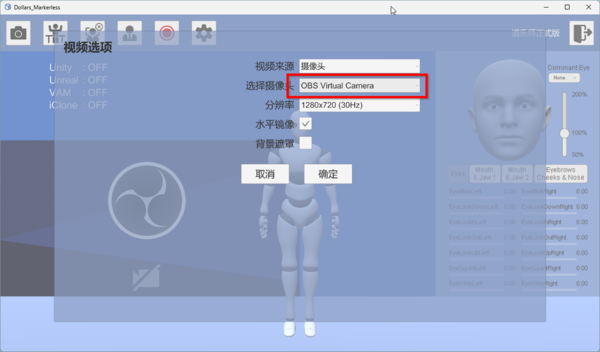
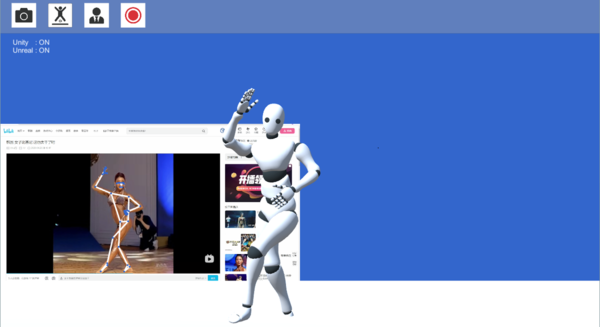
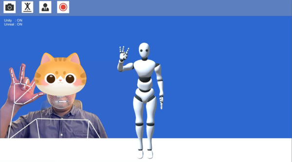

# 使用 OBS 虚拟摄像头作为输入

道乐师从 v.230722 版本开始支持 OBS 的原生虚拟摄像头，借助虚拟摄像头，可以实现如下一些场景， 

- 把摄像头竖直摆放，更方便照到全身
- 使用手机作为视频源，一台手机实现面捕动捕
- 将网络视频，甚至任何桌面上显示的画面直接作为动捕输入

您可以在这里下载 OBS，https://obsproject.com

您可以在 OBS 中点击右侧按钮启动虚拟摄像头，

同时在道乐师中，选择 OBS 的虚拟摄像头作为视频来源，

之后，您可以通过 OBS 的抓屏功能，将桌面上其他窗口的画面直接作为动捕输入，

或者在手机投屏到电脑后，将 Live Link Face 的画面作为动捕输入，实现用一台手机同时进行动捕和面捕。

您可以在以下视频中，进一步了解如何使用 OBS Virtual Camera 提升动捕质量。

<iframe src="//player.bilibili.com/player.html?bvid=BV1Wm421g7Xs&autoplay=0" width="640" height="360" scrolling="no" border="0" frameborder="no" framespacing="0" allowfullscreen="true"> </iframe>
