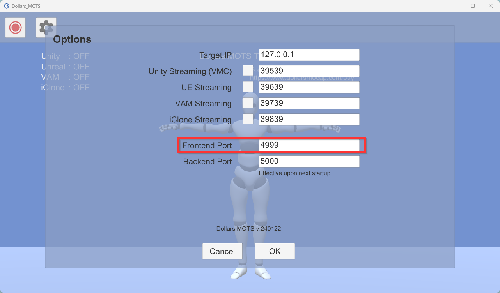

# 使用 API

您可以使用 OSC 协议与 MOTS 前端进行通信，从而控制人物的动作。

## 命令

|地址|参数|说明|
|---|---|---|
|/dollars/generate|string| string 为动作描述，英文

## 默认端口

MOTS 前端默认监听 4999 端口。

您可以在设置中进行修改，修改后需要重启 MOTS 前端。

## 示例

### OSC 基础示例

https://github.com/SunnyViewTech/MOTS-OSCSample

包含 Python，UE，以及 Unity 实现

### 使用语音控制动作

https://github.com/SunnyViewTech/MOTS-VoiceCmdSample

包含使用百度实现语音识别、中译英，以及使用 OSC 协议控制 MOTS 前端的中文语音示例，以及使用 Microsoft Azure API 的英文语音示例。
