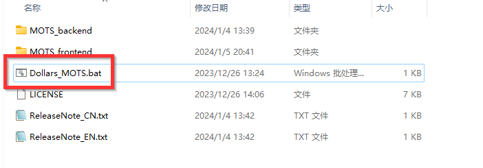
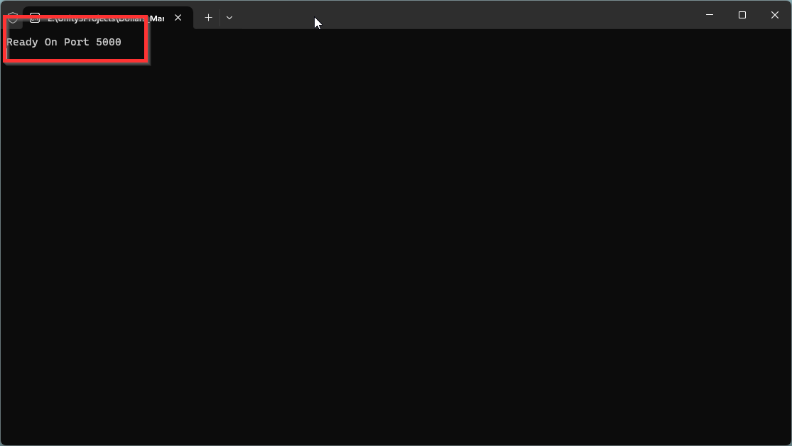
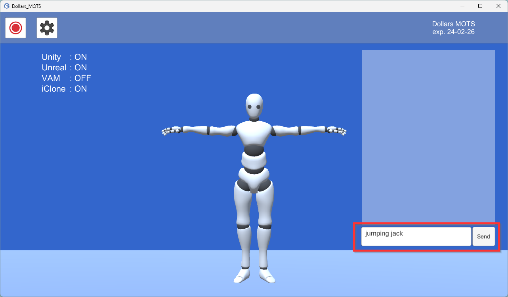
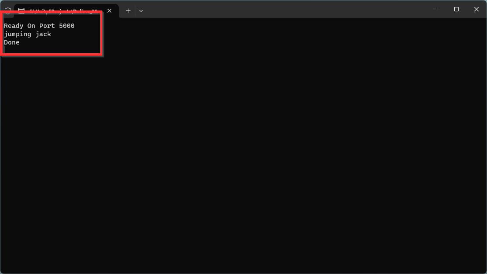
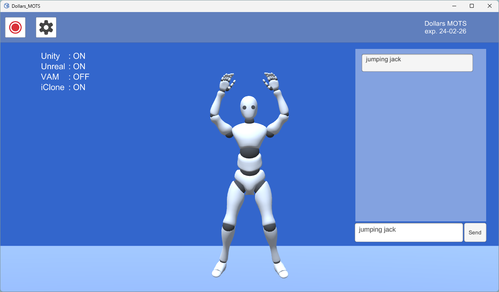
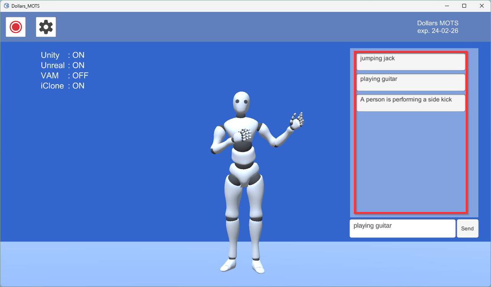

# 开始使用

Dollars MOTS 由前后端两部分组成，您可以点击 Dollars MOTS 目录中的 Dollars_MOTS.bat 同时启动前后端。

后端启动可能需要一些时间，当程序中显示 Ready On 5000 时，表示后端已经启动成功。

此时，您可以在前端程序中输入您的文本，并且点击发送按钮。

后端程序会显示收到的文本指令，并且在动作生成后显示 Done。

此时前端程序会显示生成的动作。

启动程序后生成的动作会出现在右侧的列表中，点击其中的文字可以再次播放相应的动作。

