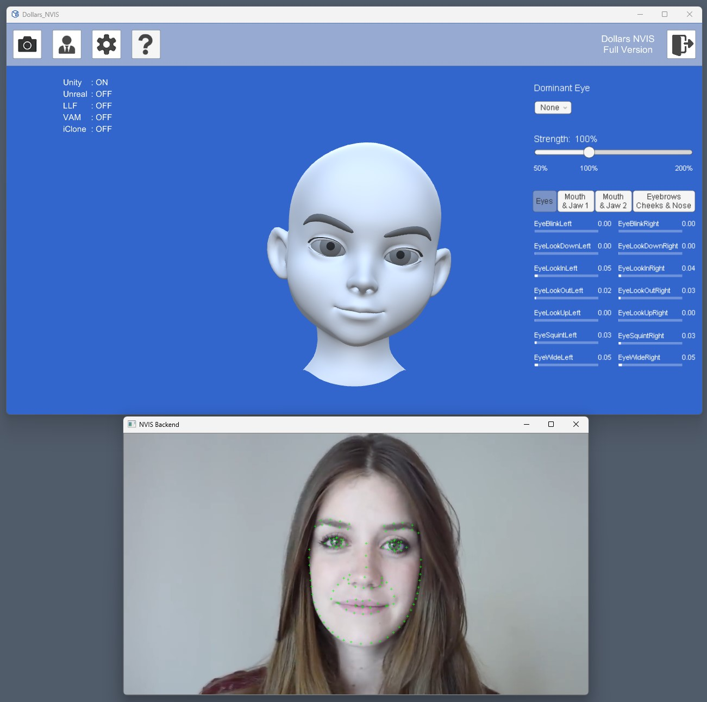

# 开始使用

在使用 Dollars NVIS 前，您需要在 NVIDIA Broadcast 下载中心，下载您的显卡对应的程序包，并且进行安装。安装之后建议重启。

https://www.nvidia.com/en-us/geforce/broadcasting/broadcast-sdk/resources/

正确安装后，运行 NVIS，您将可以看到 NVIS 前端（下图中上半部分）以及后端（下图中下半部分）两个窗口。

