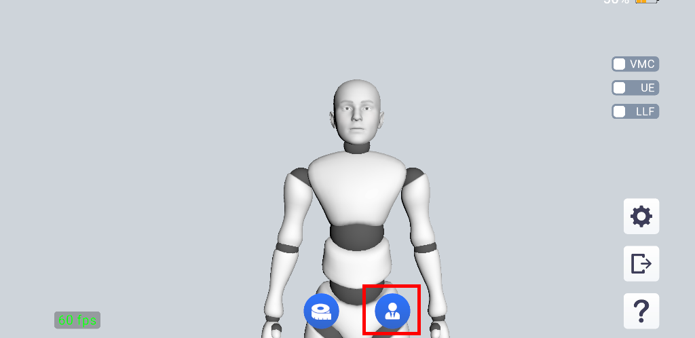

# 校准

## 校准的目的

当 iOS 设备放置时，若存在一定角度（如前倾或后仰），会造成动捕人物前倾或者后仰，校准可以改善这一现象。

同时，由于每个人的面部特征存在基准偏差，也会影响表情的还原效果，进行校准可以更准确地识别动态表情变化。

## 校准方法

点击程序下方的按钮开始进行校准。

校准时，请放松身体和表情，双手自然下垂，目视前方。

倒计时结束，出现“校准完成”的提示之后，即可进行正常动捕。

校准过程中，您可以点击同一按钮，取消校准。