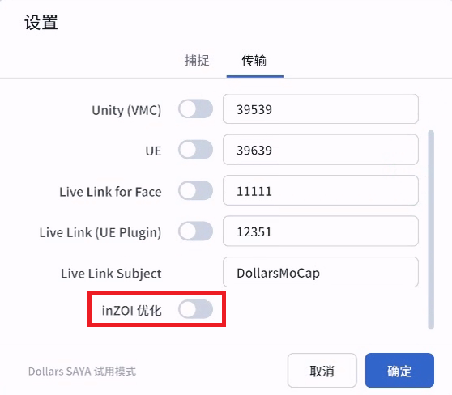
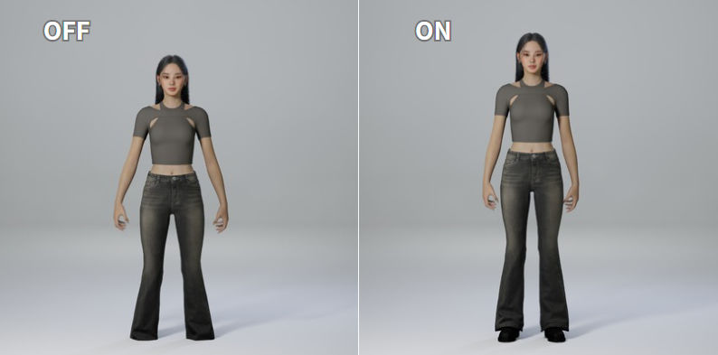
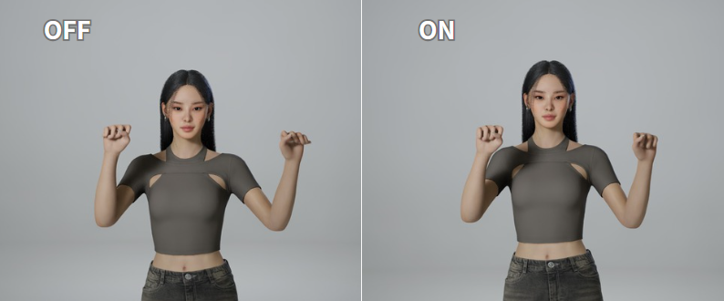

---
sidebar_position: 70
title: inZOI 优化
---	

# inZOI 优化

当您将动捕数据发送至 inZOI 时，建议按顺序完成以下两项设置。

## 载入 inZOI 的 VRM

首先，通过 [载入 VRM](./loadvrm.md) 载入 inZOI 程序附带的 VRM 文件，动作将按 inZOI 角色的体型解算，与角色更加贴合。

## 勾选 inZOI 优化

然后，在 SAYA 设置中勾选 inZOI 优化选项。

## 优化效果

完成以上两项设置后，动捕效果将在以下方面得到改善，

- 自然站立时，姿态更为自然，同时减少脚部穿地。

- 双手握拳时，减少手指的扭曲。

