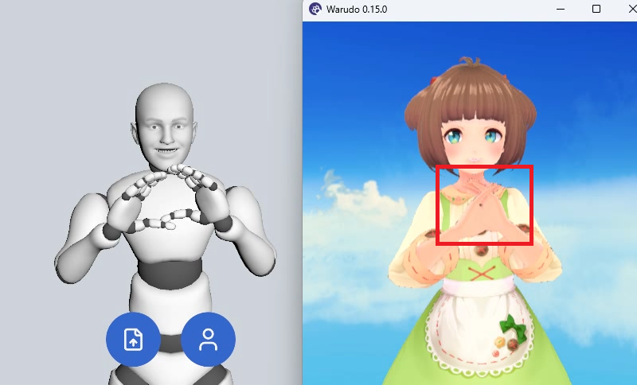

# 载入 VRM

## 为什么要载入 VRM

SAYA 默认按照道乐师内置模型的体型解算动作。当您实际使用的角色在肩宽、臂长等比例上与内置模型差异较大时，双手合十这类需要精确对位的动作就容易出现偏差，例如两手错开或相互穿模。

载入您的 VRM 后，SAYA 会直接按照该模型的骨骼比例解算并输出动作。不同体型的角色都能自然贴合您的动作，无需再手动填写上臂间距等参数。

## 操作流程

1. 将角色的 VRM 文件传输到您的 iOS 设备，可使用 AirDrop、iCloud 云盘或数据线等方式。
2. 在 SAYA 中点击下方按钮，在弹出的对话框中选择您的 VRM 即可。

载入完成后，该 VRM 会在 SAYA 每次启动时自动加载。

:::info 注意

载入 VRM 只影响 Unity(VMC) 传输协议的输出，其他协议不受影响。

:::
