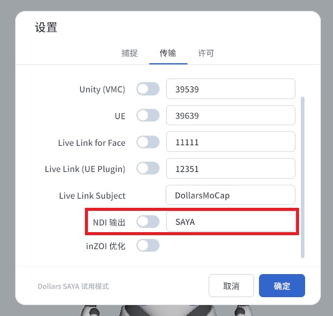
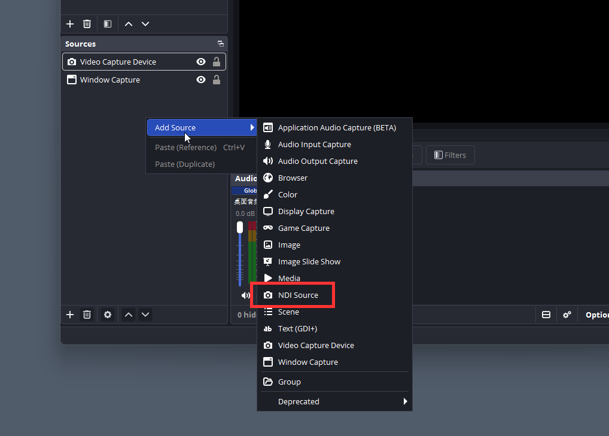

# NDI 输出

SAYA 可以将渲染好的虚拟形象画面通过 NDI 推流到同一局域网内的电脑，在 OBS 中作为来源直接使用。渲染在设备上完成，电脑端无需运行任何形象软件，可为直播、录制等其他任务释放更多资源。

## 开始之前

请先通过 [载入 VRM](./loadvrm.md) 载入您的虚拟形象，并确认设备与电脑处于同一局域网。

## 开启 NDI 输出

在 SAYA 设置的传输页中，打开 NDI 输出开关。开关旁的输入框用于设置 NDI 源的名称，默认为 SAYA，可根据需要修改。

## 在 OBS 中接收

首次使用前，请在电脑上安装 OBS 的 NDI 插件 DistroAV（原名 obs-ndi）及其依赖的 NDI 运行库，并重启 OBS。

在 OBS 中添加来源，选择 NDI Source，

在来源列表中选择您的设备，名称通常为设备型号加四位随机字母，括号内为设置中填写的 NDI 名称。选择后即可看到实时渲染的形象画面。

:::info 注意

开启 NDI 输出后，源可能需要 30 秒到 1 分钟才会出现在 OBS 中。

若等待后仍未出现，请确认设备与电脑处于同一局域网，并检查电脑防火墙是否拦截了 NDI。

:::
