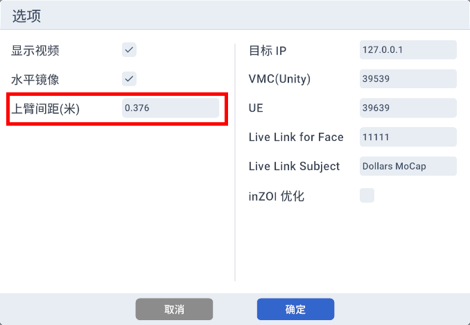
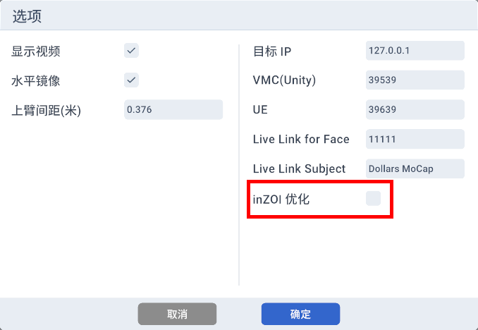
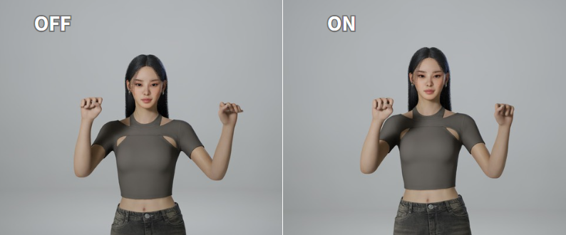
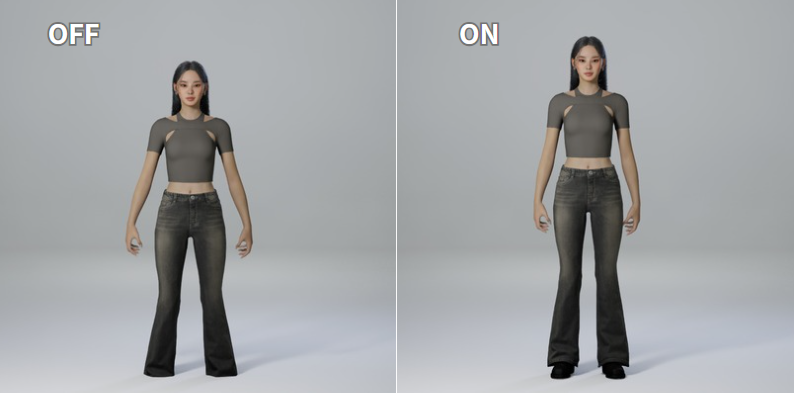

---
sidebar_position: 50
title: 程序选项
---	

# 程序选项

程序中的大部分选项如其字面意思，以下是一些需要额外说明的选项，

## 上臂间距

请在此填写您最终用于展示的模型中，左右 UpperArm（上臂）骨骼之间的水平距离（注意：不是肩膀的距离）。

由于捕捉过程中可能存在误差，建议适当扩大该数值，以获得更好的效果。

默认值是 0.376，为道乐师动捕模型的上臂间距。

## inZOI 优化

当您将数据发送至 inZOI 时，建议勾选该选项。

该选项会在以下方面进行优化，

- 双手握拳时，减少手指的扭曲。

- 自然站立时，姿态更为自然，同时减少脚部穿地。

