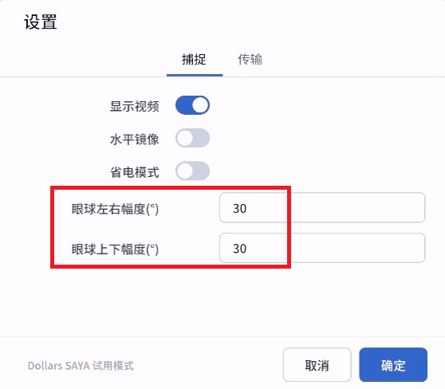
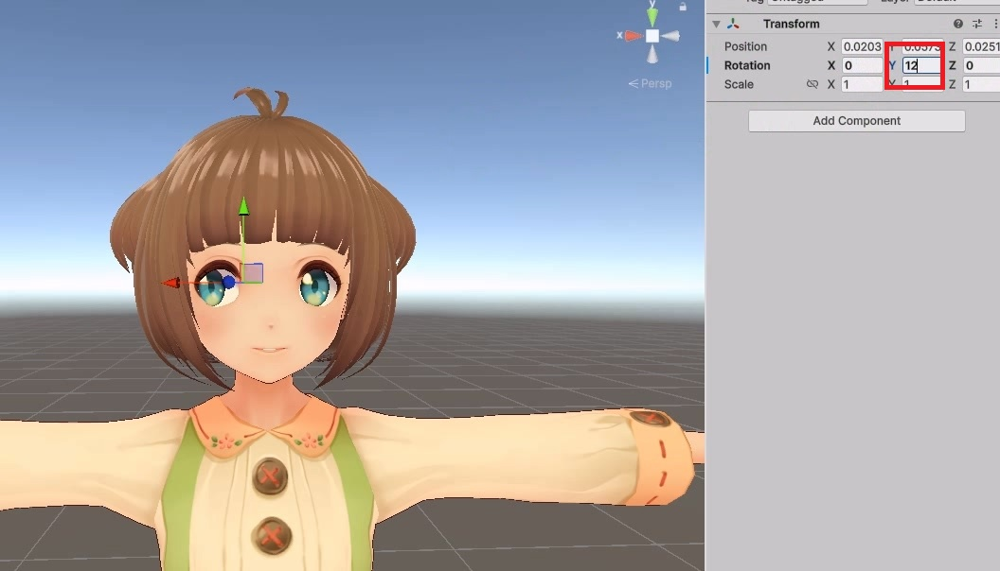
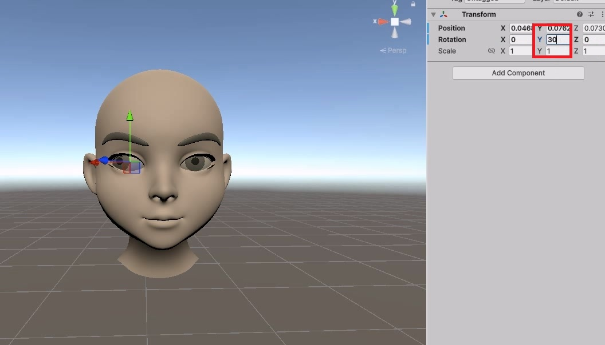

---
sidebar_position: 50
title: 程序选项
---	

# 程序选项

程序中的大部分选项如其字面意思，以下是一些需要额外说明的选项，

## 眼球幅度

部分模型的眼球无法由 ARKit 的眼部 BlendShape 带动。对于这类模型，可以改用眼球骨骼的 VMC 数据控制眼球转动，并根据模型设置眼球的左右和上下幅度。

您可以将模型的眼球骨骼旋转到单侧的极限位置，以此时的角度作为幅度值。

比如以下模型的左右幅度可以取 12 度。

上下幅度同样可以取 12 度。

而以下模型的左右幅度可以取 30 度。

上下幅度可以取 20 度。

注意，眼球骨骼的朝向以 VRM 标准为准。

另外，通常您也可以在接收端调整幅度大小，以下以 Warudo 为例。

