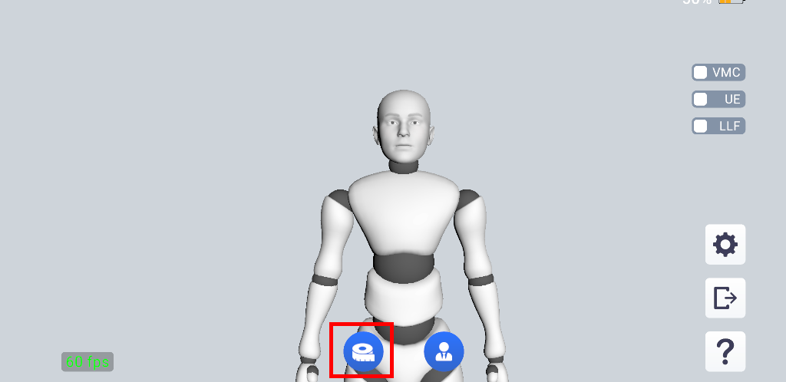
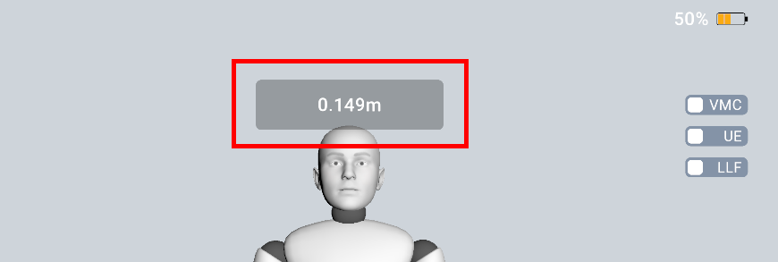

# 测量上臂间距

## 测量的目的

由于您最终使用的模型与我们用于动捕的模型在体型上存在差异，当您双手靠近或者合十时，可能存在最终的模型双手距离较远，或者相互交叉的情况，设置合适的上臂间距可以改善这样的问题。

:::warning 请注意

实时动捕中双手合十，或者类似的身体各部位接触的动作，仍然属于技术难题，无法保证所有情况下都能完美实现。

:::

## 测量方法

测量前请先完成 SAYA 与您的模型的同步，因为测量时需要通过模型观察效果。

点击程序下方的按钮开始测量。

测量时，请双手指尖靠近，置于胸前。

测量过程中，请将双手指尖靠近并置于胸前，同时避免双手紧贴，以免造成捕捉混淆，影响结果。

开始测量后，程序将自动循环调整上臂间距，您可以观察模型，当模型的手腕刚好接触时，通过点头确认。

您也可以在模型手腕接触时，记下画面上显示的数值，并将其手动填写到设置中。

测量过程中可随时再次点击按钮取消。

测量完成后，您可根据需要微调上臂间距参数，以获得更理想的表现效果。

## 测量过程演示视频

以下视频演示了测量上臂间距的过程。

<iframe src="//player.bilibili.com/player.html?bvid=BV1UdiEBWE5c&autoplay=0" width="640" height="360" scrolling="no" border="0" frameborder="no" framespacing="0" allowfullscreen="true"> </iframe>
