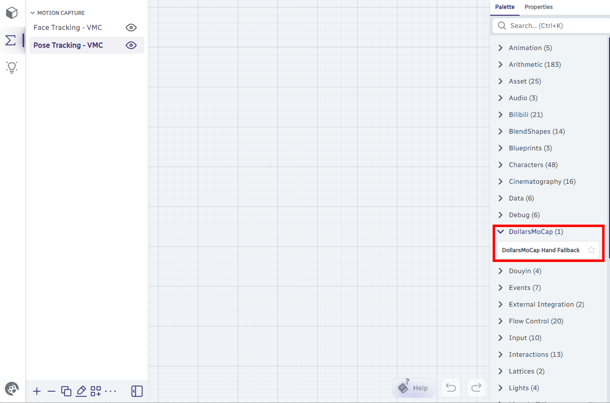

# Warudo 手部动画融合

Dollars SAYA 支持在 Warudo 中，根据手部的可见度，进行动捕和预制动画间的融合。

:::info 注意
本文介绍的是其中一种实现方式。如果您有更好的方案，欢迎[与我们联系](https://www.sunnyview.tech/contact)告知我们，非常感谢。
:::

## 前提条件

- Dollars SAYA 已通过 VMC 协议连接到 Warudo

## 1. 下载自定义节点脚本

在[道乐师网站](https://www.sunnyview.tech/download#misc)下载 **DollarsMoCapHandFallbackNode.cs**，将其放入 Warudo 的 Playground 文件夹，

```
<Warudo安装目录>/Warudo_Data/StreamingAssets/Playground/DollarsMoCapHandFallbackNode.cs
```

:::tip 如何找到 Playground 文件夹
在 Warudo 中点击 **Menu → Open Data Folder**，打开的目录中即可找到 `Playground` 文件夹。
:::

Warudo 会自动编译并加载该脚本。编译成功后，您将可以在蓝图节点列表中的 **DollarsMoCap** 类中看到该节点。



## 2. 修改 VMC 追踪蓝图

打开 Warudo 中 VMC 的 **Pose Tracking** 蓝图，找到 **Switch Float List** 和 **Override Character Bone Rotations** 两个节点。

首先，断开 **Output Float List** 与 **Bone Rotation Weights** 之间的连线。


然后在两者之间插入 **DollarsMoCap Hand Fallback** 节点，按下图所示进行连接。


连线完成后的数据流如下，

| 端口 | 连接来源 |
|---|---|
| DollarsMoCap Hand Fallback → **Input List** | Switch Float List → Output Float List |
| DollarsMoCap Hand Fallback → **Blend Shape List** | Get VMC Receiver Data → BlendShape List |
| Override Character Bone Rotations → **Bone Rotation Weights** | DollarsMoCap Hand Fallback → Output List |

## 调整平滑参数

DollarsMoCap Hand Fallback 节点上有一个 **Smooth Time** 滑块（默认 0.2），用于控制动捕与预制动画之间过渡的平滑程度。

## 技巧
- 双手放松时，请确保它们处于镜头之外，避免在画面边缘时隐时现，导致角色双手始终处于动捕与预制动画的中间状态。
- 建议选择手部处于较低位置的预制动画。动捕时双手通常从画面下方消失，这样可以让过渡更加自然。