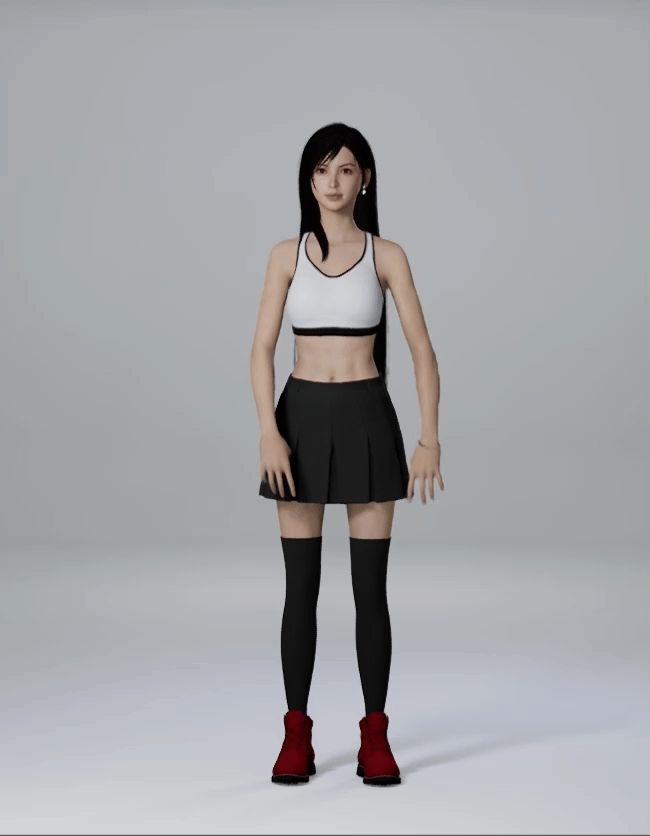
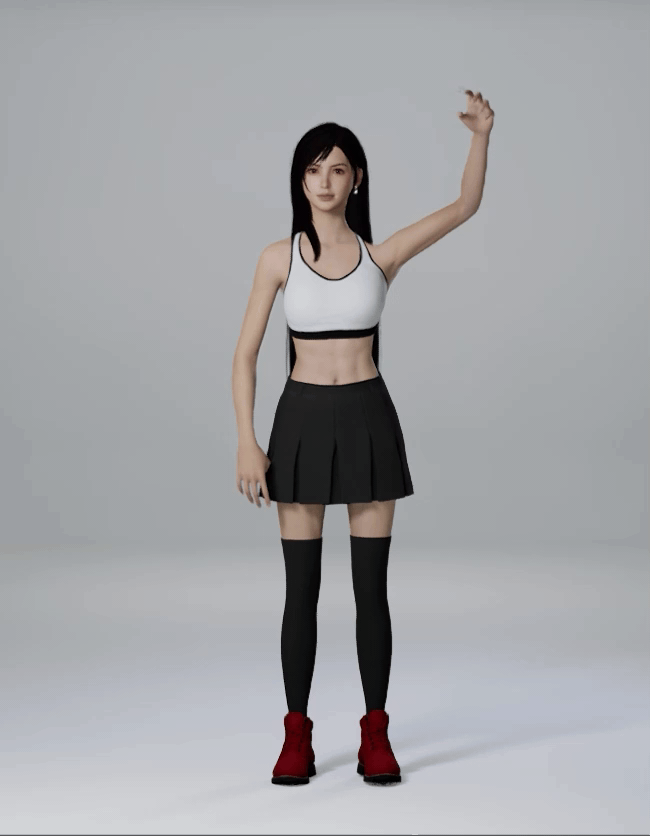

# 身体姿势

SOMA 当前支持以下身体姿势的识别。

## 姿势消息

姿势消息会在对应姿势被识别时发送一次。

对于以下姿势，如果长时间保持，消息会多次发送。

- RaiseRightHand
- RaiseLeftHand
- TPose

在以下消息结束后，会发送表示结束的消息。
- ZoomIn 结束后发送 ZoomInCompleted
- ZoomOut 结束后发送 ZoomOutCompleted

## 姿势一览

其中的**姿势名**，即为在虚幻、Unity 中可以得到的姿势字符串。

|姿势名|显示名|姿势描述|姿势演示|
|---|---|---|---|
|SwipeLeft|右手向左划|右手放在身体右侧，然后平稳地向左侧划动。| 
|SwipeRight|左手向右划|左手放在身体左侧，然后平稳地向右侧划动。| 
|SwipeUp|向上划动|任一手进行上抬，同时另一个手保持自然下垂。| 
|SwipeDown|向下滑动|任一手从高处进行下挥，同时另一个手保持自然下垂| 
|RaiseRightHand|举右手|右手高举过头并保持一段时间| 
|RaiseLeftHand|举左手|左手高举过头并保持一段时间| 
|ZoomIn|放大|双手靠近放在胸前并保持片刻。 之后调整双手之间的距离来控制缩放程度。 双手放下后停止缩放。| 
|ZoomOut|缩小|双手放在身体前方，双手之间距离大于肩宽。 保持该姿势片刻后，调整双手之间的距离来控制缩放程度。 双手放下后停止缩放。| 
|Tpose|TPose|双臂水平伸展并保持一段时间| 
|Jump|原地跳跃|字面意义上的跳一下| 

