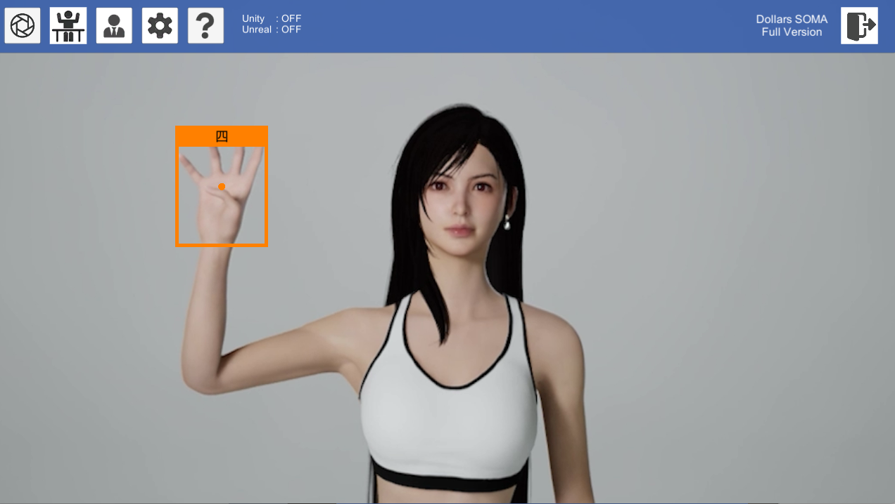
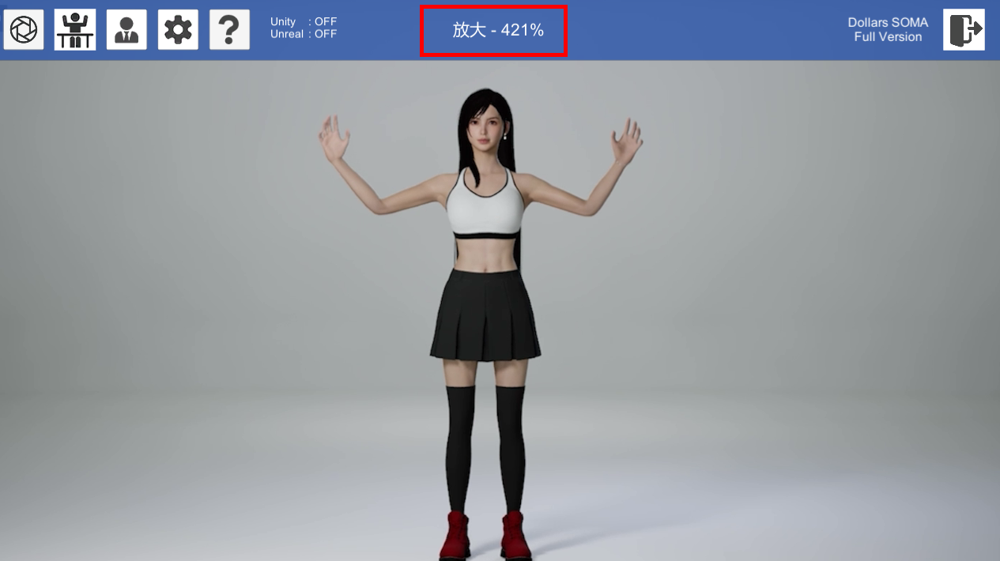
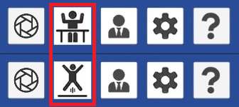
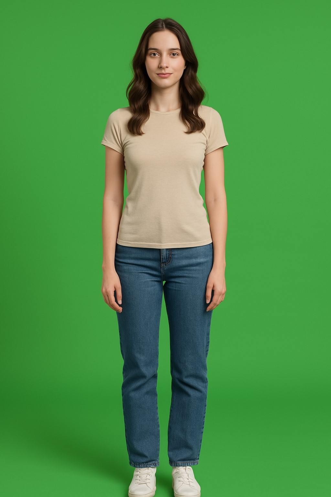

# 开始使用

初次打开后，程序将调用您设备中的主摄像头。您可以在画面中直观地看到被识别出的手势，同时在屏幕上方区域看到被捕捉到的身体姿势。

## 摄像头选项

您可以点击摄像头选项按钮，在弹出的对话框中进行摄像头选择，修改分辨率等操作。

## 模式

您可以通过点击模式按钮，在半身以及全身模式中切换。

半身模式中，白色人偶的腰部以下骨骼将被固定。适用于摄像头无法拍摄到演员全身的情况。

:::warning

跳跃仅在全身模式中生效。

:::

## 校准

我们建议您在识别身体姿势前进行一次校准，这将有效提高识别精度。

半身模式下，请保持双手自然下垂或平放于桌面上，同时保持目视前方。

全身模式下，全身放松，双腿自然并拢即可。

