# 手势

SOMA 当前支持以下手势的识别。

## 手势消息

手势消息会在对应手势被识别时发送一次。保持同样的手势不会导致消息重复发送，直到手势变化之后，才会触发新的消息。

## 手势一览

其中的**手势名**，即为在虚幻、Unity 中可以得到的手势字符串。

|手势名|显示名|触发姿势|
|---|---|---|
|Call|打电话|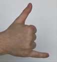 
|Dislike|踩| 
|Fist|握拳|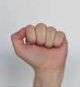 
|Four|四|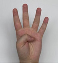 
|Like|赞| 
|Mute|噤声| 
|Ok|OK|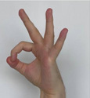 
|One|一|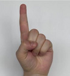 
|Palm|五|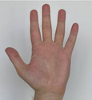 
|Peace|二|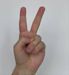 
|PeaceInverted|二(背面)|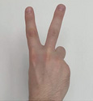 
|Rock|牛角|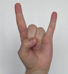 
|Stop|合掌|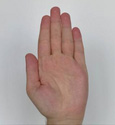 
|StopInverted|合掌(背面)|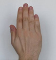 
|Three|三|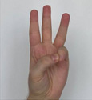 
|TwoUp|剑指|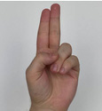 
|TwoUpInverted|剑指(背面)|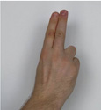

图片鸣谢：

https://github.com/hukenovs/hagrid
