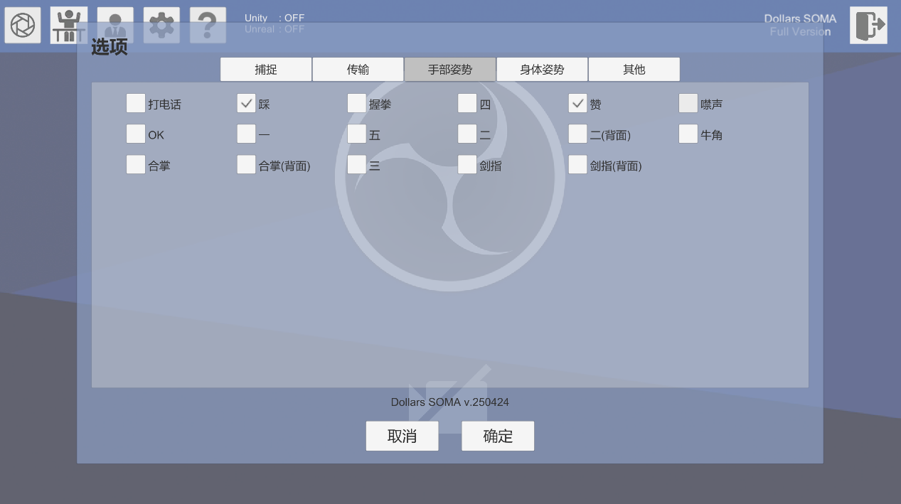
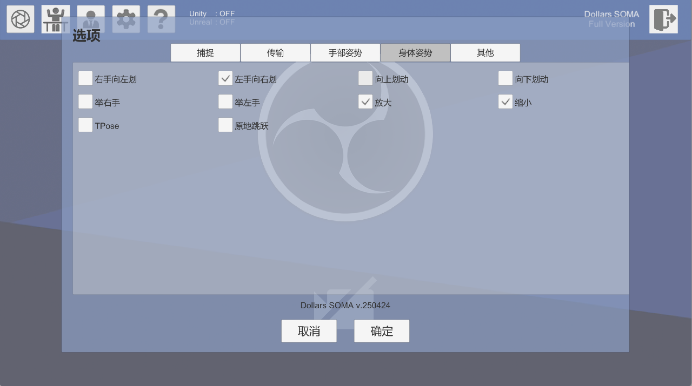

# 程序设置

您可以点击齿轮按钮打开程序设置。

## 捕捉

### 灵敏度

请参见 MONO 中的[相关页面](/Dollars-MONO/sensitivity)。

### 容错度

请参见 MONO 中的[相关页面](/Dollars-MONO/tolerance)。

### 手势容错度

设置越高，则越容易触发手势识别，但是可能会提高误识别率。

### 手势频率

手势识别进行的频率。

:::warning

由于手势识别将耗费较多系统资源，建议您选择合适于您使用场景的适当频率。

:::

## 传输

请参见 MONO 中的[相关页面](/Dollars-MONO/engines)。

## 手部姿势

您可以在这里勾选您需要识别的手势。

## 身体姿势

您可以在这里勾选您需要识别的身体姿势。

:::warning

我们推荐您只勾选必要的姿势，以避免姿势间的误识别（比如向上滑动和举手之间的混淆）。

:::

