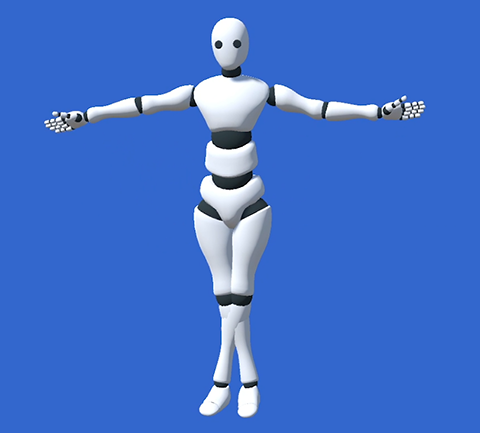
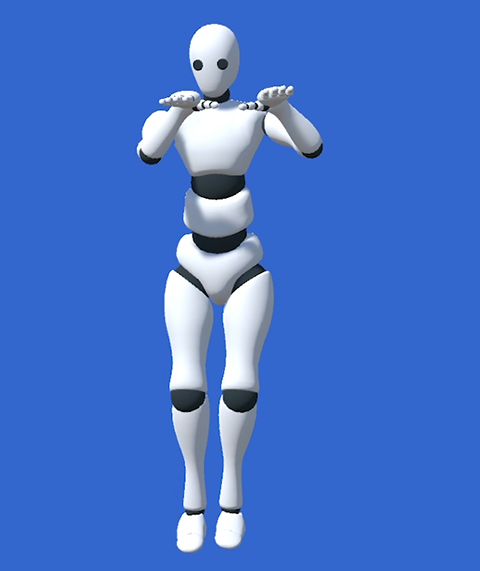
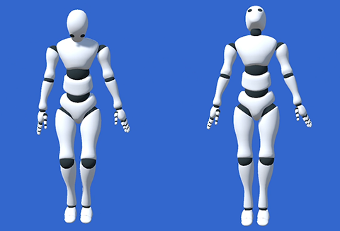

# 常见校准问题

以下是一些常见校准问题以及解决方法。

如果您双脚并拢时，人偶的双脚交叉，那是因为校准时您双腿没有并拢。

请并拢双腿，再次校准。

如果您双手向前伸平时，发现人偶的双手弯曲，是因为校准时双臂没有打开或者伸平。

请伸直肘部，展开双臂再次校准。如有必要，可以双手稍许向身后伸展。

如果您在放松状态下，发现人偶的头抬得过高或者过低，那是因为校准时有抬头或者低头的动作。

请确保在双目平视前方的状态下完成校准。

