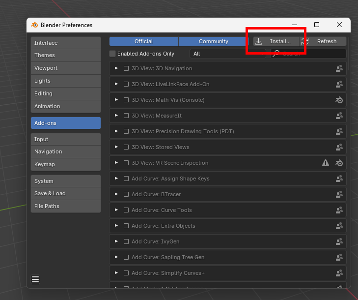
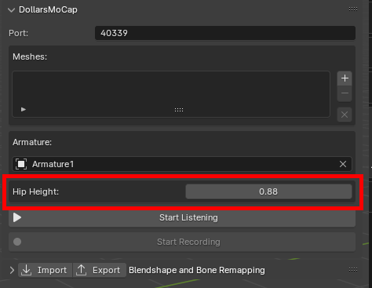

# 在 Blender 中使用道乐师插件

:::info

道乐师的以下产品支持原生 Blender 插件：

- Dollars MONO（自 v.250522 起）
- Dollars EGAO（自 v.250601 起）
- Dollars NVIS（自 v.250609 起）

:::

## 插件下载与安装

您可以在[道乐师网站](https://www.sunnyview.tech/download)下载道乐师的原生 Blender 插件。

下载后无需解压，在 Blender 的 Preferences 界面中，

**1.** 切换至 Add-ons 标签页，

**2.** 点击右上角的 Install，

**3.** 选择下载的压缩文件进行安装，并且勾选激活。

安装成功后，您将可以在 Blender 侧边栏看到 DollarsMoCap 标签页。

## 对模型的要求{#models}

### 动作捕捉

用于动作捕捉的模型需满足以下条件，

- **骨架 Transform**
    - Location 为 (0, 0, 0)
    - Rotation 为 (0, 0, 0)
    - Scale 为 (1，1，1)
- **骨架姿态**
    - 处于标准 TPose

#### 注意事项：

- **如果骨架 Location 或 Rotation 不为 (0, 0, 0)**

这可能导致动捕动作不正确。您可以在开始动捕前，选中骨架后，在 Object 菜单中选择 Apply > All Transforms，将位置和旋转归零。

- **如果骨架 Scale 不为 (1, 1, 1)**

这会导致模型腰部运动异常。您可以在设置腰部骨骼后，手动调整 Hip Height 参数，将其修正为腰部骨骼的实际高度（单位：米）。

### 面部捕捉

用于面部捕捉的模型需满足以下条件，

- **Blendshape 命名**

建议使用 ARKit 命名方式为 Blendshape 命名。

- **多 Mesh 一致性**

如果您的模型包含多个面捕相关的 Mesh，各个 Mesh 中的 Blendshape 名称需要保持一致。

#### 注意事项：

如果您的 Blendshape 采用非 ARKit 命名方式，也可在插件的 Blendshape Remapping 面板中进行映射。

## 卸载插件

如需卸载道乐师插件，可点击左侧的三角图标展开插件详情，随后点击 Remove 即可进行移除。

