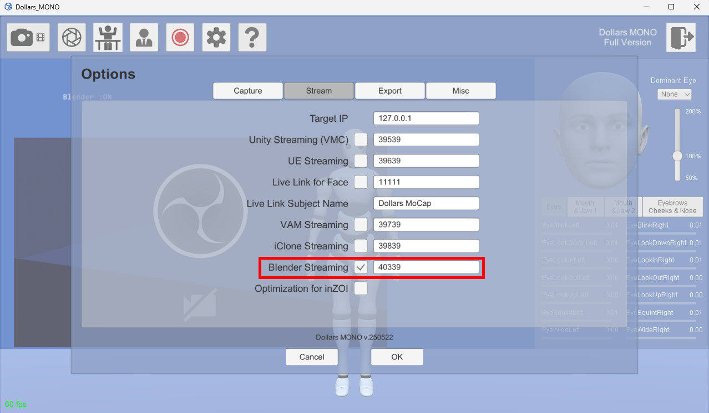
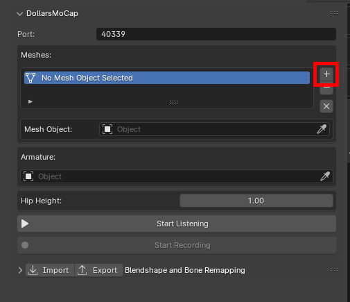
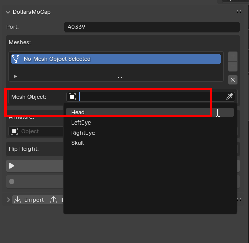
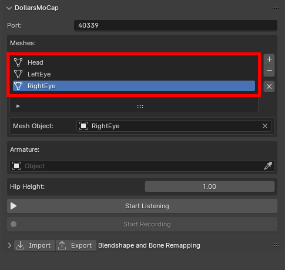
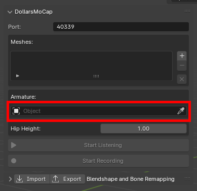
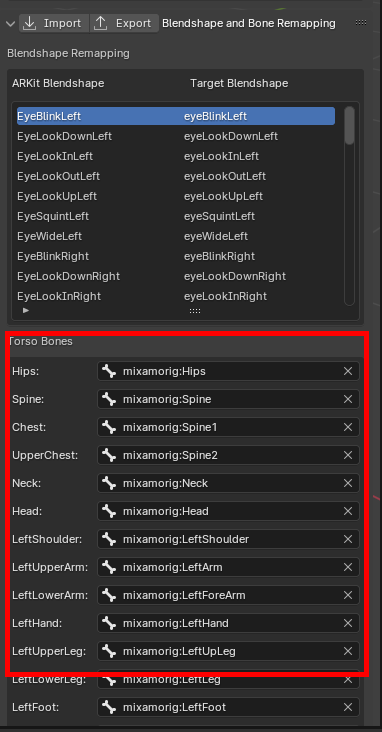
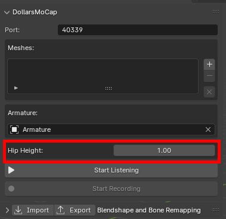
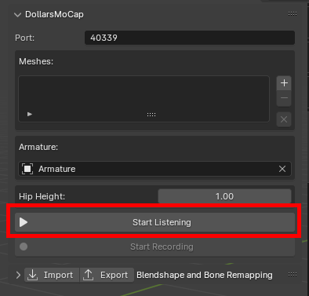
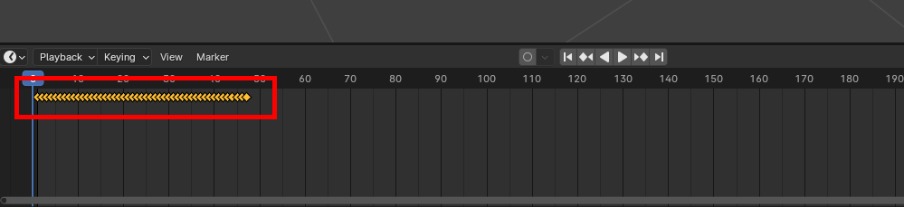
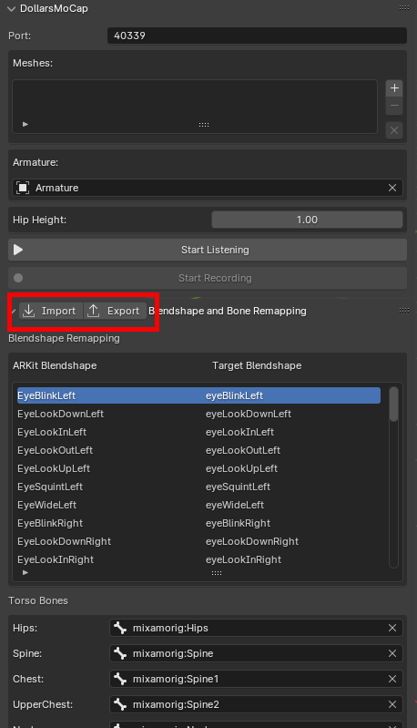

# 操作流程

## 步骤详解

### 1. 启动推送功能

在道乐师端打开 Blender 推送，根据需要可以修改端口。

### 2. 导入模型

在 Blender 中导入您的模型。

您可以在[这里](/blender-plugin#models)查看对于模型的要求。

### 3. 配置面部捕捉 Mesh

对于面部捕捉，您需要在 Meshes 列表中添加所有用于面捕的 Mesh。

#### 3.1 点击 + 增加一个 Mesh 对象

#### 3.2 选择对应的 Mesh

#### 3.3 如果您的模型包含多个用于面捕的 Mesh，可以重复以上步骤，添加多个 Mesh。

如果您的模型的 Blendshape，未使用 ARKit 命名方式，可在 Blendshape Remapping 面板中修改 Target Blendshape 的名称。

### 4. 配置动作捕捉骨架

在 Armature 中选择模型骨架。

插件会根据骨骼命名自动匹配骨骼，您也可以在 Bone Remapping 面板中手动调整。

插件会根据腰部骨骼自动获取腰部高度，您也可以手动修改该值（单位：米）。

### 5. 连接与实时预览

点击 Start Listening，与道乐师程序建立连接，实时查看动捕与面捕效果。

### 6. 录制捕捉数据

点击 Start Recording，开始录制捕捉数据。

录制完成后，您将可以在 Timeline 中看到对应的关键帧。

:::info 注意
建议在回放录制数据前，断开与道乐师程序的连接。
:::

## 导出与导入映射配置文件

### 导出配置

完成 Blendshape 或骨骼映射设置后，您可以点击 Export 导出当前配置，以便后续直接使用。

### 导入配置

如需复用之前保存的配置文件，只需点击 Import，选择目标文件，即可快速载入对应的映射设置。

注意，如果您希望导入骨骼映射配置，请先设置目标 Armature，以确保配置文件能正确应用到当前模型的骨骼上。