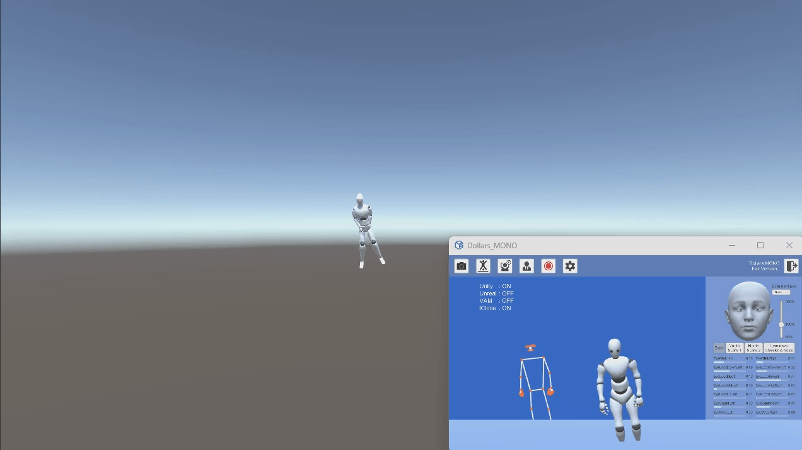
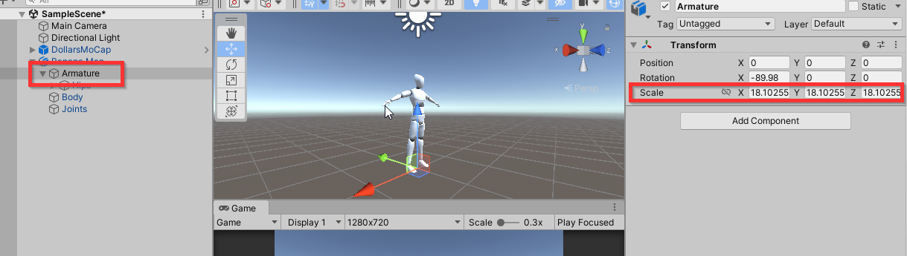
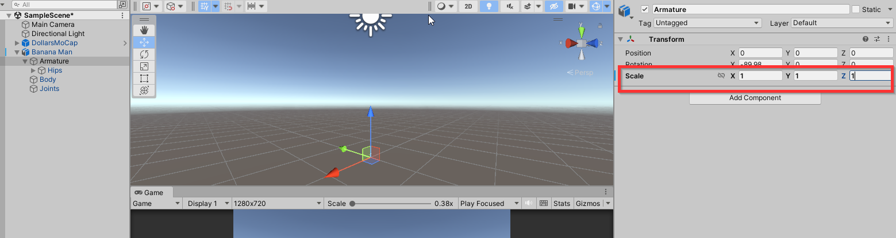
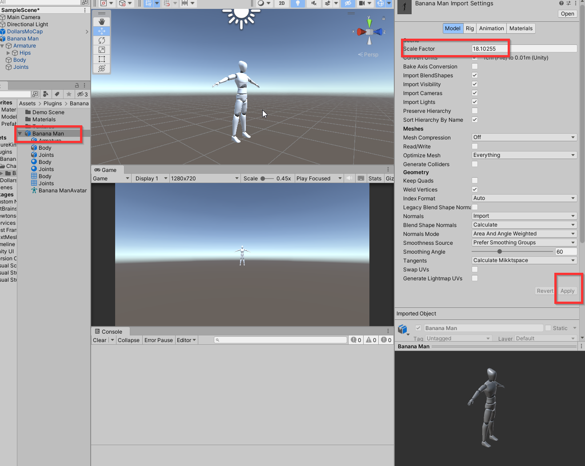

---
sidebar_position: 70
title: 常见问题
slug: /unity-faq
---	

# 常见问题

import TOCInline from '@theme/TOCInline';

<TOCInline toc={toc} />

## Unity 场景中的人物飘动

如果您发现你在摄像头前移动了小段距离，Dollars MONO 也识别出了您的移动，但是在 Unity 场景中，您的虚拟人物不移动，或者移动了一大段距离，比如下图，

这通常是因为，虚拟人物的 Hips 骨骼，或者其某个父节点的 Scale 不为 1。

比如下图中的 Hips 骨骼的父节点 Armature，Scale 为 18.1。

此时，我们可以将 Armature 的 Scale 改为 1。

同时在模型的 Import Settings 中，将 Scale Factor 改为刚才的 18.1，并且 Apply。

之后就可以看到虚拟人物可以正常移动了。

