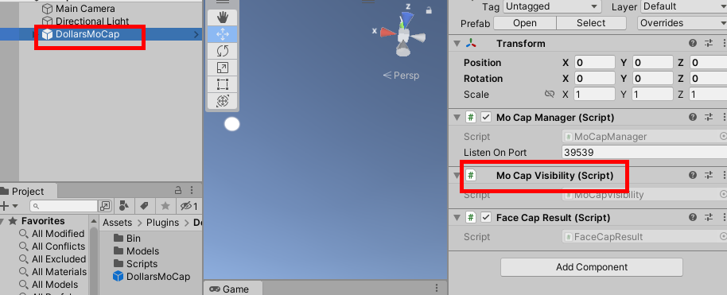
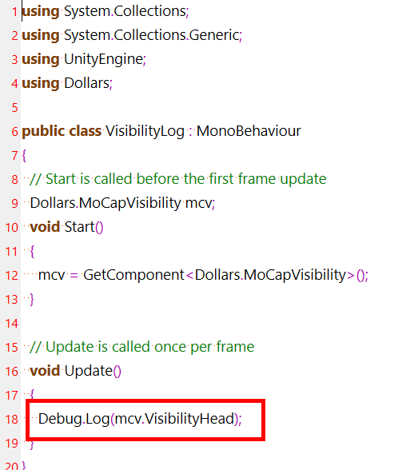

# 人物追踪状态

您可以通过获取 **DollarsMoCap** prefab 中的 **MoCapVisibility** 组件，

从中取得 **VisibilityHead** 的值，来判断当前是否有对象处于追踪状态。

如果对象处于追踪状态，通常该值会大于 0.95。

除了 **VisibilityHead** 外，**MoCapVisibility** 还含有以下追踪值，您可以根据需要使用。

- VisibilityLeftHand

- VisibilityRightHand

- VisibilityHip

- VisibilityLeftLeg

- VisibilityRightLeg