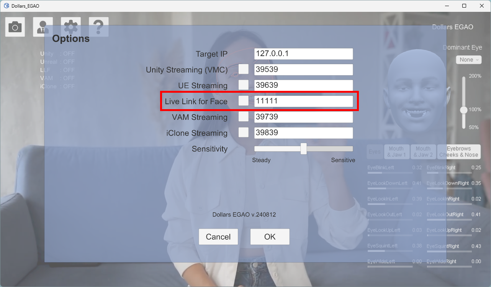
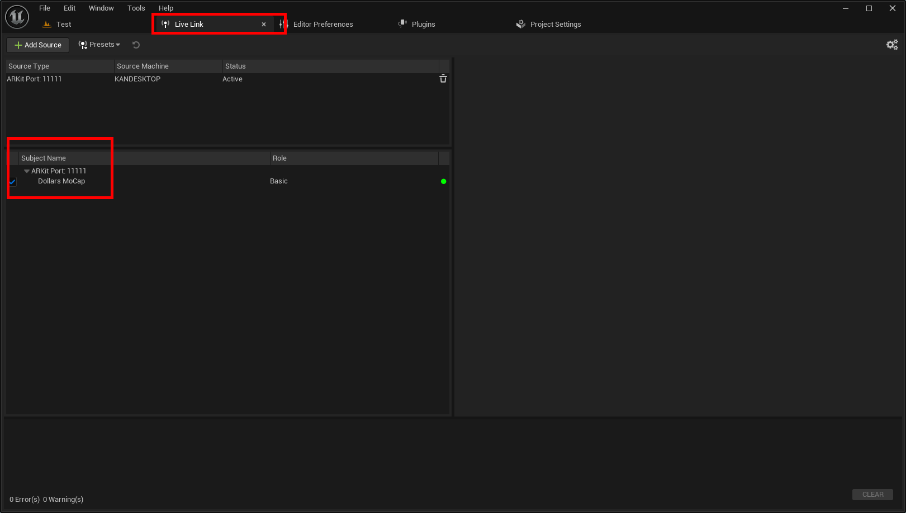
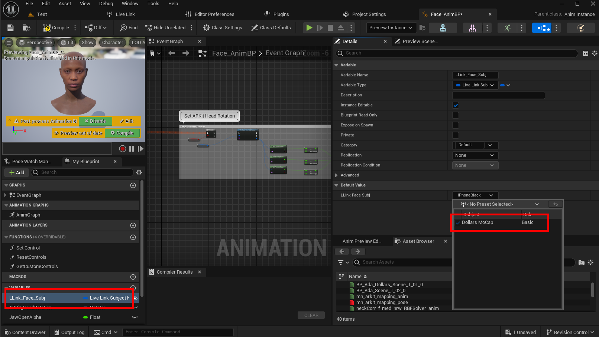

# LiveLinkFace 方式的面捕
:::info

道乐师的以下产品支持 LiveLinkFace 方式的面捕，

- Dollars MONO（自 v.240711 起）
- Dollars EGAO（自 v.240812 起）
- Dollars NVIS（自 v.240812 起）

:::

对于支持 Live Link Face 方式的道乐师程序，您可以在设置中打开对应的开关。您也可以根据需要修改使用的端口。

打开 Live Link for Face 之后，您可以在虚幻编辑器的 Live Link 窗口中，看到名为 Dollars MoCap 的对象名。

:::warning注意

如果您在编辑器中无法看到 Dollars MoCap 对象，请确认您只打开了一个虚幻项目。

:::

之后，您就可以在动画蓝图中，选择 Dollars MoCap 作为面捕输入。以下以 MetaHuman 为例。

