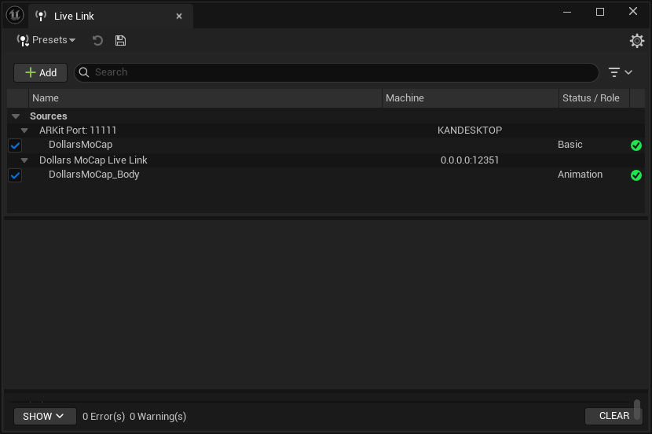
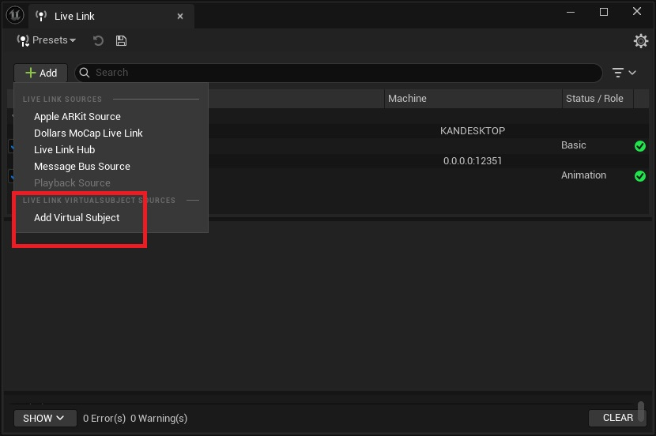
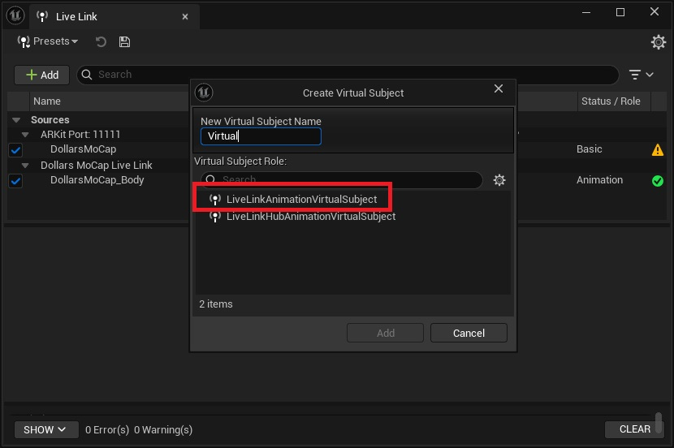
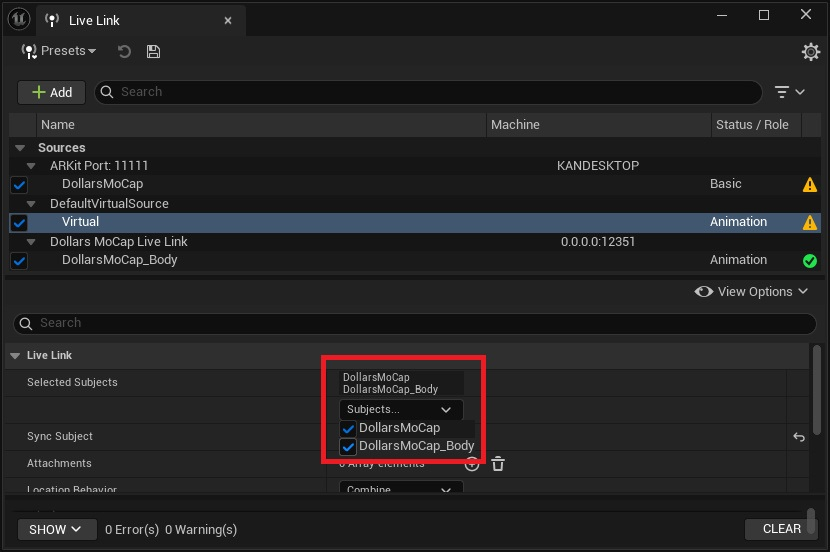
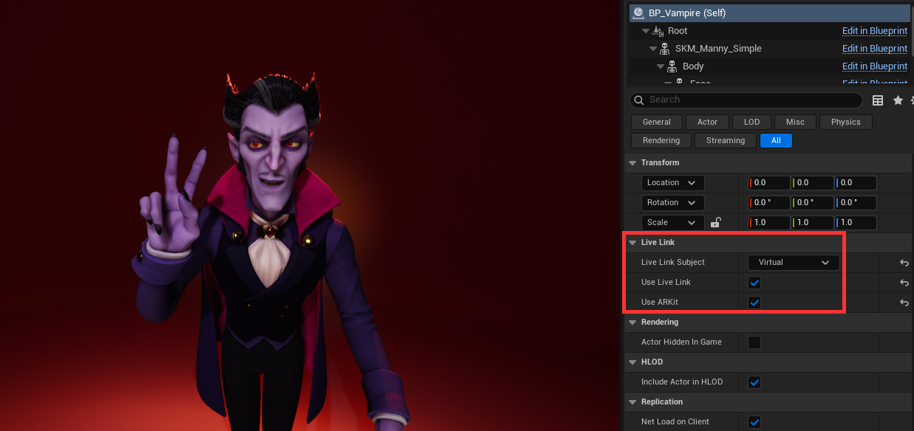

# MetaHuman 合并动捕面捕

MetaHuman 默认的角色蓝图中只提供了一个 Live Link Subject，无法分别指定身体与面部来源。可以使用 Live Link 的 Virtual Subject，将动捕与面捕合并为一个 Subject，再指定给 MetaHuman。

合并前，请先分别接好动捕（身体）与面捕（面部）的 Subject，可参考 [使用 Live Link 插件](/ue-livelink) 与 [LiveLinkFace 方式的面捕](/ue-livelinkface)。

:::info

本节以道乐师的 LiveLinkFace 方式面捕为例。若您使用手机上的 Live Link Face 应用，只需将面捕 Subject 替换为对应的 Subject 即可。

:::

1. 在 Live Link 窗口中新建一个 Virtual Subject。

2. 将类型选择为 Animation。

3. 在该 Virtual Subject 的设置中，勾选动捕与面捕两个 Subject，使其同时包含身体骨骼与面部数据。

4. 在 MetaHuman 的角色蓝图中，将 Live Link Subject 指定为这个 Virtual Subject，此时便能同时获得身体动作与面部表情。

