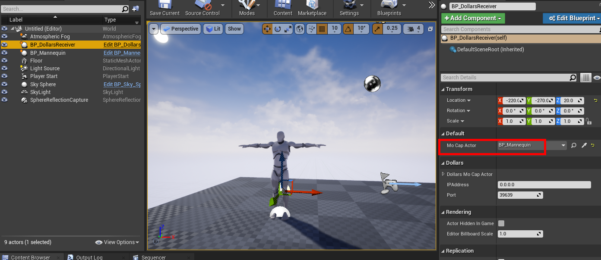
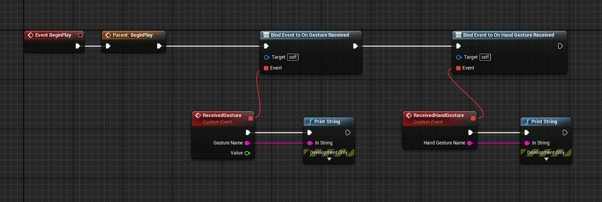

# 姿势识别

:::info

道乐师的以下产品支持本文提及的姿势识别：

- Dollars SOMA
- Dollars DEEP Lite

:::

在虚幻项目中接收姿势识别消息的过程与接收动捕数据类似，具体步骤如下：

## 监听姿势消息

### 1. 添加插件

首先，您需要将插件添加到项目中，您可以在在[这里](/ue-getstarted)查看相关信息。

### 2. 前提条件

为了接收姿势识别消息，请确保满足以下条件：

- 您的角色蓝图继承自 ```BP_DollarsMoCapActor```
- 在场景中添加 ```BP_DollarsReceiver```，并在角色蓝图中选中该 Receiver。

### 3. 接收姿势识别消息的独有操作

除了上述设置，还需要执行以下操作：

**- 在 Receiver 中设置 MoCapActor**

如果您希望获得姿态识别的消息，除了在角色蓝图中指定 Dollars Receiver 之外，您还需要在 Dollars Receiver 中，指定角色蓝图。



**- 绑定姿势消息**

您需要在角色蓝图中，绑定 On Gesture Received，On Hand Gesture Received 消息，下图是简单示例。



## 消息参数说明

- ```Gesture Name``` 参数表示捕捉到的姿势或手势的名称。
- ```Value``` 参数在 ZoomIn 和 ZoomOut 动作中表示双手当前距离与动作触发时的比例；在其他动作中，该值始终为 0。

