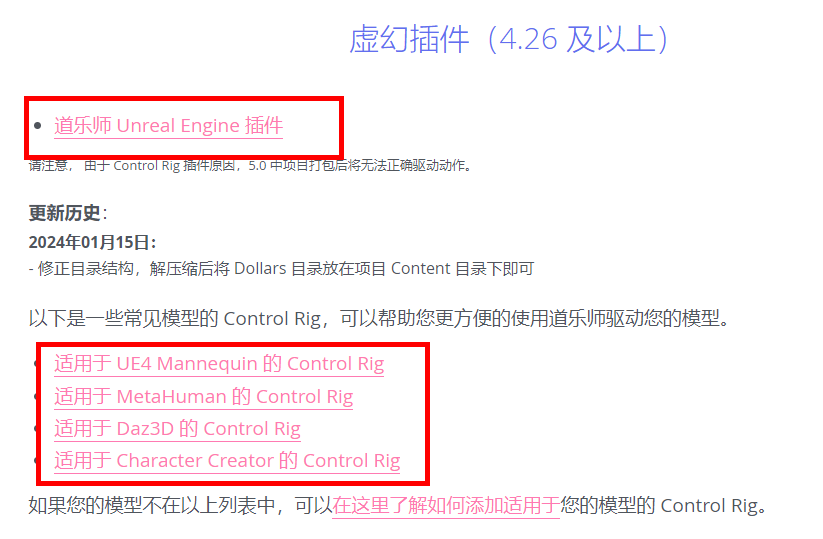
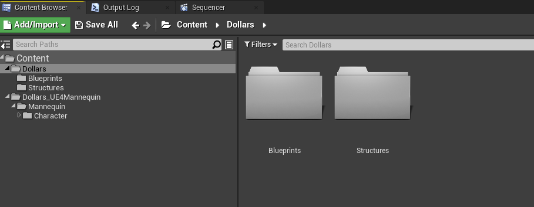
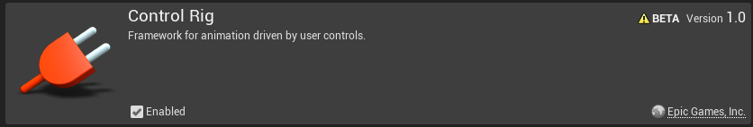
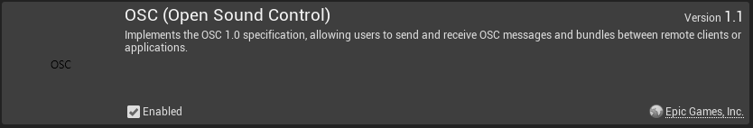
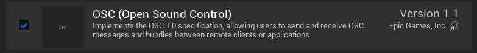

---
sidebar_position: 5
title: 开始使用
slug: /ue-getstarted
---	
# 开始使用

## 虚幻版本

道乐师支持 4.26，4.27，以及所有 5.X 版本的虚幻。

其中 5.0 存在打包后动捕失效的问题，建议使用 5.1 或更高版本。

## 下载道乐师插件

您需要在道乐师官网下载虚幻插件以及所需的 Control Rig。

## 复制插件到您的项目

解压缩下载的文件，并将 Dollars 目录、以及 Control Rig （这里以 UE4 Mannequin 为例）目录复制到您项目中的 Content 目录下。注意保持 Dollars 目录结构不变。

此时，您打开项目后，文件结构应该如下图所示，

:::warning 注意
在第一次复制时，改变 Dollars 目录的位置会引发编译错误。
:::

:::info
如果您希望改变 Dollars 目录位置，可以打开项目，确保编译无误后，在虚幻编辑器中拖动该目录。
:::

## 激活插件

在虚幻 4 各版本中，您需要激活的插件包括 Ctrl Rig 和 OSC，

在虚幻 5 中，由于 Ctrl Rig 已默认激活，您只需激活 OSC 即可。

## 开始！

激活插件并重启项目后，准备工作结束，您可以开始与您的模型相关的整合了。

您可以在[这里](/ue-characters)进一步查看各种骨骼与道乐师整合的方法。