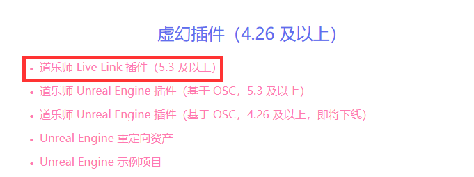
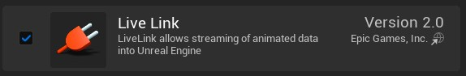
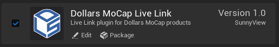
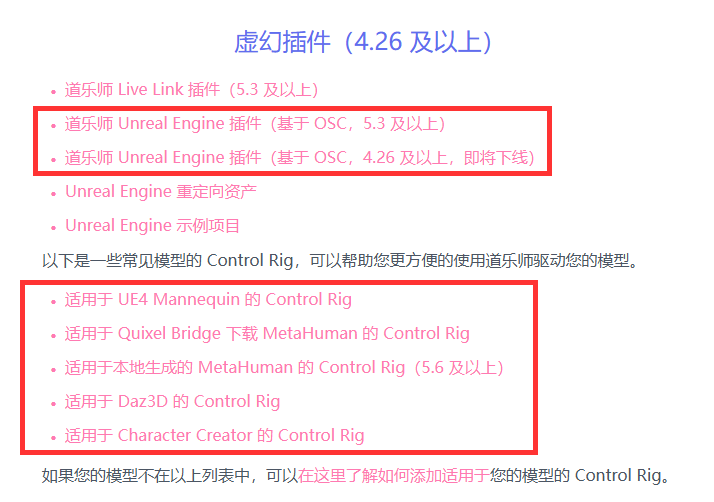
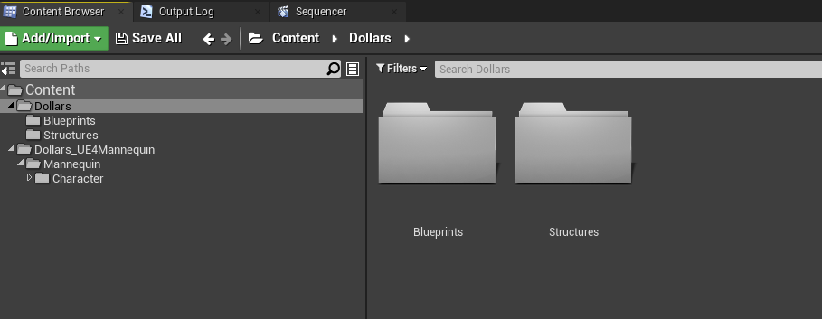
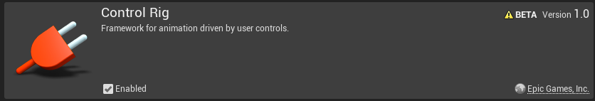
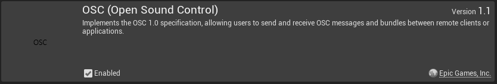
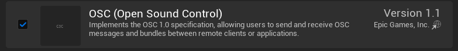

---
sidebar_position: 10
title: 开始使用
slug: /ue-getstarted
---	
# 开始使用

## 插件形式

道乐师为虚幻提供 Live Link 与 OSC 两种插件。您可以根据所使用的道乐师产品和目标角色，选择其中一种。

:::tip 推荐
若您使用的道乐师产品支持 Live Link，建议优先使用。
:::

## 虚幻版本

### 基于 Live Link 的插件

支持虚幻 5.3 及更高版本。

### 基于 OSC 的插件

支持虚幻 4.26、4.27 以及所有 5.X 版本。

其中 5.0 存在打包后动捕失效的问题，建议使用 5.1 或更高版本。

## Live Link 插件

### 下载插件

请在道乐师官网下载 Live Link 插件。



### 复制插件到您的项目

解压下载的文件，根据您的虚幻版本选择对应的插件目录，复制到项目根目录的 `Plugins` 文件夹中（若没有该文件夹，请先新建）。

复制完成后，项目结构应类似：

```
您的项目/
  Plugins/
    DollarsMoCapLiveLink/
```

### 激活插件

打开项目后，在 `编辑 > 插件` 中确保启用以下插件，

- **Live Link**（虚幻自带）
- **Dollars MoCap Live Link**（道乐师提供）





启用后重启项目即可。


## OSC 插件

### 下载插件

您需要在道乐师官网下载虚幻插件以及所需的 Control Rig。



### 复制插件到您的项目

解压下载的文件，将 Dollars 目录与 Control Rig（这里以 UE4 Mannequin 为例）目录复制到您项目的 Content 目录下，并保持 Dollars 目录结构不变。

此时，您打开项目后，文件结构应该如下图所示，



:::warning 注意
在第一次复制时，改变 Dollars 目录的位置会引发编译错误。
:::

:::info
如果您希望改变 Dollars 目录位置，可以打开项目，确保编译无误后，在虚幻编辑器中拖动该目录。
:::

### 激活插件

在虚幻 4 各版本中，您需要激活的插件包括 Ctrl Rig 和 OSC，






在虚幻 5 中，由于 Ctrl Rig 已默认激活，您只需激活 OSC 即可。




## 开始！

完成上述安装后，准备工作就结束了，接下来即可开始与您的模型整合。

您可以前往[使用您的角色](/ue-characters)，进一步了解各种骨骼与道乐师整合的方法。