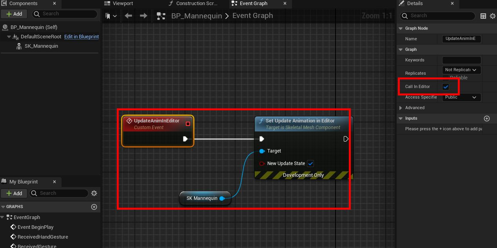
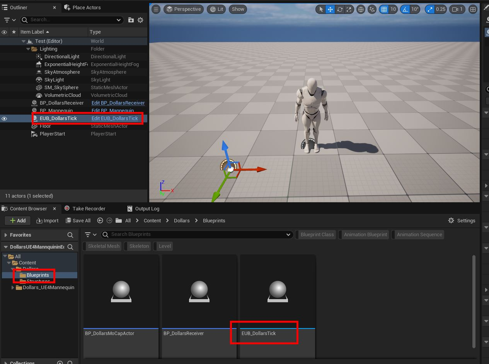
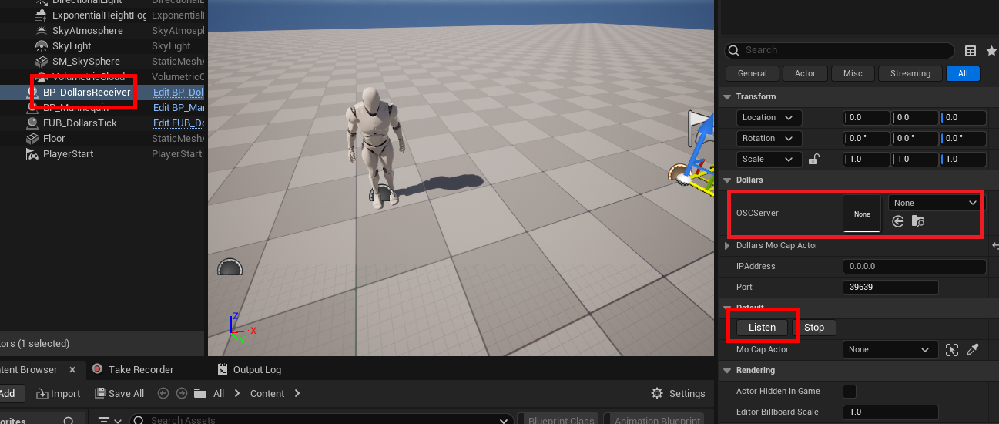
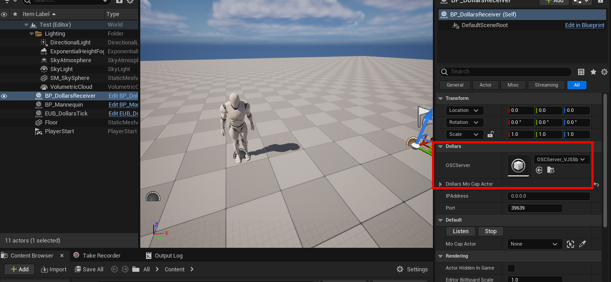
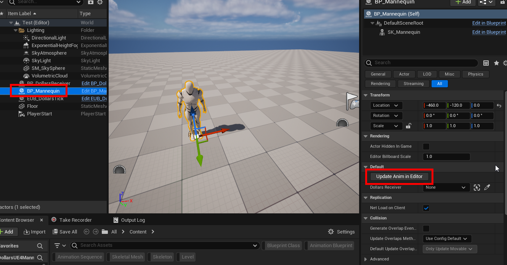

---
sidebar_position: 12
title: 在编辑器中使用
slug: /ue-ineditor
---	

# 在编辑器中使用道乐师插件

:::info

您需要支持 5.3 以上版本的道乐师插件，才能使用本文介绍的编辑器实时控制功能。

另外，编辑器中使用道乐师只适用于单个动捕角色，暂时不支持同时在编辑器中控制多个角色。

:::


## 准备

1. 您需要首先完成我们在[各个视频](/ue-characters)中介绍的整合步骤，将您的角色与道乐师插件联动起来。

2. 在角色蓝图中，添加一个自定义事件，在其中为**所有 Skeletal Mesh** 激活 Set Update Animation in Editor。并将该事件设为可在编辑器中调用。



3. 在场景中，除了放置角色蓝图和 DollarsReceiver 外，再添加一个 ```Dollars > Blueprints > EUB_DollarsTick```。



## 使用（以 UE4 Mannequin 项目为例）

1. 选择场景中的 Dollar Receiver，点击详情中的 Listen。

如果点击 Listen 前，OSCServer 变量不为 None，可以点击 Stop 将其清空。



2. 点击 Listen 后，可以看到 OSCServer 变量被赋值。



3. 选择角色蓝图，点击您在**准备**步骤中创建的自定义事件按钮。



4. 打开道乐师中的虚幻同步，便可在编辑器中实时控制虚拟角色。