# 使用 Live Link 插件

:::info

道乐师的以下产品支持 Live Link 插件，

- Dollars MONO（自 v.260623 起）

:::

## 准备

请先按 [开始使用](/ue-getstarted) 中的说明，安装道乐师 Live Link 插件，并在虚幻中启用 Live Link 插件。

## 开启道乐师的 Live Link 推送

在道乐师的设置中打开 Live Link 推送开关。您也可以根据需要修改使用的端口。

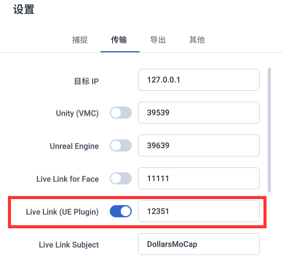

## 添加 Live Link 源

打开虚幻编辑器的 Live Link 窗口，在 Source 中添加 Dollars MoCap Live Link 源。若上一步修改过端口，请在此填入相同的端口。

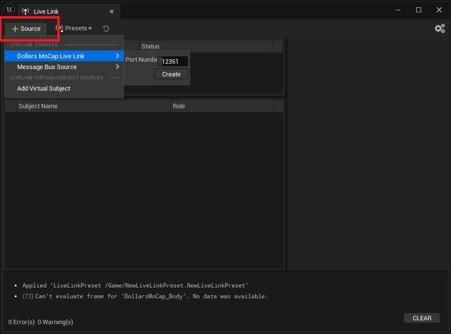

添加后即可看到对应的 Subject。

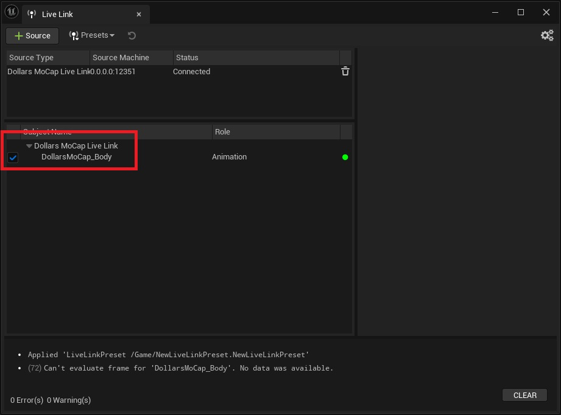

若启用了多人动捕，则会看到多至五个 Subject。

:::warning 注意

如果在编辑器中看不到道乐师的 Subject，请确认只打开了一个虚幻项目。

:::

## 接收动作

道乐师的 Live Link 以虚幻示例角色 **SKM_Manny_Simple** 的骨骼为标准传输动作数据。

若项目中还没有该角色，可以在 Content Browser 中点击 Add 添加内容，

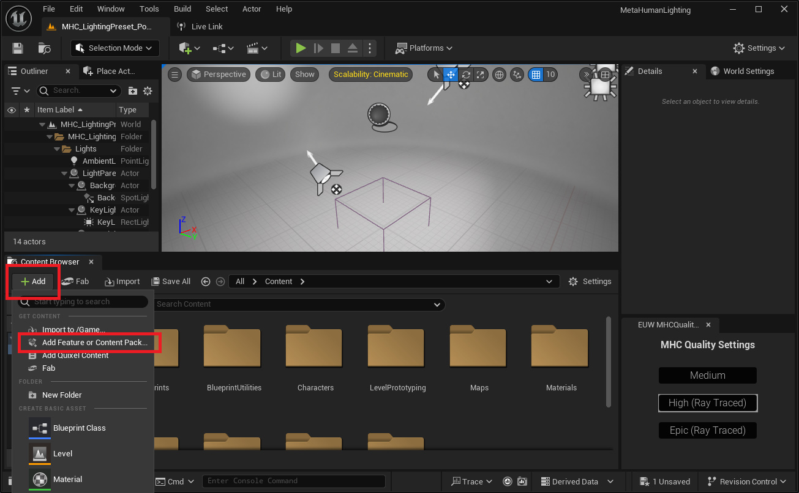

选择包含该角色的 Third Person 或 Top Down 模板，

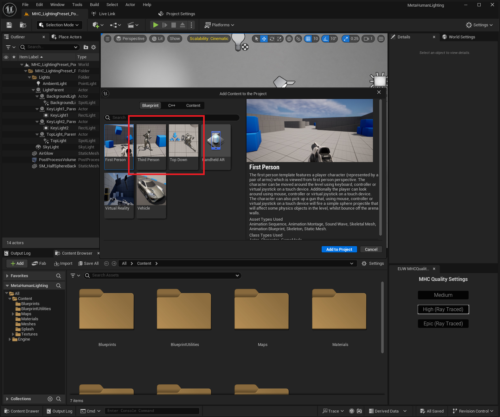

接着选中 SKM_Manny_Simple，右键新建一个动画蓝图，

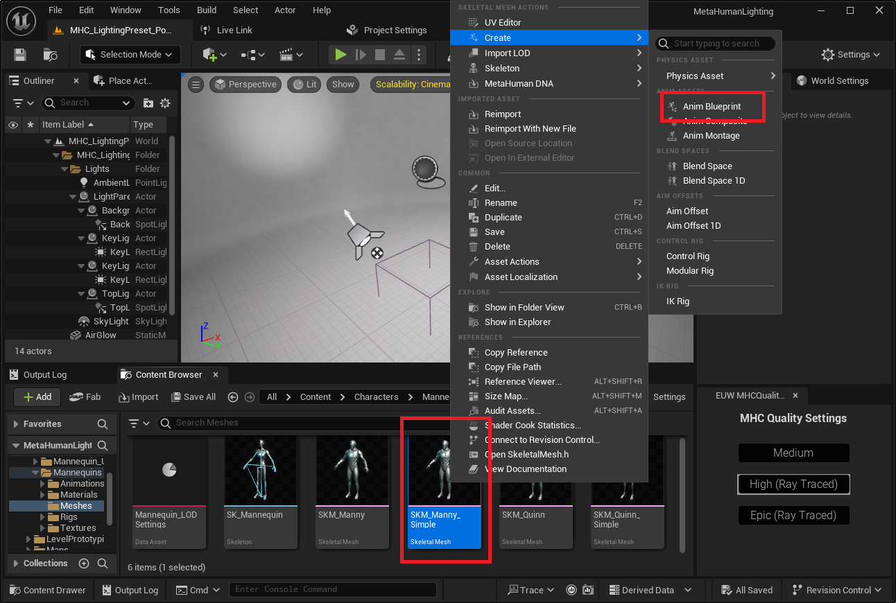

在其中加入 Live Link Pose 节点，并将动作来源选为 Dollars MoCap。

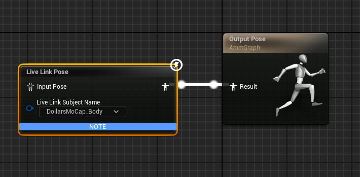

完成后，SKM_Manny_Simple 便能直接接收动作。

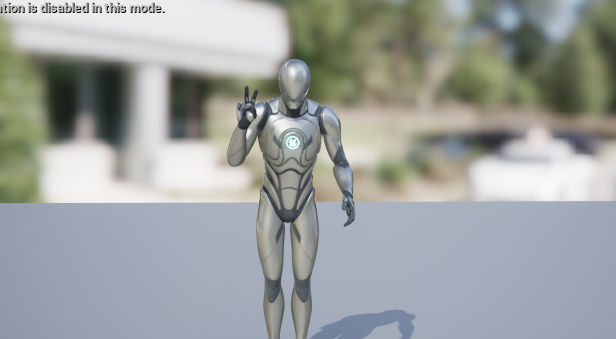

## 驱动您的角色

确认 SKM_Manny_Simple 能正常接收动作后，就可以驱动您自己的角色了。若您的角色使用其它骨骼，需要先把动作从 SKM_Manny_Simple 重定向过来。

以下以 Epic 的 [MetaHuman Vampire](https://www.fab.com/listings/59278ffd-5879-4538-affb-a65a829acc54) 为例。

### 创建 IK Rig

分别为 SKM_Manny_Simple 和 SKM_Vampire_Body 创建 IK Rig，并设置好各自的重定向链。

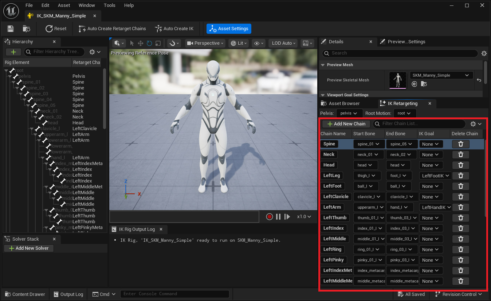

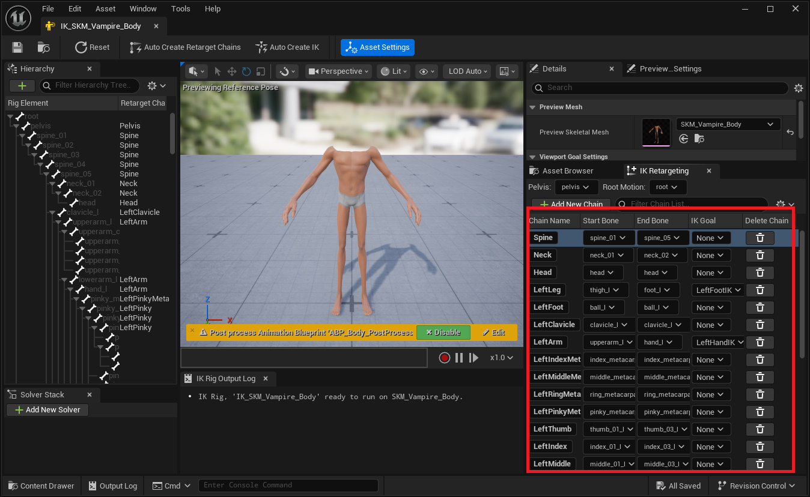

### 创建 IK Retargeter

新建一个 IK Retargeter，源（Source）选择 SKM_Manny_Simple 的 IK Rig，目标（Target）选择 SKM_Vampire_Body 的 IK Rig。

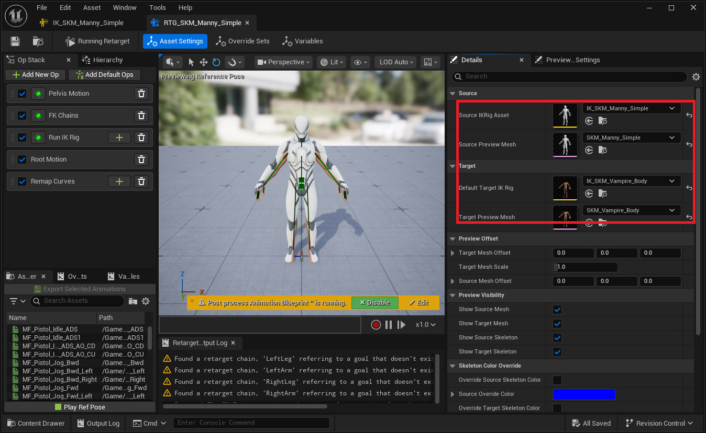

### 角色蓝图中添加 SKM_Manny_Simple

将 SKM_Manny_Simple 添加到角色蓝图中，置于 Root 之下、作为 Vampire 身体（Body）的父级，并为其指定「接收动作」一节中创建的动画蓝图。

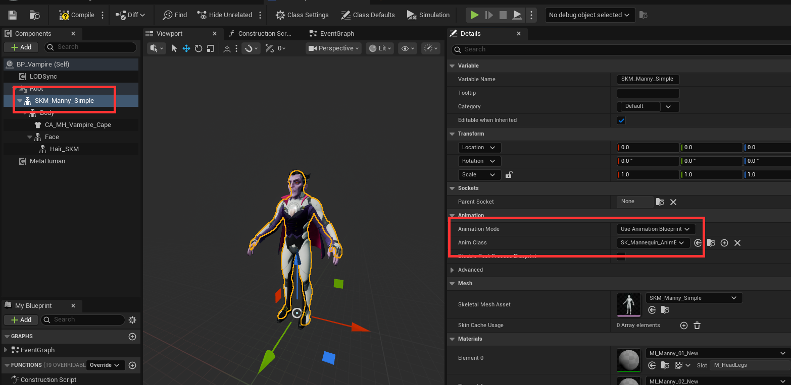

取消勾选 Visible，让 SKM_Manny_Simple 只负责接收动作，不在画面中显示。

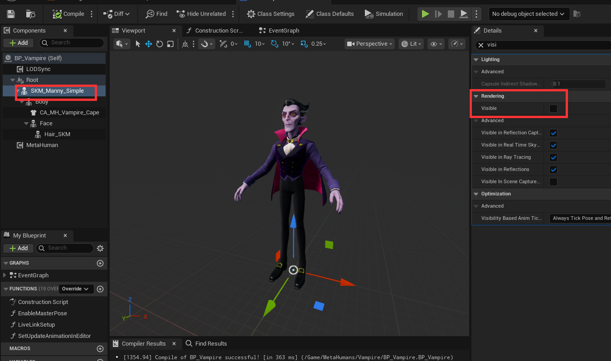

### 在动画蓝图中重定向

在 Vampire 的动画蓝图中断开原有的 Copy Pose From Mesh，改为加入 Retarget Pose From Mesh 节点，

- 将 Retarget From 设为 Parent，即指向被 Live Link 驱动的 SKM_Manny_Simple
- 将 IK Retargeter Asset 设为前面创建的 IK Retargeter

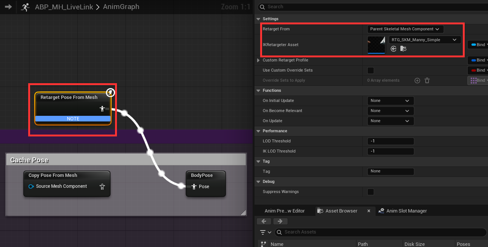

这一步的作用是，隐藏的 SKM_Manny_Simple 先接收道乐师输出的标准骨骼动作，再由 Retarget Pose From Mesh 借助 IK Retargeter 重定向到 Vampire 的骨骼上。

这样，Vampire 就能跟随道乐师的动作。

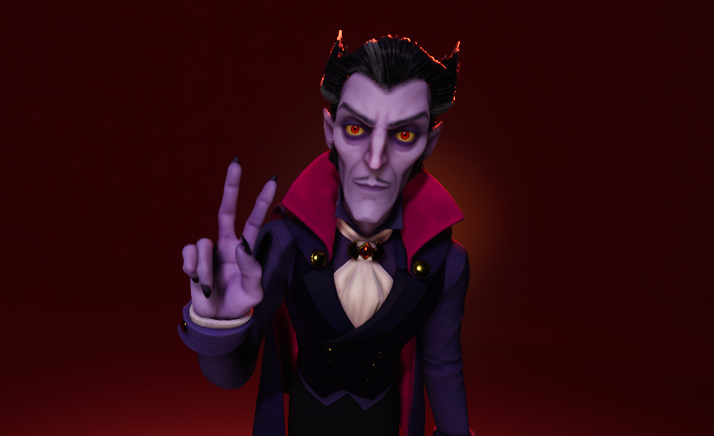

## 打包

Live Link 的源不会随关卡一起保存，因此打包前需要将其保存为 Preset，并设置为启动时自动加载。

添加源之后，在 Live Link 窗口中将其保存为一个 Preset。

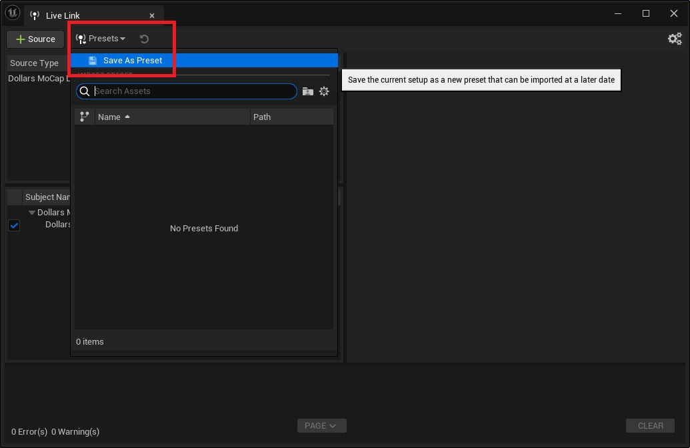

打开 编辑 → 项目设置，在左侧的 插件 → Live Link 中，将 Default Live Link Preset 设为刚才保存的 Preset，程序启动时便会自动加载。

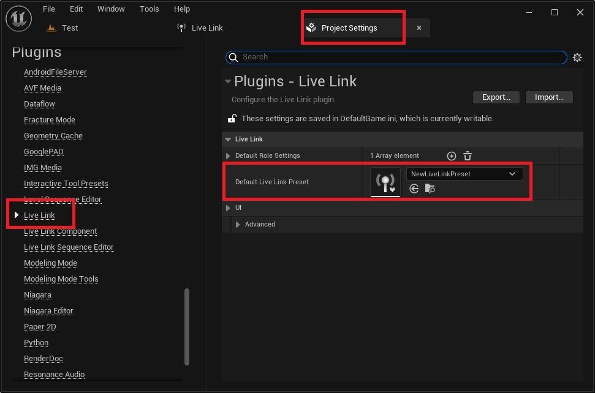

:::warning 注意

运行打包后的程序前，请先关闭虚幻编辑器。否则 Live Link 所用的端口会被编辑器占用，导致打包后的程序无法接收动作数据。

:::