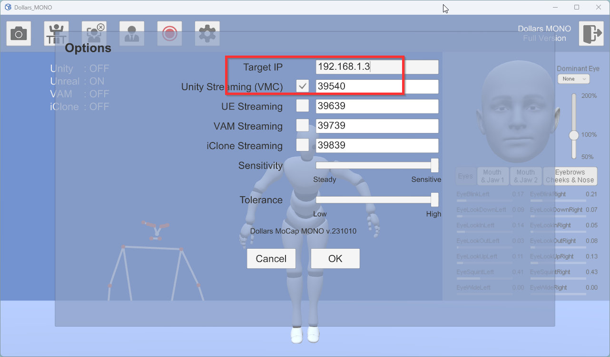
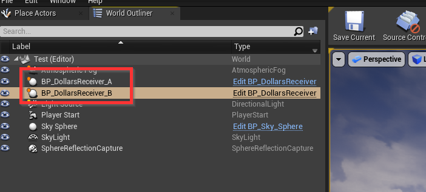
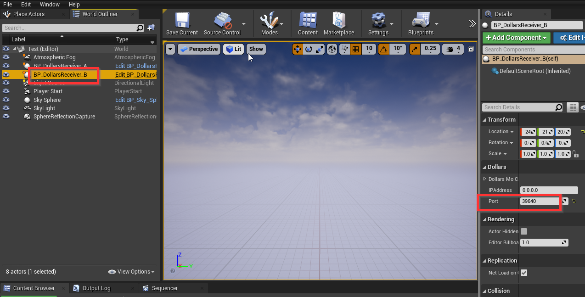
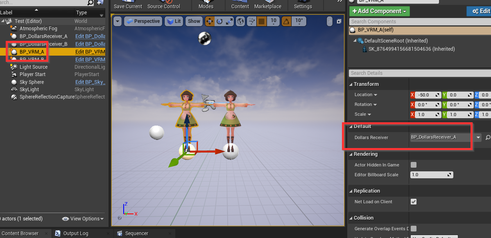
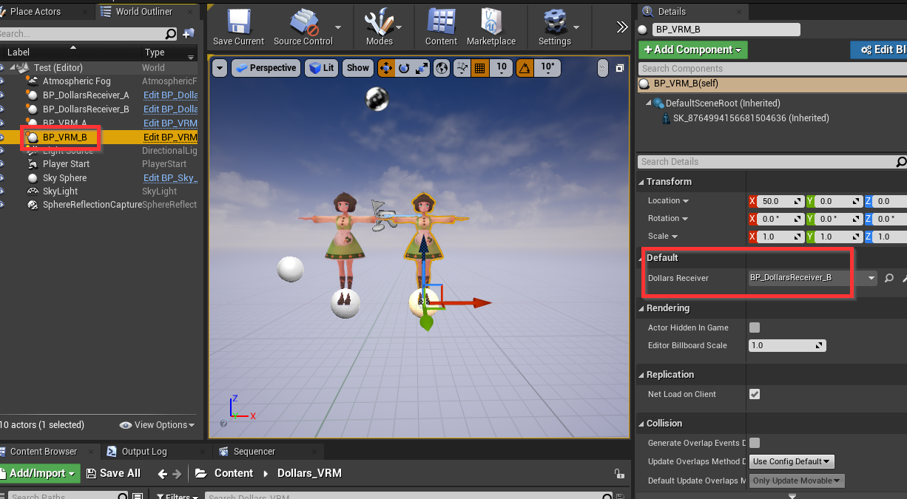

# 多人动捕

您可以在多台电脑上分别运行道乐师动捕程序，并将动捕结果汇集到同一个虚幻场景中，从而实现多角色同屏互动。

以使用两台电脑为例，假设我们希望在电脑 A（IP 地址192.168.1.3）和电脑 B（IP 地址192.168.1.10）上进行动捕，并将结果汇总到电脑 A 的虚幻场景中。

:::info注意
请先确保电脑 B 可以 ping 电脑 A，如果 ping 不通，请检查电脑 A 的防火墙设置。
:::

在电脑 A 上，我们照常运行道乐师动捕程序。

在电脑 B 上，运行道乐师程序后，我们打开选项对话框，在其中 ip 字段中，填入电脑 A 的 ip，192.168.1.3，并将 Unity 的端口，改为 39539 之外的其他数字，比如 39540，结果如下图。

:::info注意
您也可以在同一台电脑上运行多个道乐师动捕程序，此时，保持 IP 仍为默认的 127.0.0.1，只要将 Unity 端口号设置为不同的数字即可。
:::

在电脑 A 的虚幻场景中，加入两个 BP_DollarsReceiver。

为了便于标识，我们将他们分别命名为 BP_DollarsReceiver_A，以及 BP_DollarsReceiver_B。

选中 BP_DollarsReceiver_B，修改其 Port 为填入我们刚才在电脑 B 的中修改的端口号 39540。

加入两个角色蓝图，我们这里分别命名为 BP_VRM_A 和 BP_VRM_B。

在 BP_VRM_A 的 Dollar Receiver 变量中，选择场景中的 BP_DollarsReceiver_A。

BP_VRM_B 则选择 BP_DollarsReceiver_B。

此时 BP_VRM_A 由电脑 A 上的动捕程序控制，BP_VRM_B 则由电脑 B 上的动捕程序控制。

以下是示例项目。

链接：https://pan.baidu.com/s/1N259Dkno9zoaihvDatkFjg 

提取码：2dhn 