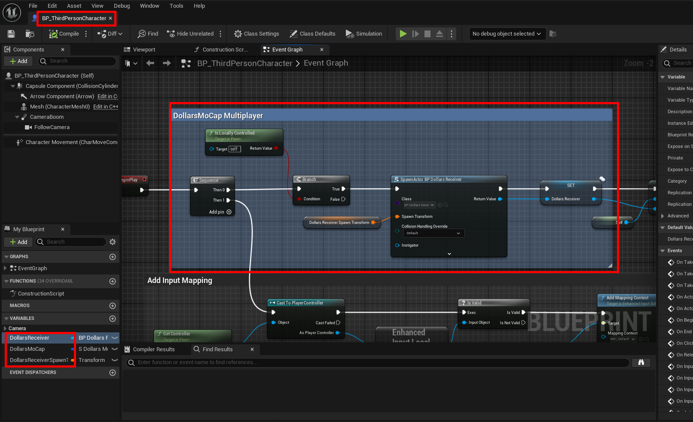
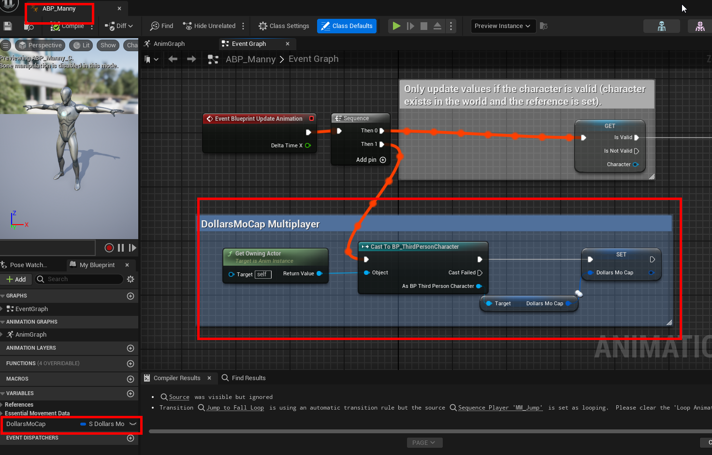
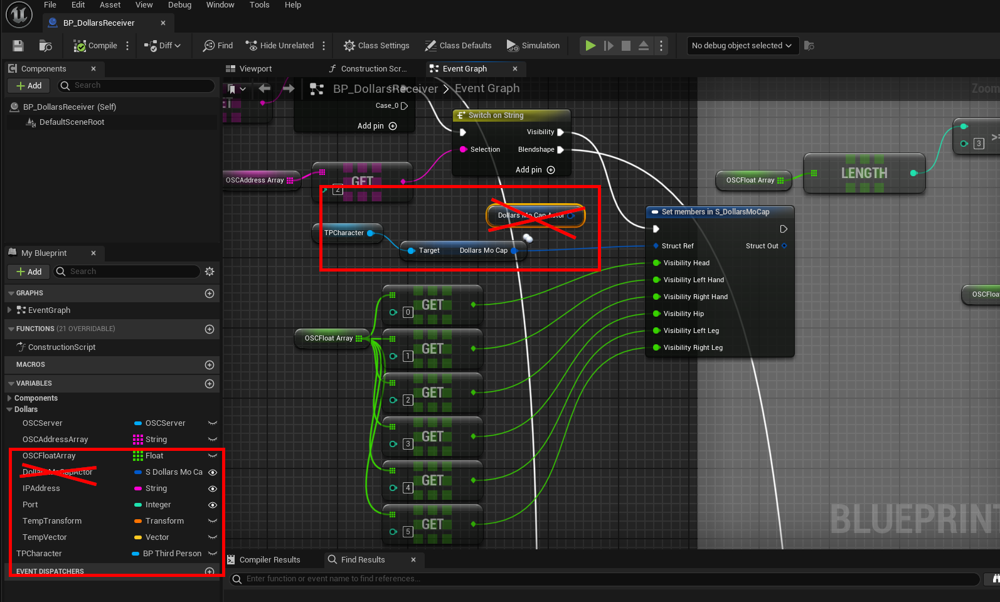
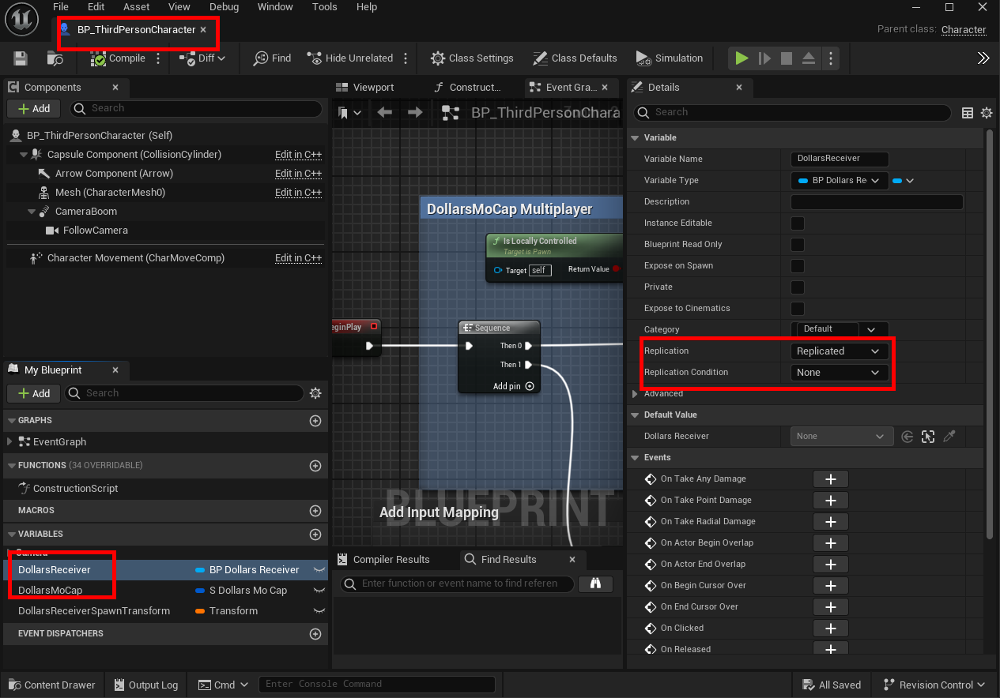

# 多人联网应用

您可以使用虚幻的 Replication 机制实现跨网络的多人联网。这需要对道乐师的虚幻插件做一些相应修改，以下将以虚幻的 TPS 模板为例，对这些修改做一个总结。

## 修改角色蓝图

我们将在角色蓝图中判断当前是否为本地控制器。如果是本地控制器，则 Spawn 一个 DollarsReceiver。

同时我们添加一个 DollarsMoCap 的结构，用于存储 Receiver 中得到的数据。

## 修改角色动画蓝图

我们将在动画蓝图中，尝试得到角色蓝图中的 DollarsMoCap 结构。该结构将被用于 Ctrl Rig，从而控制动作。

## 修改DollarsReceiver

我们在 DollarsReceiver 中添加一个角色蓝图的类变量。并将原本保存在 DollarsMoCapActor 中的数据，改为保存在角色蓝图中的 DollarsMoCap 结构中。

完成以上这些步骤后，可以运行程序，确认可以正确 Spawn 出角色并且进行动捕。

## 设置 Replication 属性

最后，回到角色蓝图中，将 DollarsReceiver 以及 DollarsMoCap 结构的 Replication 设置为 Replicated，即可实现多人联网。

## 演示

<iframe src="//player.bilibili.com/player.html?bvid=BV1Y7RnYWEKS&autoplay=0" width="640" height="360" scrolling="no" border="0" frameborder="no" framespacing="0" allowfullscreen="true"> </iframe>

## 下载

https://pan.baidu.com/s/1sMTw0Fe2PgB88-5qtb15jA?pwd=84ek

