# 配合使用其他追踪设备

道乐师各产品都可配合其他追踪设备共同使用，并且在引擎，以及 DCC 软件中对于追踪结果进行整合。

这里我们将为您介绍同时使用 Dollars VIVA 以及 Rokoko Smartgloves 动捕手套，并且在 Unity 中进行整合的例子，其他动捕手套如诺亦腾 Hi5 也可以通过同样方法与道乐师结合使用。

本文假定你已经成功在 Rokoko Studio 中连通了 Smartgloves，并且激活了 Unity 同步，Rokoko 的 Unity 插件可以在这里下载。

https://assetstore.unity.com/packages/tools/animation/rokoko-live-98045

我们将使用以下项目进行示例，

https://github.com/unity3d-jp/UnityChanKAGURA

打开之后运行，可以看到使用 URP 渲染的最新版 UnityChan。

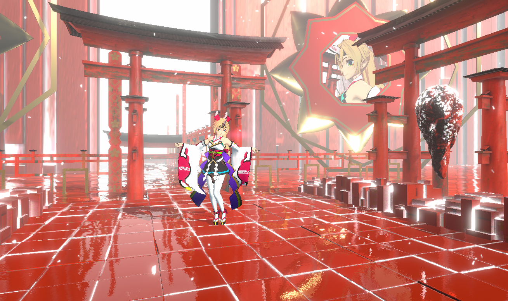

## 准备工作

我们把 UI、Timeline 下的对象，以及 VCAM 对象全都无效，

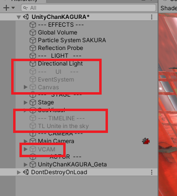

再把 UnityChanKAGURA 的 Animator Controller 置空，

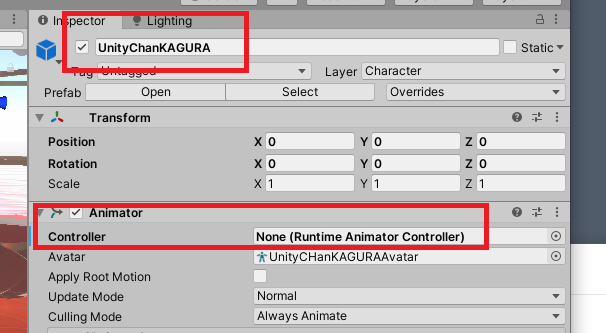

稍许调整一下 Main Camera 的位置，运行程序，将是这个样子，

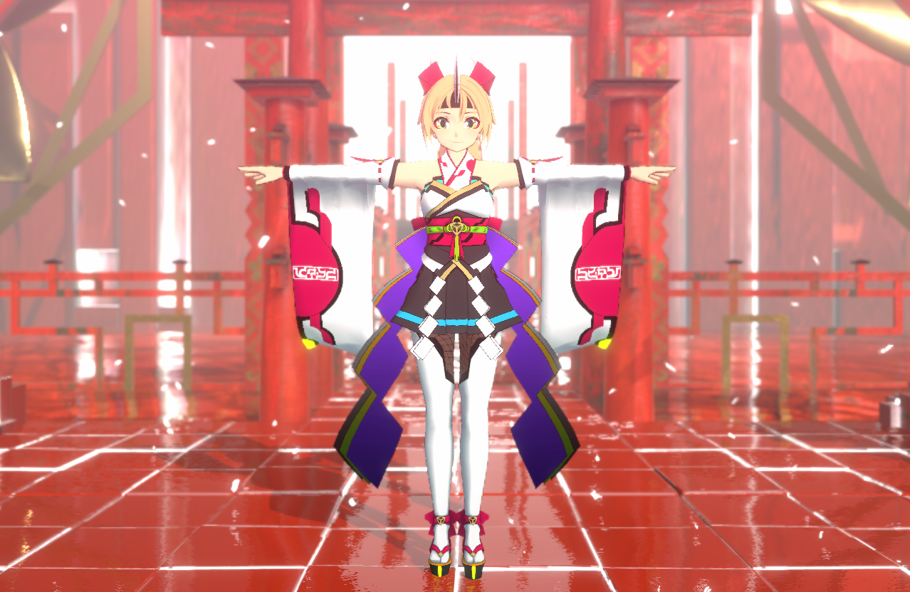

准备就做得差不多了，接下去我们为 UnityChan 添加动捕。

## 动捕

将道乐师的 Unity 插件导入项目，并且将其中的 DollarsMoCap prefab 拉到场景中。

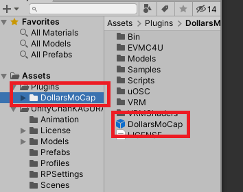

然后为 UnityChanKAGURA 添加 MoCapSrc 组件，将刚才添加的 DollarsMoCap prefab 设置到 src 变量。

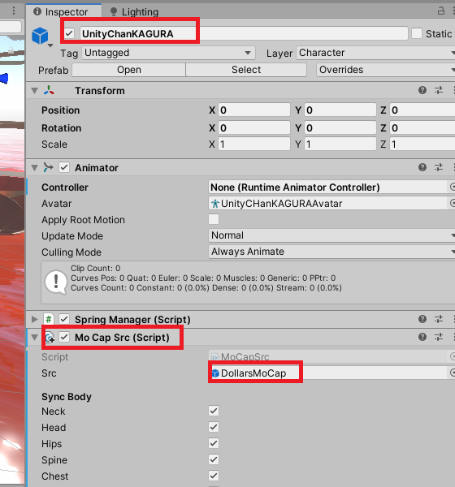

动作就搞定了。

## 导入 Rokoko 插件

接下去我们导入下载好的 Rokoko 插件，导入后会出现如下 Shader 错误，可以忽略不计。

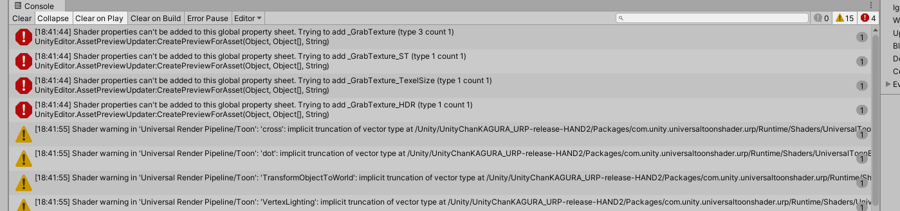

在 Rokoko/Scenes 目录中选中 RokokoPluginExampleScene_CustomActors 并右键点击，在菜单中选择 Open Scene Additive。

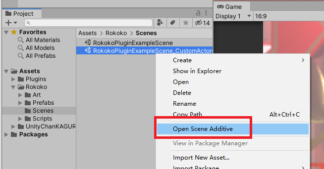

该场景将会和现有场景叠加在一起。

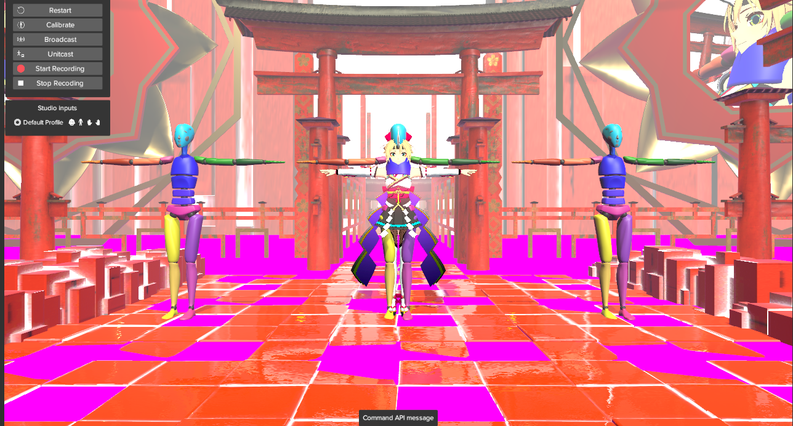

我们在 Rokoko 的场景中选择 Rokoko 以及 StudioManager 两个对象，并且将他们拖入我们的场景，

之后我们右键点击 RokokoPluginExampleScene_CustomActors，选择 Remove Scene，注意不要保存修改。

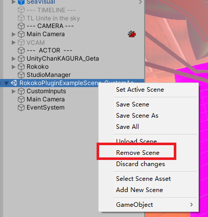

之后，我们把 Rokoko 对象下的 Environment 对象，以及 Rokoko/CommandAPI/Canvas、Rokoko/Hierarchy_UI 中的 Canvas 组件无效，

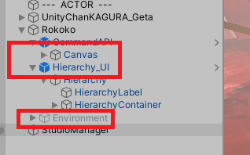

画面终于又回来了。

## 加入手套

我们在 UnityChanKAGURA 上添加 Rokoko 的 Actor 以及 Human Bone Mapping 两个组件，并且在 Actor 组件的 Profile Name 中填入 Rokoko Studio 中对应的名字，

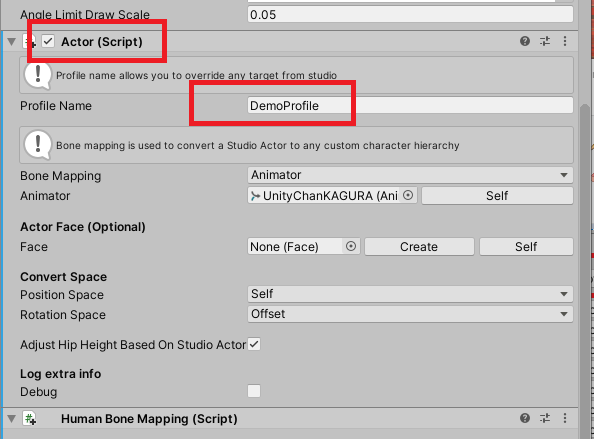

点击 HumanBoneMapping 组件中的 Copy from Animator，组件会自动从 UnityChanKAGURA 中识别各骨骼，并且填入相应的栏位。

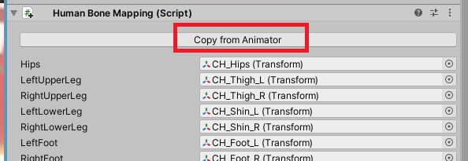

接下去我们要做的，是删除手指之外的栏位，使得 Rokoko 仅控制手指，最后的结果像这样，

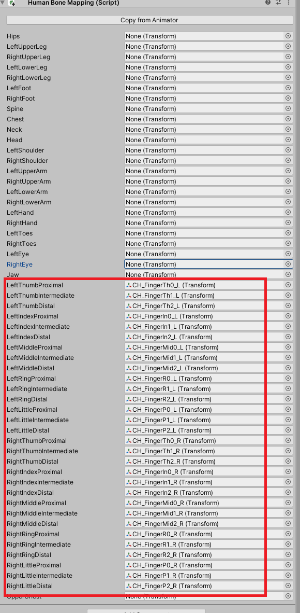

另外，根据 Rokoko 的要求，我们还需要在编辑器中，将 UnityChan 的手指关节尽量伸平，将他们从这样，

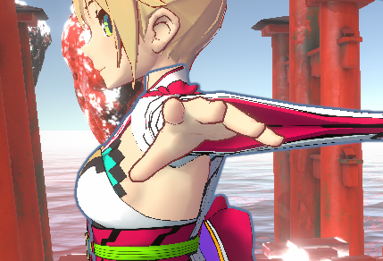

调整为这样，以便可以获得更好的捕捉效果。

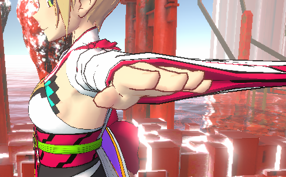

完成这些之后，分别启动道乐师和 Rokoko Studio，可以看到 UnityChan 的身体由道乐师控制，手部由 Rokoko 控制了。

运行效果如下，

<iframe src="//player.bilibili.com/player.html?bvid=BV12u4y177XB&autoplay=0" width="640" height="360" scrolling="no" border="0" frameborder="no" framespacing="0" allowfullscreen="true"> </iframe>
