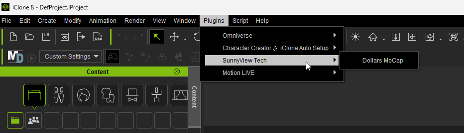
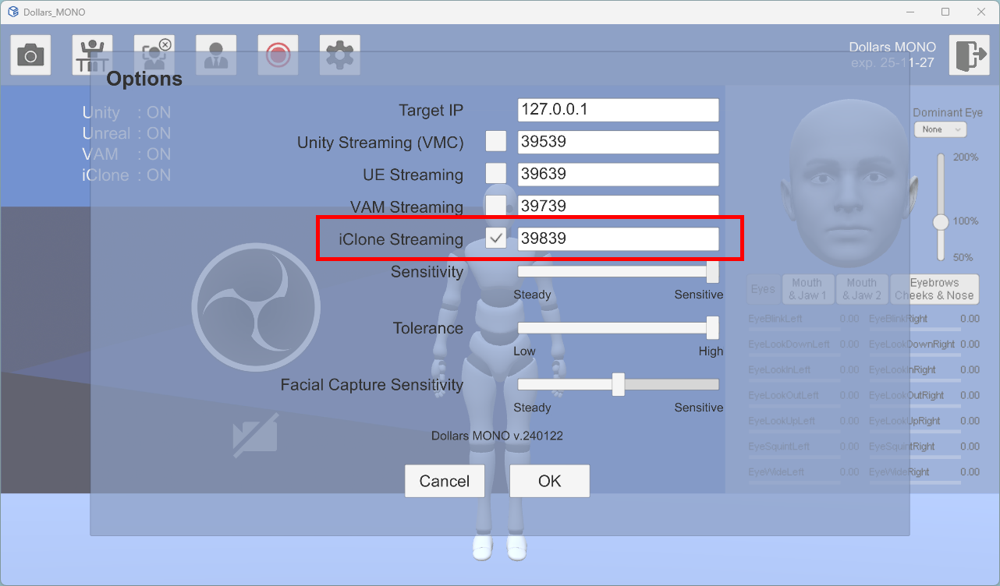
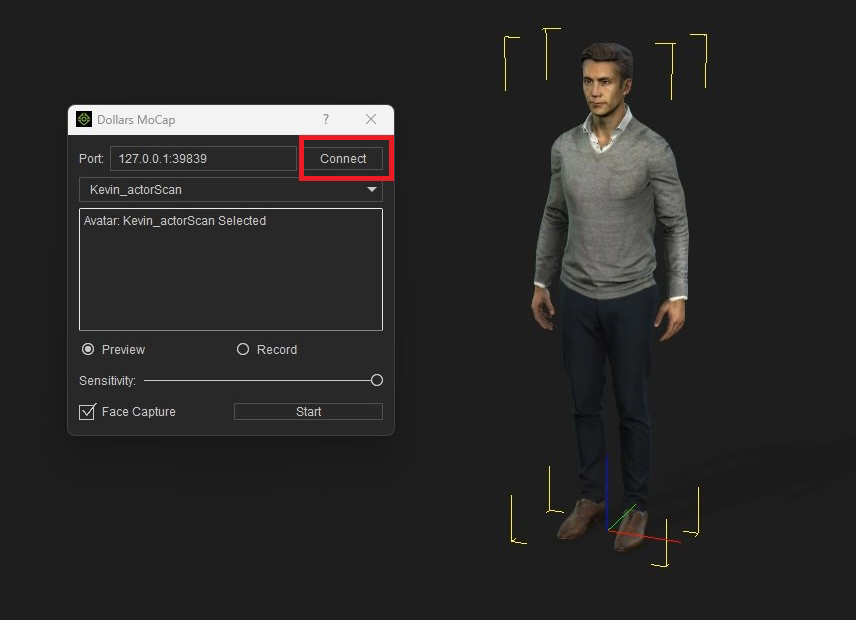
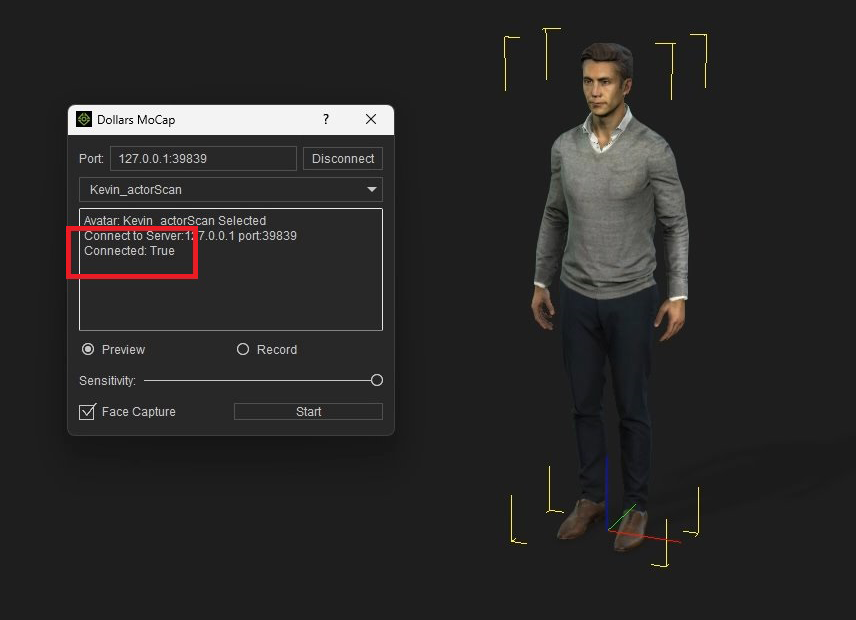
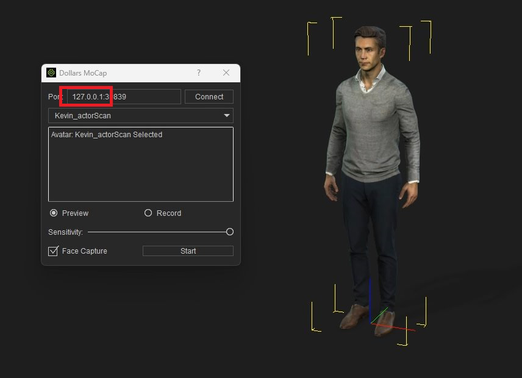

# 在 iClone8 中使用道乐师插件

## 下载并安装道乐师插件

您可以在[道乐师网站](https://www.sunnyview.tech/download)或者[Reallusion 插件市场](https://marketplace.reallusion.com/dollars-markerless-mocap)下载道乐师的 iClone8 插件。

解压缩下载的文件，将其中的 DollarsMoCap 目录复制到 iClone8 的插件目录中。

通常情况下，插件目录位于 `C:\Program Files\Reallusion\iClone 8\Bin64\OpenPlugin`。

正确安装后，您将可以在 iClone 的插件菜单中看到道乐师插件。



## 道乐师程序开启 iClone 推送

打开您使用的道乐师程序，在设置中勾选 iClone 推送。



:::info

如果您使用的是 Dollars LINK，不需要勾选 iClone 推送。Dollars LINK 在启动后会自动监听 iClone 的连接请求。

:::

## 启动插件，连接道乐师

在 iClone 中添加人物后，在菜单中打开道乐师插件。

点击插件中的 Connect 按钮。



在消息栏中出现```Connect: True```字样说明成功连接道乐师程序。



之后，点击 Start 按钮，您就可以进行捕捉了。

如果出现```Connect: False```，请检查道乐师程序是否开启了 iClone 推送。如果确认已经打开，请将道乐师以及 iClone 插件的推送端口 39839 改为其他数字，然后尝试重新连接。

:::warning

如果您在场景中添加或者删除了角色，需要重新打开道乐师插件。

:::

## 跨电脑连接

如果道乐师程序和 iClone 不在同一台电脑上，您可以在 iClone 中修改```127.0.0.1```为道乐师程序所在电脑的 IP 地址。道乐师端的设置不变。


