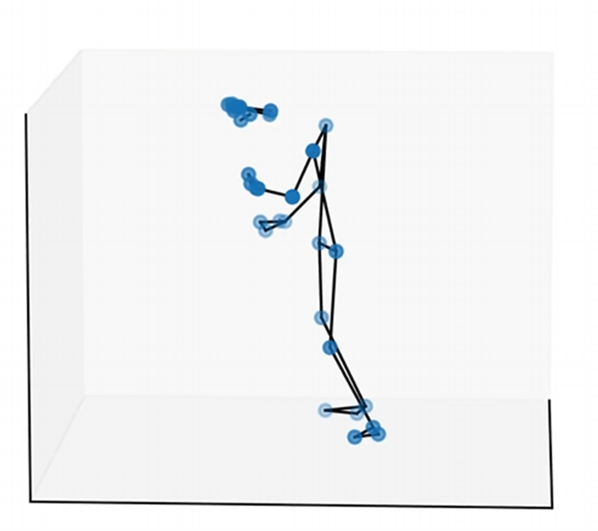
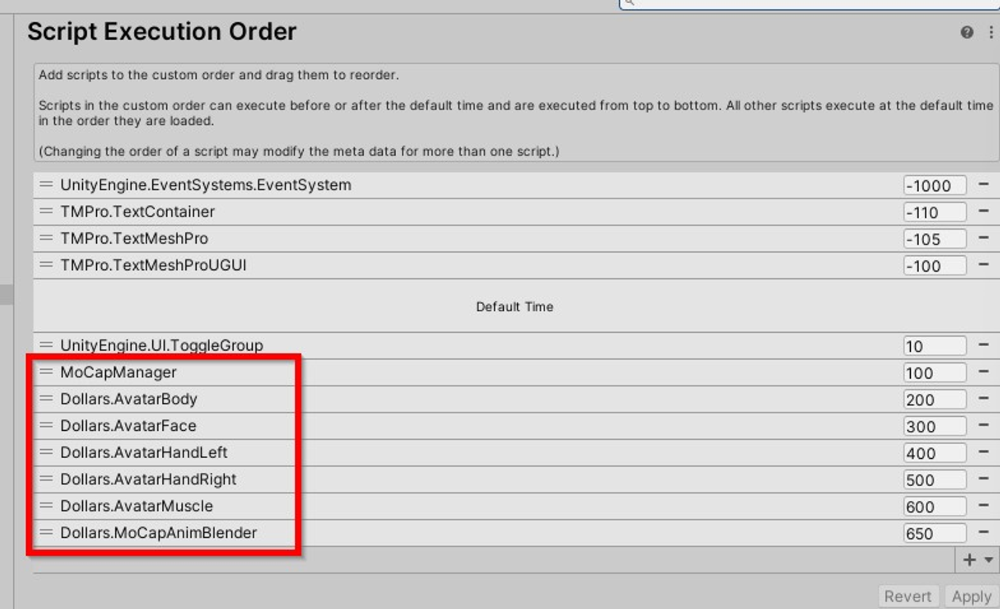
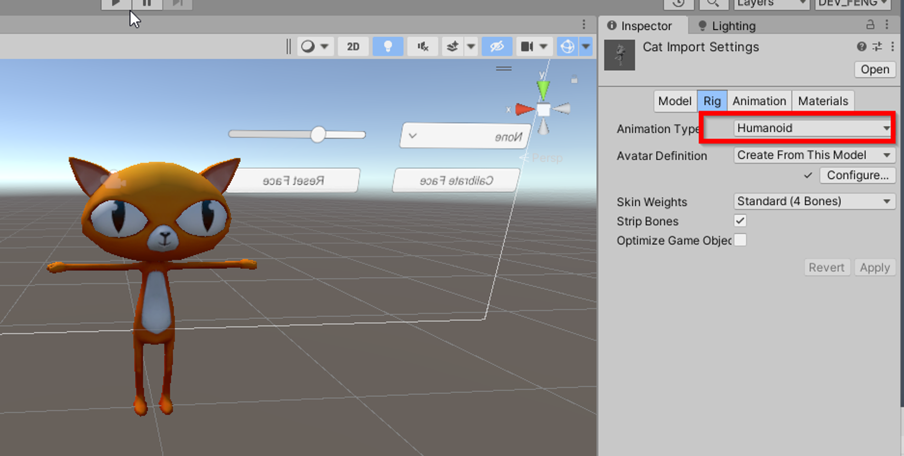
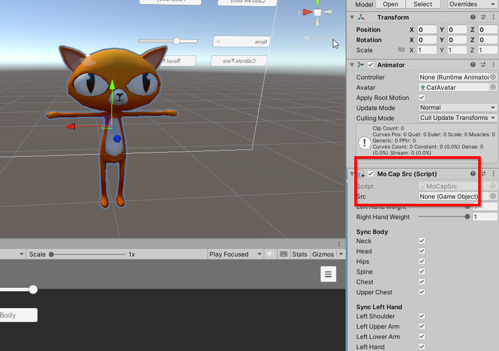
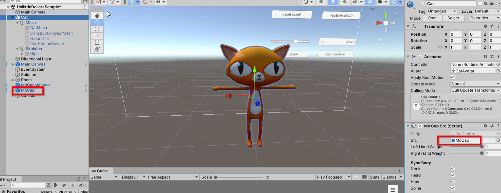
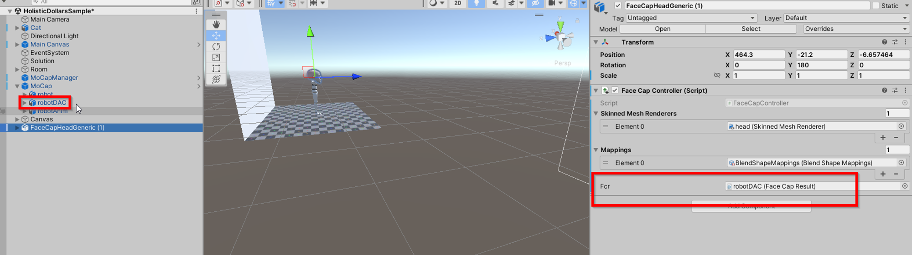
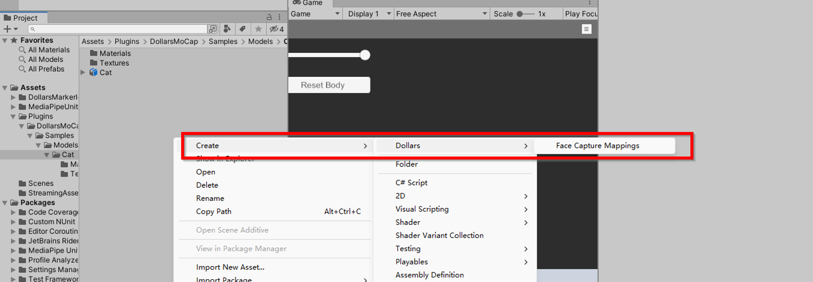
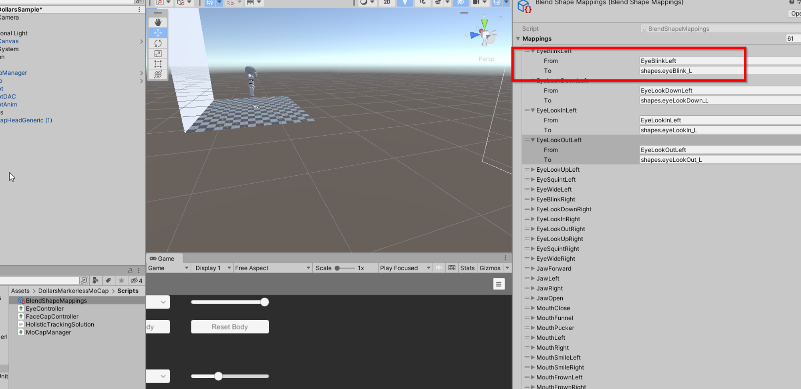
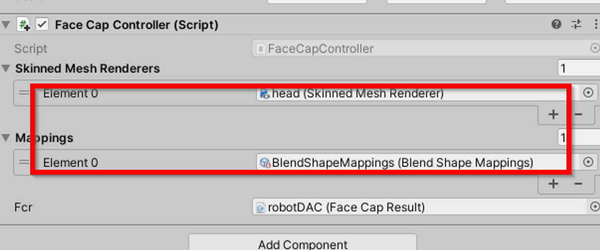

# 无穿戴 SDK 使用说明

## 简介

本 SDK 基于 MediaPipeUnityPlugin 项目开发，可以运行在除 WebGL 之外的 Unity 平台。

## 数据类型

### Dollars.MoCapMode

动捕模式

枚举型，取值为 jump, flat, upperbody

### Dollars.DominantEye

面捕主视眼

枚举型，取值为 none, left, right

### Sensitivity

动捕灵敏度

整型，1-5，1 为最稳定，5 为最灵敏

### Strength

面捕强度

浮点型，取值无限制，建议 0.5 至 2 之间

## 类

### AvatarBody

用于推算骨骼数据

#### InitFilter(int sensitivity)

#### SetMoCapMode(Dollars.MoCapMode mode)

#### SetSensitivity(int sensitivity)

#### Calibrate()

说明：

根据当前 MediaPipe 的输出将人体立直，双脚站在地面。

MediaPipe 推算的人体整体会前倾（见下图），前倾程度根据摄像头参数，人物大小等因素不定，因此为了取得较好的动捕效果，建议在开始前进行一次校准。

校准时放松目视前方即可。

#### ResetCalibration()

说明：用于重置校准数据，推荐更换摄像头以及视频文件时调用。

### AvatarFace

用于返回面捕数据

#### Calibrate()

说明：

将当前各面捕表情参数作为面捕基准

#### ResetCalibration()

说明：用于重置校准数据，推荐与 AvatarBody.ResetCalibration() 同时调用

#### SetStrength(float strength)

设置面捕强度系数

#### SetDominantEye(Dollars.DominantEye eye)

设置主视眼

## 使用

### 约定

在开始动捕前，调用

`AvatarBody.InitFilter(5);`

`AvatarBody.SetMoCapMode(MoCapMode.jump);`

初始化过滤器并且设置动捕模式，顺序不可改变。

如示例项目中的 MoCapManager.cs。

另外通过指定执行顺序确保 MoCapManager.cs 在动捕相关代码前执行。

动捕相关顺序请保持图中顺序。

### 为模型添加动捕

设置模型 Rig 为 Humanoid 并正确配置各骨骼

将模型添加至场景中，增加 MoCapSrc 组件

如果模型默认不是 TPose，调节骨骼角度，将模型调整为 TPose

MoCapSrc 组件中的 src 变量，设置为场景中的 MoCap 对象

完成！

### 为模型添加面捕

为需要面捕的模型添加 Face Cap Controller 组件，并将其中的 Fcr 变量设置为场景中 MoCap 下的 robotDAC。

新建一个 Face Capture Mapping

在 Mapping 文件的 To 栏目中，填入各面捕表情对应的 blendshape 名，注意区分大小写

Face Capture Controller 的 Skinned Mesh Renderers 数组中，填入面捕表情控制的模型，Mapping 数组中，填入新建的对应关系

注意点：

- 如果不存在某面捕对应的 blendshape，mapping 文件中对应的位置置空即可。
- mapping 文件中 TongueOut 及之后的栏目可忽略。
- 如果需要使用同一个面捕表情控制多个 blendshape，可以将同一个 mesh 多次加入 Skinned Mesh Renderers 数组，并且分别对应不同的 mapping。
- Skinned Mesh Renderers 和 Mappings 数组长度及对应顺序需一致。