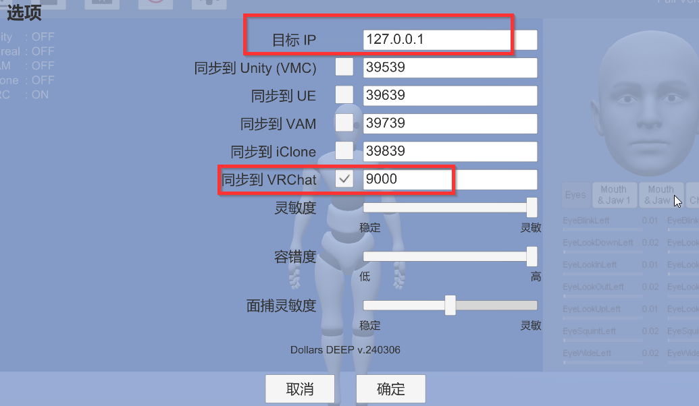
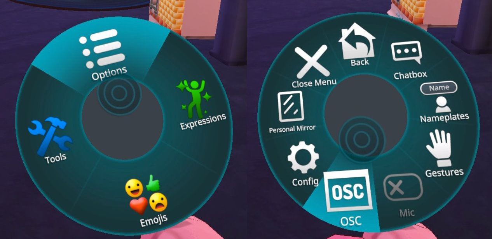
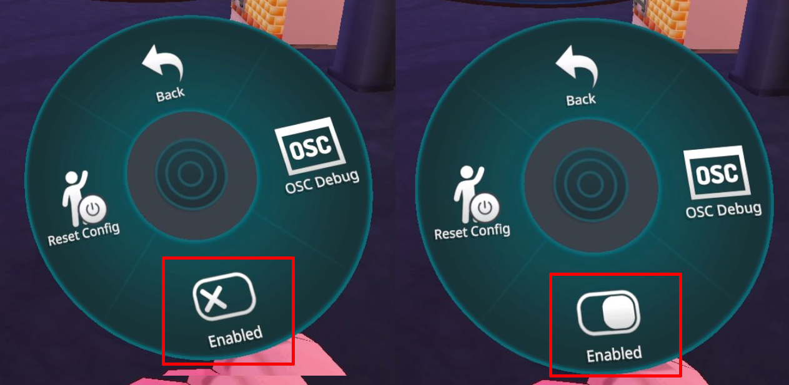
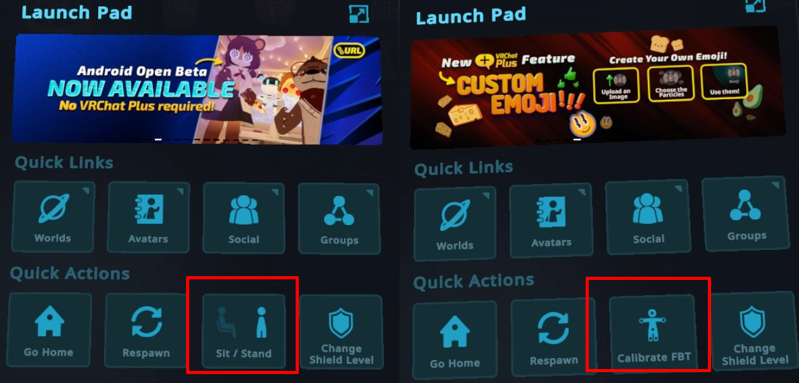
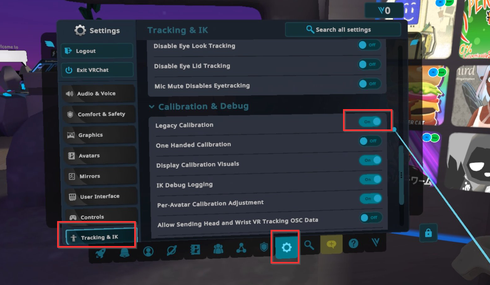
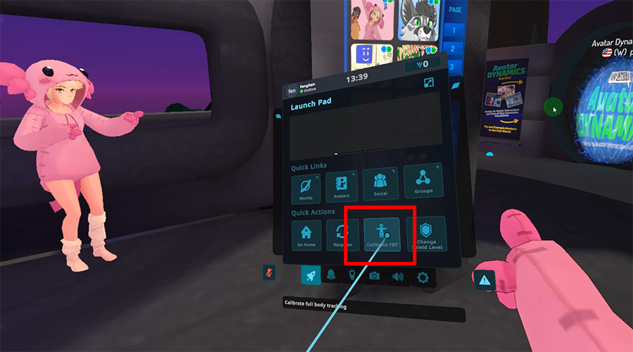
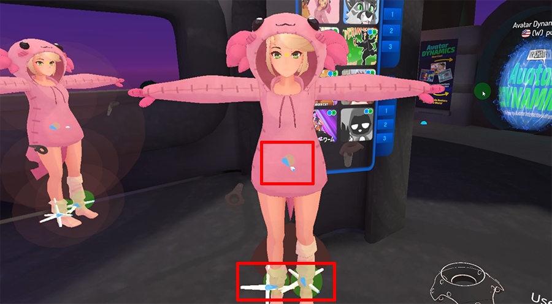

# VRChat 全身动捕

:::info注意
道乐师的以下产品支持 VRChat 全身动捕，

- Dollars DEEP（自 v.240306 起）
:::

## 准备

### 道乐师产品端

请打开 VRChat 同步，如有必要，请修改 IP 地址以及端口。

### VRChat 端

#### 激活 OSC

打开 Action Menu，通过 Options > OSC > 进入 OSC 的相关选项。

点击 Enabled，激活 OSC

根据您使用的控制器不同，打开 Action Menu 的方式也不同，请参阅以下 VRChat 文档。

https://docs.vrchat.com/docs/action-menu

打开 OSC 后，Quick Menu 中的 "Sit/Stand" 选项将被替换为 "Calibrate FBT" 选项。

#### 切换动捕模式

另外，建议您在 Settings 中，将 Legacy Calibration 选项置于 On。

准备工作完成。

## 校准

在 Dollars DEEP 中完成校准后，点击 Quick Menu 中的 "Calibrate FBT" 选项

此时可在腰部以及腿部位置看到追踪器。

之后，双手向两侧伸展，同时扣动双手的扳机键，即可完成校准。
